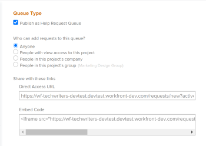
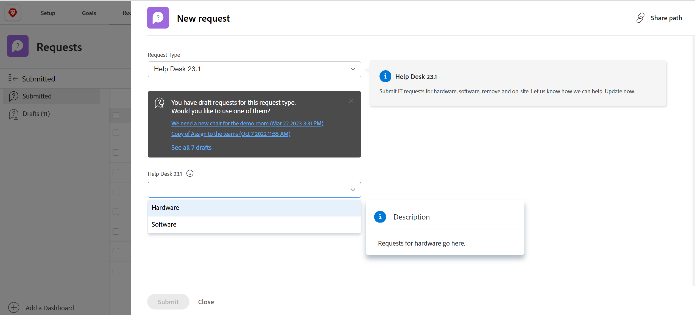
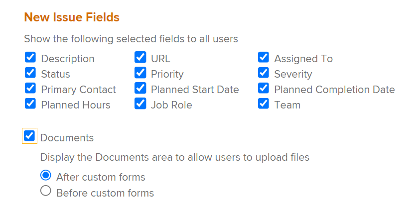
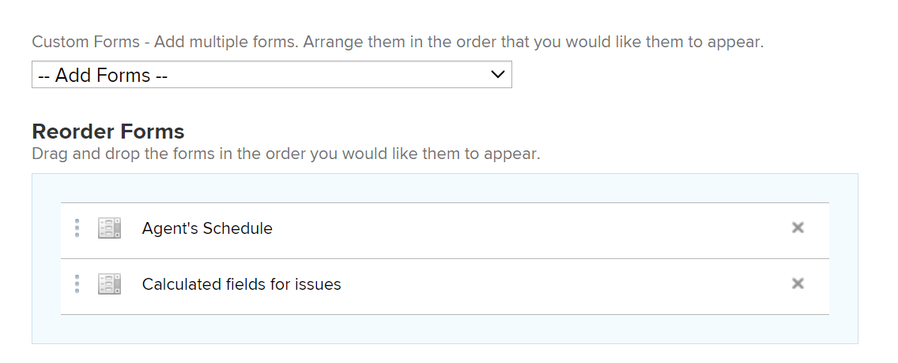

# Create a Request Queue

<!--
<THIS IS CONNECTED TO THE PRODUCT IN BLUEPRINTS. DO NOT MOVE/ CHANGE URL>
-->

You can set up a Request Queue where users can enter occasional requests that are not planned work on a project. For example, a help desk request queue can be set up to capture all user requests that come to an IT department.

## Access requirements

<!--drafted for P&P: replace the table below with this:

<table style="table-layout:auto"> 
 <col> 
 <col> 
 <tbody> 
  <tr> 
   <td role="rowheader">Adobe Workfront plan*</td> 
   <td> 
Any 
 </td> 
  </tr> 
  <tr> 
   <td role="rowheader">Adobe Workfront license*</td> 
   <td> 
   
Current license: Stadard 

   Or
   
Legacy license: Plan 
 </td> 
  </tr> 
  <tr> 
   <td role="rowheader">Access level configurations*</td> 
   <td> 
Edit access to Projects
 
<b>NOTE</b> 
   
   If you still don't have access, ask your Workfront administrator if they set additional restrictions in your access level. For information on how a Workfront administrator can modify your access level, see <a href="../../../administration-and-setup/add-users/configure-and-grant-access/create-modify-access-levels.md" class="MCXref xref">Create or modify custom access levels</a>.
 </td> 
  </tr> 
  <tr> 
   <td role="rowheader">Object permissions</td> 
   <td> 
 Manage permissions to the project
 
For information on requesting additional access, see <a href="../../../workfront-basics/grant-and-request-access-to-objects/request-access.md" class="MCXref xref">Request access to objects </a>.
 </td> 
  </tr> 
 </tbody> 
</table>

&#42;To find out what plan, license type, or access you have, contact your Workfront administrator
-->

You must have the following access to perform the steps in this article:

<table style="table-layout:auto"> 
 <col> 
 <col> 
 <tbody> 
  <tr> 
   <td role="rowheader">Adobe Workfront plan*</td> 
   <td> 
Any 
 </td> 
  </tr> 
  <tr> 
   <td role="rowheader">Adobe Workfront license*</td> 
   <td> 
Plan 
 </td> 
  </tr> 
  <tr> 
   <td role="rowheader">Access level configurations*</td> 
   <td> 
Edit access to Projects
 
Note: If you still don't have access, ask your Workfront administrator if they set additional restrictions in your access level. For information on how a Workfront administrator can modify your access level, see <a href="../../../administration-and-setup/add-users/configure-and-grant-access/create-modify-access-levels.md" class="MCXref xref">Create or modify custom access levels</a>.
 </td> 
  </tr> 
  <tr> 
   <td role="rowheader">Object permissions</td> 
   <td> 
 Manage permissions to the project
 
For information on requesting additional access, see <a href="../../../workfront-basics/grant-and-request-access-to-objects/request-access.md" class="MCXref xref">Request access to objects </a>.
 </td> 
  </tr> 
 </tbody> 
</table>

&#42;To find out what plan, license type, or access you have, contact your Workfront administrator

## Request queues overview

You set up a request queue as a project. When you designate the project as a Request Queue, the queue becomes accessible from the Requests area of Adobe Workfront. When you customize the Request Queue you are also customizing the form users fill out when they submit the requests.

This article describes how to create a request queue from an existing project. However, to build consistency for your request intake process or to add multiple layers to it for reporting purposes and better management, you can also configure additional building blocks of a request queue which are described in the following table. 

<table style="table-layout:auto"> 
 <col> 
 <col> 
 <tbody> 
  <tr> 
   <td role="rowheader">Queue Details</td> 
   <td> 
You must set up a project as a request queue in the Queue&nbsp;Details area.&nbsp;This step is mandatory. 
 
For more information, see the <a href="#create-a-request-queue" class="MCXref xref">Create a Request Queue</a> section in this article.
 </td> 
  </tr> 
  <tr> 
   <td role="rowheader">Topic Groups</td> 
   <td> 
They are additional menus that classify requests based on common features. For example, for an IT Request Queue, you might want to have "On-site" and "Remote" topic groups. 
 
For more information, see <a href="../../../manage-work/requests/create-and-manage-request-queues/create-topic-groups.md" class="MCXref xref">Create Topic Groups</a>. 
 
This is optional.
 </td> 
  </tr> 
  <tr> 
   <td role="rowheader">Queue Topics</td> 
   <td> 
They are additional menus that classify requests that belong to the same Topic&nbsp;Group based on common features. A&nbsp;topic group can contain several queue topics. 
 
For example, the "On-site" topic group for the IT&nbsp;Request Queue may contain the "Hardware", "Software" and "Network" queue topics. 
 
For more information, see <a href="../../../manage-work/requests/create-and-manage-request-queues/create-queue-topics.md" class="MCXref xref">Create Queue Topics</a>. 
 
This is optional.
 </td> 
  </tr> 
  <tr> 
   <td role="rowheader">Routing Rules</td> 
   <td> 
They allow you to route each request to a user, job role, team, or to a project. 
 
For more information, see <a href="../../../manage-work/requests/create-and-manage-request-queues/create-routing-rules.md" class="MCXref xref">Create Routing Rules</a>. 
 
This is optional.
 </td> 
  </tr> 
 </tbody> 
</table>

## Create a Request Queue

When you set up a project as a Request Queue, the project status must be Current in order to display in the Requests area of Workfront.

To create a Request Queue:

1. Go to the project that you want to set up as a Request Queue.
1. (Optional)&nbsp;Click **Project Details** in the left panel and add a **Description** to the project in the **Overview** area. This information displays on all new requests.
1. Click **Queue Details** in the left panel. You might need to click **Show More**, then **Queue Details**.

   This opens the Queue Details  section .

   

1. Specify the following information:

   * **Publish as Help Request Queue:** Select this option to identify this project as a request queue. All incoming issues are considered Requests.  
     When this option is not selected, the project behaves like a standard project in Workfront and all incoming issues are issues.
   
   * **Who can add requests to this queue:** Select which users have access to add requests to this queue. You can allow the following groups of people to see the Request Queue in their Requests area of the Global Navigation Bar:

     |Who can enter requests | Description|
     |---|---|
     | Anyone  |Any Workfront user with an active account can view this request queue and add requests to it |
     | People with view access to this project |Users with View permissions to the project can view and add requests to this queue |
     | People in this project's company |Users who belong to the company associated with this project can view and add requests to this queue. If there is a company associated with the project, the name of the company is listed in parentheses after this setting.  |
     | People in this project's group |Users who belong to the group associated with this project can view and add requests to this queue. If there is a group associated with the project, the name of the group is listed in parentheses after this setting.  |

     {style="table-layout:auto"}

   * **Share with these links:** The following options enable you to provide direct access to the Request Queue and the forms associated with it to users outside of Workfront or to Workfront users using an external page. For information about embedding a request queue in a dashboard as an external page, see [Embed a request queue in a dashboard](../../../reports-and-dashboards/dashboards/creating-and-managing-dashboards/embed-request-queue-dashboard.md).

     Users must already have access rights to the Request Queue in order to gain direct access. Using either option described here does not automatically grant access to users.

     >[!TIP]
     >
     >Users must first log in to Workfront before gaining access to the request queue when they access the Request Queue page from another application.

      * **Direct Access URL:** When a user accesses this URL from a browser, the user is taken directly to the New Request  section in the Requests area and this request is selected by default for them.

        

        >[!NOTE]
        >
        >You can display a Request Queue in a dashboard as an external page. In this case, the request queue is preselected, but you can select any other request queue from the Request&nbsp;Type field. users can change the Request&nbsp;Type. Navigation components of the Requests also display.

      * **Embed Code:** Use this HTML code to embed the request queue form as an iframe within any HTML page.  
        If users are not already authenticated to Workfront when they view the page where the code is embedded, the Workfront login dialog box is displayed. After users log in, the Request Queue form is displayed.

        >[!NOTE]
        >
        >When displaying a Request Queue in an iframe, only the request form displays, the request name is preselected and dimmed. User cannot change the Request type. Navigation components of the Requests area do not display.

        In order for the request queue form to be displayed when using this embed code, you must enable the "Allow embedding of Workfront in an iframe" setting in your system setup. For more information about enabling embedding of Workfront in an iframe, see [Configure system security preferences](../../../administration-and-setup/manage-workfront/security/configure-security-preferences.md). If this setting is not enabled, the iframe is displayed as blank.

        You can adjust various aspects of how the embedded form is displayed, as follows:

        <table border="1" cellspacing="15"> 
         <col> 
         <col> 
         <thead> 
          <tr> 
           <th> 
<strong>Functionality</strong> 
 </th> 
           <th> 
<strong>Solution</strong> 
 </th> 
          </tr> 
         </thead> 
         <tbody> 
          <tr> 
           <td> 
Adjust the size of the frame
 </td> 
           <td> 
Modify the "width" and "height" attributes.
 
By default, the width is "500" and the height is "600"
 </td> 
          </tr> 
          <tr> 
           <td> 
Direct users to a specific Queue Topic or Topic Group
 </td> 
           <td> 
Add the "path" parameter to the src URL. You can find the path parameter by navigating to the desired Queue Topic or Topic Group in the non-embedded form and inspecting the URL.
 </td> 
          </tr> 
          <tr> 
           <td> 
Show and allow users to change the pre-configured Topic Group drop-down list
 </td> 
           <td> 
Use the "path" parameter by adding the <code>showPreSelectedOptions=true</code> parameter to the <code>src URL</code>.
 </td> 
          </tr> 
          <tr> 
           <td> 
Detect when the form has been submitted
 </td> 
           <td> 
Add a "message" event listener to your web page's window and checking if <code>event.data.type</code> is <code>requestSubmitted</code>. <code>event.data.newIssueID</code> will be set to the ID of the created issue.
 </td> 
          </tr> 
         </tbody> 
        </table>

   * **Request Types:** Select from the default options below.

     The Workfront administrator can rename the default request types. For more information about renaming the request types, see [Customize default issue types](../../../administration-and-setup/set-up-workfront/configure-system-defaults/customize-default-issue-types.md).

      * Bug Report
      * Change Order
      * Issue
      * Request

        This is a required field and you must select at least one option.

     >[!NOTE]
     >
     >Request Types display as a selection in the Requests area only if the Request Type is selected in both the Queue Details and the Queue Topic pages. For information about setting up the Queue Details area of a project, see [Create Queue Topics](../../../manage-work/requests/create-and-manage-request-queues/create-queue-topics.md).

     Each type selected here will be available on the form (you can select more than one). Selecting more than one type can help organize multiple requests coming in.  
     For example, if you are using the form on a request queue for an IT project, the following request types can come in to the queue: hardware, software, bug fixes, and issues.

   * **Default Duration:** The default duration is the length of time it typically takes to complete an issue. This becomes the default for all incoming issues and can be modified manually. Duration is generally set in hours, days, or weeks. The Default Duration of an issue is the same as the Planned Hours on the issue. The Planned Completion Date of the issue calculates based on this field.  
     The default for the issue Duration is 1 day or 8 hours. If your Workfront administrator set the Typical Hours per Work Day as less than 8 hours, the Default Duration for issues is still 8 hours. For example, if the Typical Hours per Work Day is set to 7 hours, the Default Duration for issues is 1.14 Days or 8 hours. For more information about how to set up the system Typical Hours per Work Day, see the "Timeline Calculations" section in the article [Configure system-wide project preferences](../../../administration-and-setup/set-up-workfront/configure-system-defaults/set-project-preferences.md).
   
   * **People from the same company will inherit the same permissions for all requests.:** When selected, all requests submitted to the queue are visible for users in the same company. Users can view these requests in the All Requests  section , located within the Requests area. At the time that this setting is enabled or disabled, it impacts all future requests; it does not retroactively impact information. 
   * **When someone makes a request, automatically grant:** When a user makes a request to the request queue, the user is automatically granted the level of permission that you choose to that request. Select from the following permissions levels: 

      * **View** 
      * **Contribute**. This is the default selection.
      * **Manage**

     For information about the Workfront permissions model, see [Overview of sharing permissions on objects](../../../workfront-basics/grant-and-request-access-to-objects/sharing-permissions-on-objects-overview.md).   
     Setting permissions here saves time, rather than having to grant permissions for each individual incoming request. Choosing this option impacts all future requests, but does not retroactively impact existing requests. 
   
   * **Default Approval**: Associate an approval process with this request queue. Only Issue Approval Processes are visible in this drop-down menu. All issues submitted to this queue will be associated with this approval process. Your Workfront administrator must define system-level approval processes before you can associate them with request queues. Users with administrative access to Approval processes can also create group-specific approval processes.

     >[!IMPORTANT]
     >
     >If the group of the project changes, the group-specific approval process attached to existing issues becomes a single-use approval process. For more information about how changes to the group of the project or changes in the approval process affect approval settings, see [How group and approval process changes affect assigned approval processes](../../../administration-and-setup/customize-workfront/configure-approval-milestone-processes/how-changes-affect-group-approvals.md).

     If you have multiple queue topics associated with a request queue, we recommend that you associate approval processes with the queue topics instead. For more information about creating queue topics, see [Create Queue Topics](../../../manage-work/requests/create-and-manage-request-queues/create-queue-topics.md). 
   
     Consider the following when adding approval processes to request queues:

      * Only active approval processes display in the list. 
      * System-wide and group-specific approval processes display in the list. An approval process associated with a group other than that of the project does not display in the list.

   * **Default Route**: Associate a Routing Rule with this request queue. Use Routing Rules to automatically assign new issues submitted to a Request Queue to the correct resource (user, job role, or team), and to the correct project. All issues submitted to this queue will be associated with this Routing Rule. You must configure Routing Rules before you can associate them with request queue.  
     If you have multiple queue topics associated with a request queue, we recommend that you associate routing rules with the queue topics instead. For more information about creating routing rules, see [Create Routing Rules](../../../manage-work/requests/create-and-manage-request-queues/create-routing-rules.md).
   
   * **New Issue Fields:** In the Show the following selected fields to all users section, select any fields that you want to be visible to all users who submit a request to the project or add an issue to the project or the tasks.

     >[!TIP]
     >
     >New Issue Fields selected in the Queue&nbsp;Details section are also associated with any new issue added to the project or to the tasks in the Issues section.

     When you enable any of the Assigned to, Job Role, or the Team fields, they are always renamed to Assignments in the request form, but you can only specify the type of assignment selected here.

      >[!NOTE]
      >
      >If you selected Assigned To in the Queue Details area, you can enter only users in the Assignments field on the request form. In this case, you cannot enter job roles or a team. 

   
   * **Documents**: If you select to display the Documents section in the new request form, select where the document uploading section should be positioned. Select from the following:

     <table style="table-layout:auto"> 
      <col> 
      <col> 
      <tbody> 
       <tr> 
        <td role="rowheader">After custom forms</td> 
        <td>The Documents section displays at the bottom of the request form. </td> 
       </tr> 
       <tr> 
        <td role="rowheader">Before custom forms</td> 
        <td> 
The Documents section displays between the Workfront fields and the custom fields of the request form. 
 </td> 
       </tr> 
      </tbody> 
     </table>   
   
     

   * **Show all selected and unselected fields to:** Select which users you want to see all the fields on the form. The following options control the access to the fields on the form.
    
      |Which users can see all fields on the request form | Description|  
      |---|---| 
      | All Users (Plan Licenses) |All users who have a Plan license can see the selected as well as the unselected fields. |
      | People with view access to this project (Plan License) |Those users with a Plan license that also have View rights to this project can see the selected as well as the unselected fields. The rest of the users who can submit requests to this project can see just the selected fields. |
      | No Users |No users can see the unselected fields. All users who can submit requests to this project can only see the fields selected.  |
  
   * **Custom Forms**: Select a custom form to associate with the Request Queue. Only Issue Custom Forms are available to select from this drop-down menu. All issues submitted to the Request Queue will have the selected forms associated with them.  
     If you have multiple Queue Topics associated with a Request Queue, we recommend that you associate custom forms with the Queue Topics instead. For more information about creating sub-sections for the Request Queue, see [Create Queue Topics](../../../manage-work/requests/create-and-manage-request-queues/create-queue-topics.md).

     

     If you have multiple custom forms associated with the Request Queue, drag and drop the forms to sort them in the desired order, in the **Reorder Forms** section.

     >[!TIP]
     >
     >Custom forms added to the Queue Details section are also associated with any new issue added to the project or the tasks in the Issues  section.

1. Continue selecting information for the settings in the **Email Queue Settings** area, to allow users to email requests to the request queue project. 

    For more information, see [Enable users to email an issue into a Request Queue project](../../../manage-work/requests/create-requests/enable-email-issues-into-projects.md).

1. Click **Save**.  
   Your project has now been configured to be a Request Queue and users can now add requests to it. 

1. (Optional) To enhance the Request Queue functionality, build additional sub-sections for your queue, as well as rules to route the incoming requests to the correct team, assignee or project.

   * For information about creating sub-sections for the Request Queue, see the articles [Create Queue Topics](../../../manage-work/requests/create-and-manage-request-queues/create-queue-topics.md) and [Create Topic Groups](../../../manage-work/requests/create-and-manage-request-queues/create-topic-groups.md).  
   * For information about routing the requests to the appropriate assignee, team, and appropriate project, see [Create Routing Rules](../../../manage-work/requests/create-and-manage-request-queues/create-routing-rules.md).
