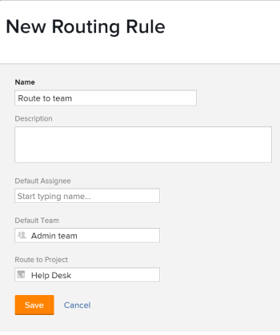

# Create Routing Rules

Routing rules control what Adobe Workfront does with issues when they are submitted to a request queue. For more information about creating Request Queues, see [Create a Request Queue](../../../manage-work/requests/create-and-manage-request-queues/create-request-queue.md).

Routing rules send issues to specific users or job roles best equipped to resolve the submitted issue or request. Routing rules are usually associated with queue topics, which are used to control which routing rule will be applied to the issue or request.

## Access requirements

<!--drafted - replace the table at P&P:

<table style="table-layout:auto"> 
 <col> 
 <col> 
 <tbody> 
  <tr> 
   <td role="rowheader">Adobe Workfront plan*</td> 
   <td> 
Any 
 </td> 
  </tr> 
  <tr> 
   <td role="rowheader">Adobe Workfront license*</td> 
   <td> 
Current license: Standard 
 
   Or
   
Legacy license: Plan 
 </td> 
  </tr> 
  <tr> 
   <td role="rowheader">Access level configurations*</td> 
   <td> 
Edit access to Projects
 
<b>NOTE</b>
   
   If you still don't have access, ask your Workfront administrator if they set additional restrictions in your access level. For information on how a Workfront administrator can modify your access level, see <a href="../../../administration-and-setup/add-users/configure-and-grant-access/create-modify-access-levels.md" class="MCXref xref">Create or modify custom access levels</a>.
 </td> 
  </tr> 
  <tr> 
   <td role="rowheader">Object permissions</td> 
   <td> 
 Manage permissions to the project
 
For information on requesting additional access, see <a href="../../../workfront-basics/grant-and-request-access-to-objects/request-access.md" class="MCXref xref">Request access to objects </a>.
 </td> 
  </tr> 
 </tbody> 
</table>
-->

You must have the following:

<table style="table-layout:auto"> 
 <col> 
 <col> 
 <tbody> 
  <tr> 
   <td role="rowheader">Adobe Workfront plan*</td> 
   <td> 
Any 
 </td> 
  </tr> 
  <tr> 
   <td role="rowheader">Adobe Workfront license*</td> 
   <td> 
Plan 
 </td> 
  </tr> 
  <tr> 
   <td role="rowheader">Access level configurations*</td> 
   <td> 
Edit access to Projects
 
<b>NOTE</b>
   
   If you still don't have access, ask your Workfront administrator if they set additional restrictions in your access level. For information on how a Workfront administrator can modify your access level, see <a href="../../../administration-and-setup/add-users/configure-and-grant-access/create-modify-access-levels.md" class="MCXref xref">Create or modify custom access levels</a>.
 </td> 
  </tr> 
  <tr> 
   <td role="rowheader">Object permissions</td> 
   <td> 
 Manage permissions to the project
 
For information on requesting additional access, see <a href="../../../workfront-basics/grant-and-request-access-to-objects/request-access.md" class="MCXref xref">Request access to objects </a>.
 </td> 
  </tr> 
 </tbody> 
</table>

*To find out what plan, license type, or access you have, contact your Workfront administrator

## Create a Routing Rule

1. Go to the project which you want to add the routing rules for your requests. 
1. Click **Routing Rules** in the left panel. You might need to click **Show More**, then **Routing Rules**.
1. Click **New Routing Rules** to add the new rule. 
1. Specify the following information for the Routing Rule:

   <table style="table-layout:auto"> 
    <col> 
    <col> 
    <thead> 
     </thead> 
    <tbody> 
     <tr> 
      <td role="rowheader"><strong>Name</strong> </td> 
      <td> 
The name of the routing rule. You can see the routing rule if you have access to see this information on the project.
 </td> 
     </tr> 
     <tr> 
      <td role="rowheader"><strong>Description</strong> </td> 
      <td>Add a description for the routing rule.</td> 
     </tr> 
     <tr> 
      <td role="rowheader"><strong>Default Assignee*</strong> </td> 
      <td>Add an active user or an active job role to whom the new issues should be assigned. You can only have one default assignee in this field. </td> 
     </tr> 
     <tr> 
      <td role="rowheader"><strong>Default Team*</strong> </td> 
      <td>Add an active team to whom the new issue should be assigned. You can only have one default team in this field.
      
      
<b>NOTE</b>

      
      After the issue is submitted, you can edit its assignments and assign other users, roles, or teams. For information, see  <a href="../../../manage-work/issues/manage-issues/assign-issues.md">Assign issues </a>. 
      
      </td> 
     </tr> 
     <tr> 
      <td role="rowheader"><strong>Route to Project</strong> </td> 
      <td>This is the project where the issue is added.</td> 
     </tr> 
    </tbody> 
   </table>

   >[!NOTE]
   >
   >*If a user, job role, or team are deactivated after they are associated with a routing rule, the requests continue to be routed to them. You must periodically take an inventory of all routing rules and replace deactivated assignments with active ones.

   When you route an issue to a project, users with permissions on the issue receive the permissions set on that project. For information about setting permissions on projects, see [Share a project in Adobe Workfront](../../../workfront-basics/grant-and-request-access-to-objects/share-a-project.md).

   

1. Click **Save**.

   This process only defines the Routing Rule. To ensure that the issue is routed when it is submitted to the request queue, you must select the routing rule on the **Queue Details** tab under **Default Route**. 
   
   For information about adding a Default Route to a request queue, see [Create a Request Queue](../../../manage-work/requests/create-and-manage-request-queues/create-request-queue.md).  
   
   If you want to associate multiple routing rules with the request queue, you must create multiple queue topics and associate each one with a separate routing rule. For more information about creating a queue topic, see [Create Queue Topics](../../../manage-work/requests/create-and-manage-request-queues/create-queue-topics.md).
