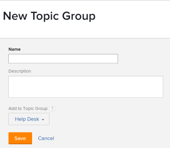

# Create Topic Groups

<!-- Audited: 2/2024 -->

Topic Groups are associated with Request Queues. They allow you to layer your Request Queues in multiple categories, depending on the nature of the requests.

## Access requirements

You must have the following:

<table style="table-layout:auto"> 
 <col> 
 <col> 
 <tbody> 
  <tr> 
   <td role="rowheader">Adobe Workfront plan</td> 
   <td> 
Any 
 </td> 
  </tr> 
  <tr> 
   <td role="rowheader"> 
Adobe Workfront license
 </td> 
   <td>   
      
New: Standard

      
Or
 
      
Current: Plan

 </td> 
  </tr> 
  <tr> 
   <td role="rowheader">Access level configurations</td> 
   <td> 
Edit access to Projects
 </td> 
  </tr> 
  <tr> 
   <td role="rowheader">Object permissions</td> 
   <td> 
 Manage permissions to the project
 </td> 
  </tr> 
 </tbody> 
</table>

For more detail about the information in this table, see [Access requirements in Workfront documentation](/help/quicksilver/administration-and-setup/add-users/access-levels-and-object-permissions/access-level-requirements-in-documentation.md).

## Overview of Topic Groups

For example, if you have a Request Queue for Marketing Requests, you can have a Topic Group of "Mother's Day Campaign", with a second-level Topic Group of "Digital Media", and an additional second-level Topic Group of "Print Media." Then, you can have multiple Queue Topics inside each Topic Group. For example, "Banner Ad" and "Blog" can be Queue Topics for the "Digital Media" Topic Group.

For more information about how to create Request Queues, see [Create a Request Queue](../../../manage-work/requests/create-and-manage-request-queues/create-request-queue.md).

>[!TIP]
>
>* You can create up to 10 tiers of Topic Groups within a Request Queue.
>* There is no limit to the number of Queue Topics that can be associated with a topic group. 
>* Topic groups are a reportable object.
>

## Create Topic Groups

We recommend that you create Topic Groups before you create a Queue Topic. However, a Topic Group can be created within in the Queue Topic builder. For more information about creating Queue Topics, see [Create Queue Topics](../../../manage-work/requests/create-and-manage-request-queues/create-queue-topics.md).

To create a Topic Group:

1. Go to the project that you published as a Help Request Queue.  
   For more information about publishing a project as a Help Request Queue, see [Create a Request Queue](../../../manage-work/requests/create-and-manage-request-queues/create-request-queue.md).

1. Click **Topic Groups** in the left panel. You might need to click **Show More**, then **Topic Groups**. 
1. Click **New Topic Group**.

   

1. Specify the following information:

   * **Name**: The name is visible to users who submit requests to this request queue. 
   * **Description**: The description displays when users select the topic group in the process of submitting a new request. 
   * **Add to Topic Group**: You can add the new Topic Group to an existing Topic Group, or you can add it directly to the project published as a Help Request Queue.

1. Click **Save**.  
   This creates a new Topic Group in your Request Queue. You can now select additional categories from the first drop-down menu under a Request Queue.  
   For more information about submitting requests, see [Create and submit Adobe Workfront requests](../../../manage-work/requests/create-requests/create-submit-requests.md).
