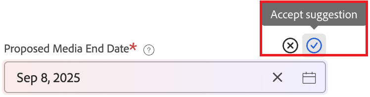

# Auto-fill a request from previous data

>[!NOTE]
>
>* This functionality will be available as an open beta on the following schedule:
>
>   * Monthly release: September 11, 2025
>   * Quarterly release: October 16, 2025

AI can help you auto-fill request fields based on previous requests. You can approve or reject these suggestions before submitting the request. 

Auto-fill does not overwrite any fields that you have already filled in.

Users do not receive suggestions of data that they do not otherwise have access to.

## Access requirements

+++ Expand to view access requirements for the functionality in this article.

You must have the following access to perform the steps in this article:

<table style="table-layout:auto"> 
 <col> 
 <col> 
 <tbody> 
  <tr> 
   <td role="rowheader">Adobe Workfront plan</td> 
   <td> 
Any 
 </td> 
  </tr> 
  <tr> 
   <td role="rowheader">Adobe Workfront license</td> 
   <td> 
New: Contributor or higher

   Or
   
Current: Request or higher

    </td> 
  </tr> 
  <tr> 
   <td role="rowheader">Access level configurations</td> 
   <td> 
Edit access to Issues
  </td> 
  </tr> 
   <td role="rowheader">Object permissions</td> 
   <td>
Access to add requests to a request queue
 
View or higher permissions on the existing request
 
For information on setting up a request queue, see <a href="../../../manage-work/requests/create-and-manage-request-queues/create-request-queue.md" class="MCXref xref">Create a Request Queue</a>. 
 </td> 
  <tr>
  </tr>
 </tbody> 
</table>

For more detail about the information in this table, see [Access requirements in Workfront documentation](/help/quicksilver/administration-and-setup/add-users/access-levels-and-object-permissions/access-level-requirements-in-documentation.md).

+++

## Get suggestions when filling out form 

Auto-fill can suggest field values while you are filling out the form. As you enter values into the request fields, Workfront compares those values with previous requests. If the entered value closely correlates with other field values in similar contexts in previous requests, Workfront suggests those values.

For example, if a clinic always uses the same billing code, Workfront would suggest that billing code in the appropriate field when the clinic name is entered.

To use suggestions based on previous requests:

1. Begin creating a request.

   For instructions, see [Create and submit requests](/help/quicksilver/manage-work/requests/create-requests/create-submit-requests.md).

1. Begin filling in fields.

   As you fill in fields, other fields may show suggestions.

1. For each field suggestion, select **Accept** or **Reject** for that field.

   

   Or

   Select **Accept all** or **Reject all** at the top of the page to accept or reject all suggestions. 

   >[!NOTE]
   >
   >Any unreviewed suggestions will be automatically accepted when you submit the request.
