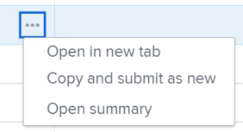

# Copy and submit requests

<!--The highlighted information on this page refers to functionality not yet generally available. It is available only in the Preview environment.-->

When you submit similar requests frequently you can copy an existing submitted request. In this case, you can copy an existing request, make minimal changes to it, and resubmit it as a new request.

## Access requirements

<!--drafted - replace table with P&P:

<table style="table-layout:auto"> 
 <col> 
 <col> 
 <tbody> 
  <tr> 
   <td role="rowheader">Adobe Workfront plan*</td> 
   <td> 
Any
 </td> 
  </tr> 
  <tr> 
   <td role="rowheader">Adobe Workfront license*</td> 
   <td>
Current license: Contributor or higher
 
   Or
   
Legacy license: Request or higher
 </td> 
  </tr> 
  <tr> 
   <td role="rowheader">Access level configurations*</td> 
   <td> 
Edit access to Issues
 
<b>NOTE</b> 
   
   If you still don't have access, ask your Workfront administrator if they set additional restrictions in your access level. For information on how a Workfront administrator can modify your access level, see <a href="../../../administration-and-setup/add-users/configure-and-grant-access/create-modify-access-levels.md" class="MCXref xref">Create or modify custom access levels</a>.
 </td> 
  </tr> 
  <tr> 
   <td role="rowheader">Object permissions</td> 
   <td> 
Access to add requests to a request queue
 
View or higher permissions on the existing request
 
For information on setting up a request queue, see <a href="../../../manage-work/requests/create-and-manage-request-queues/create-request-queue.md" class="MCXref xref">Create a Request Queue</a>. 
 </td> 
  </tr> 
 </tbody> 
</table>
-->
You must have the following access to perform the steps in this article:

<table style="table-layout:auto"> 
 <col> 
 <col> 
 <tbody> 
  <tr> 
   <td role="rowheader">Adobe Workfront plan*</td> 
   <td> 
Any
 </td> 
  </tr> 
  <tr> 
   <td role="rowheader">Adobe Workfront license*</td> 
   <td> 
Request or higher
 </td> 
  </tr> 
  <tr> 
   <td role="rowheader">Access level configurations*</td> 
   <td> 
Edit access to Issues
 
<b>NOTE</b> 
   
   If you still don't have access, ask your Workfront administrator if they set additional restrictions in your access level. For information on how a Workfront administrator can modify your access level, see <a href="../../../administration-and-setup/add-users/configure-and-grant-access/create-modify-access-levels.md" class="MCXref xref">Create or modify custom access levels</a>.
 </td> 
  </tr> 
  <tr> 
   <td role="rowheader">Object permissions</td> 
   <td> 
Access to add requests to a request queue
 
View or higher permissions on the existing request
 
For information on setting up a request queue, see <a href="../../../manage-work/requests/create-and-manage-request-queues/create-request-queue.md" class="MCXref xref">Create a Request Queue</a>. 
 </td> 
  </tr> 
 </tbody> 
</table>

&#42;To find out what plan, license type, or access you have, contact your Workfront administrator.

## Prerequisites

You must have a request that you or someone in your organization previously submitted to be able to copy it and resubmit it. If the request belongs to someone else, you must have at least access to View it to be able to copy and submit it as new.

## Considerations about copying and submitting requests as new

* You can only copy and submit submitted requests. You cannot copy drafted requests.
* You can copy and submit requests you originally submitted, or requests that others submitted and you have access to at least View.
* You always have access to copy and submit a copy of your own requests, unless someone removed your permissions to them.
* The access to copy and submit requests originally submitted by others might be granted automatically to people in the same company when the creator of the request queue enables the **People from the same company will inherit the same permissions for all requests** in the Queue Details or Edit Project areas. Disabling this setting allows only the original requestor to view their own requests.

  For more information, see the following articles:

   * [Create a Request Queue](../../../manage-work/requests/create-and-manage-request-queues/create-request-queue.md) 
   * [Edit projects](../../../manage-work/projects/manage-projects/edit-projects.md)

* You can update the copy of the original request before resubmitting it as a new request.
* If the following changes occur after the original request is submitted, you can no longer copy it and resubmit it:

   * The request queue was deleted.
   * The queue topic was deleted.

     >[!TIP]
     >
     >If the queue topic was the only one in the request queue, you can still copy and submit the request and it will be saved under the request queue itself.

   * The request queue is no longer published as a Help Request Queue. For information, see [Create a Request Queue](../../../manage-work/requests/create-and-manage-request-queues/create-request-queue.md).
   * If the request queue has no queue topic and the original request was submitted before January 2022.

   * The Status of the project associated with the request queue is no longer Current.

* You can copy and submit a copy of a converted request if the request was preserved in the conversion process. For more information, see [Overview of converting issues in Adobe Workfront](../../../manage-work/issues/convert-issues/convert-issues.md).

  >[!TIP]
  >
  >The copied request is not linked to a resolving object.

## Copy and submit requests

1. Click the **Main Menu** icon  in the upper-right corner of Adobe Workfront, then click **Requests**.
1. (Conditional) If the Submitted section does not display by default, click **Submitted** in the left panel.
1. Locate the request that you want to copy and submit as new, and do one of the following:

   * Select it, then click **Copy**  in the upper-left corner of the Submitted requests list. 

   >[!TIP]
   >
   > If you did not select a request first, the Copy icon is dimmed. 

   * Click the **More** menu  to the right of the request name, then click **Copy and submit as new** 

     Or

     Right-click on the selected request, then click **Copy and submit as new**.

     

     >[!TIP]
     >
     >When you do not have access to create issues, you receive a warning that your administrator restricted you from creating requests.

1. (Optional) Update the following information, if needed:

   * **Request Type**: the request queue where the copied request is saved. By default, the copied request is saved to the request queue of the original request.
   * **Topic Groups** and **Queue&nbsp;Topics**, if they are selected. The names or topic groups and queue topics are customized for your environment. By default, the copied request is saved to the topic groups and the queue topics of the original request.

     >[!TIP]
     >
     >If the path changes from the path of the original request, then the creator of the request queue modified the queue.

1. (Optional) Update any information from the copied request. Depending on what fields the request queue creator enabled in the **New Issue Fields** section of the **Queue Details**&nbsp;subtab on the project, you might find&nbsp;any of the following fields:

   <table style="table-layout:auto"> 
    <col> 
    <col> 
    <tbody> 
     <tr> 
      <td role="rowheader"><strong>Subject</strong> </td> 
      <td>Displays the name of the original request. Update it, if necessary.&nbsp;Otherwise, Workfront names the copied request <b>Copy of &lt;Name of original request&gt;</b>. This is a mandatory field.</td> 
     </tr> 
     <tr> 
      <td role="rowheader"><strong>Description</strong> </td> 
      <td>Displays the description of the original request. Update it, if necessary.</td> 
     </tr> 
     <tr> 
      <td role="rowheader"><strong>URL</strong> </td> 
      <td> 
Displays the URL of the original request. Update it, if necessary.
 </td> 
     </tr> 
     <tr> 
      <td role="rowheader"><strong>Priority</strong> </td> 
      <td> 
Specify the priority of your request. The priority should define how fast you think this request should be resolved. The default&nbsp;options are:
 
       <ul> 
        <li>None</li> 
        <li>Low</li> 
        <li>Normal</li> 
        <li>High</li> 
        <li>Urgent</li> 
       </ul> 
Your Workfront administrator can modify the names of priorities.
 </td> 
     </tr> 
     <tr> 
      <td role="rowheader"><strong>Severity</strong> </td> 
      <td> 
Specify the severity for your request. The severity should define the impact this request has on your work should it not be resolved in time. The default&nbsp;options are:
 
       <ul> 
        <li>Cosmetic</li> 
        <li>Causes Confusion</li> 
        <li>Bug with workaround</li> 
        <li>Bug with no workaround</li> 
        <li>Fatal error</li> 
       </ul> 
Your Workfront administrator can modify the names of severities.
 </td> 
     </tr> 
     <tr> 
      <td role="rowheader"><strong>Primary Contact</strong> </td> 
      <td>The Primary Contact of a request defaults to you, as you are the point person to address any questions pertaining to the request. However, you can change this to any other Workfront user.</td> 
     </tr> 
     <tr data-mc-conditions=""> 
      <td role="rowheader"><strong>Assignments</strong> </td> 
      <td> 
Indicate the name of an active user, job role, or team that the request should be assigned to. 
 
 You can specify more than one user, job role, or team. 
 
Depending on how the request queue was set up, you might be able to only assign the request to one or two types of resources, instead of all three. 
 
We recommend using Routing Rules for your Request Queues so that they can be automatically routed to the appropriate resources. 
 </td> 
     </tr> 
     <tr> 
      <td role="rowheader" colspan="2"> 

Depending on how the request queue was set up, you might be able to only assign one type of resource to the request (for example, users). If a routing rule is also associated to the request queue and it automatically routes the request to a different type of resource (for example, a team), your request is assigned to both the entity that you manually specify when submitting the request (users) and the resource specified in the routing rule (the team.)
 
For more information, see the following articles:
 
        <ul> 
         <li> 
<a href="../../../manage-work/requests/create-and-manage-request-queues/create-request-queue.md" class="MCXref xref">Create a Request Queue</a> 
 </li> 
         <li> 
<a href="../../../manage-work/requests/create-and-manage-request-queues/create-routing-rules.md" class="MCXref xref">Create Routing Rules</a>   
 </li> 
        </ul> 
 </td> 
     </tr> 
     <tr> 
      <td role="rowheader"><strong>Planned Hours</strong> </td> 
      <td> 
Estimate how many hours it would take for this request to complete.
 </td> 
     </tr> 
     <tr> 
      <td role="rowheader"><strong>Planned Start Date</strong> </td> 
      <td> 
The date when work on this request should start.
 </td> 
     </tr> 
     <tr> 
      <td role="rowheader"><strong>Planned Completion Date</strong> </td> 
      <td>The date when you would like for this request to be resolved.</td> 
     </tr> 
     <tr> 
      <td role="rowheader"><strong>Status</strong> </td> 
      <td>The default status of a new request is "New." Your Workfront administrator might have changed the name of this&nbsp;status. You can also change the status to something else from this drop-down menu.</td> 
     </tr> 
     <tr> 
      <td role="rowheader"><strong>Documents</strong> </td> 
      <td> 
Add documents to your request. The documents attached to the original request do not transfer to the copied request.
 
<b>TIP</b> 
      
      Depending on how the request queue was set up, the Documents section might display before or after the custom fields.
 
 
 </td> 
     </tr> 
    </tbody> 
   </table>

1. (Optional) Update any information in the custom forms attached, if needed.

   >[!TIP]
   >
   >* All custom forms attached to the original request and the values included in the custom fields transfer to the copied request. This includes fields that contain logic.
   >* You cannot remove custom forms from the copied request.

1. Click **Submit**.

   The copied request is submitted as a new request in the request queue you specified.
