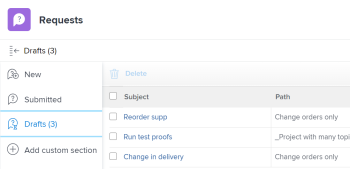

# Create requests from drafts

In addition to using the available drafts that Workfront suggests to you when you enter a new request, you can also access a draft request from the Drafts section and finish submitting it from there.

## Access requirements

+++ Expand to view access requirements for the functionality in this article.

You must have the following access to perform the steps in this article:

<table style="table-layout:auto"> 
 <col> 
 <col> 
 <tbody> 
  <tr> 
   <td role="rowheader">Adobe Workfront plan</td> 
   <td> 
Any 
 </td> 
  </tr> 
  <tr> 
   <td role="rowheader">Adobe Workfront license</td> 
   <td> 
New: Contributor or higher

   Or
   
Current: Request or higher

    </td> 
  </tr> 
  <tr> 
   <td role="rowheader">Access level configurations</td> 
   <td> 
Edit access to Issues
  </td> 
  </tr> 
 </tbody> 
</table>

For more detail about the information in this table, see [Access requirements in Workfront documentation](/help/quicksilver/administration-and-setup/add-users/access-levels-and-object-permissions/access-level-requirements-in-documentation.md).

+++

## Prerequisites for creating requests from drafts

You must do the following before you can create a request from a draft:&nbsp;

* Start creating a request. This saves the request as a draft automatically in the Drafts section.

  For information about creating requests, see [Create and submit Adobe Workfront requests](../../../manage-work/requests/create-requests/create-submit-requests.md).

## Create requests from drafts

{{step1-to-requests}}

1. Select **Drafts** in the left panel.

   A draft for each queue topic of each request queue displays in this list.

   

1. (Optional) Click a column header to sort the list by that column. 

1. Review the information about each draft in the following columns of the Drafts list:

   | Subject |This is the name you gave your request as you started to create it.  |
   |---|---|
   | Path |The name of the request queue, topic groups, and queue topics where you originally intended to submit the request. |
   | Entry Date |The date when you initiated creating the request. |
   | Last Update Date |The last of your last update. If you did not update it since you first started the request the Entry Date and the Last Update Date should be the same.  |

   {style="table-layout:auto"}

1. (Optional) Using the quick filter in the upper-right corner of the Drafts list, start typing the name of a drafted request, request queue, queue topic, or topic group, then click the name of a draft to open it.

   >[!TIP]
   >
   >You cannot apply permanent filters in the Drafts section of the Requests area. Additionally, there are no options to modify or change the view of the drafts list.  

1. Update the information for the request as described in [Create and submit Adobe Workfront requests](../../../manage-work/requests/create-requests/create-submit-requests.md).
1. (Optional and conditional) At any point during entering the request, click **Discard** draft if you want to delete the draft. This deletes the draft which cannot be recovered. For more information about deleting drafts, see [Delete a request draft](../../../manage-work/requests/create-requests/delete-request-draft.md). 

1. (Optional) Click **Cancel** in the lower-left corner of the page if you want to revert your action and keep the draft.

1. After completing the information for the request, do one of the following:

   * Click **Submit** if you are ready to submit the request. The request is saved in the Submitted section. Depending on the Routing Rule of the Request Queue, this request might be routed to a different project than the one designated as a Request Queue. For information about routing rules, see [Create Routing Rules](../../../manage-work/requests/create-and-manage-request-queues/create-routing-rules.md).

     Or

     Click **Close** if you are not quite ready to submit it and you might come back and finish it later. Your request is saved in the Drafts section  and it will be available to you next time you submit a request for this request queue.

     

     When you submit the request, the draft is deleted and cannot be restored.
