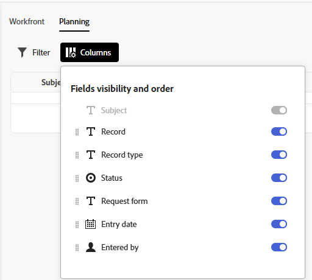

# Create or edit views in the Requests area

The information on this page refers to functionality not yet generally available. It is available only in the Preview Sandbox environment.

If you are using the new requesting experience, you can create and save views for the Requests area. These views include filters and column arrangements. 

## Access requirements

+++ Expand to view access requirements for the functionality in this article.

<table style="table-layout:auto"> 
 <col> 
 <col> 
 <tbody> 
 <tbody> 
  <tr> 
   <td role="rowheader">Adobe Workfront package</td> 
   <td> 
Any 
 </td> 
  </tr> 
  <tr> 
   <td role="rowheader">Adobe Workfront license</td> 
   <td> 
Contributor or higher

   
Request or higher

    </td> 
  </tr> 
  <tr> 
   <td role="rowheader">Access level configurations</td> 
   <td> 
Edit access to Issues
  
You must be a Workfront administrator to add views to layout templates</td> 
  </tr> 
  <tr> 
   <td role="rowheader"> Product</td> 
   <td> <ul><li>Adobe Workfront</li><li>You must have Adobe Workfront Planning to view Planning requests or request forms</td> 
  </tr> 
 </tbody> 
</table>

For more detail about the information in this table, see [Access requirements in Workfront documentation](/help/quicksilver/administration-and-setup/add-users/access-levels-and-object-permissions/access-level-requirements-in-documentation.md).

+++

## Create a view in the Requests area

{{step1-to-requests}}

1. (Optional and conditional) Select the **Switch to new experience** setting in the upper-right of the screen, if the following things apply to your organization and your Workfront instance: 

    * Your organization has purchased a Workfront package
    * Your organization has been onboarded to the Adobe Unified Experience. 
    * Your administrator has granted you access to Workfront Planning
    * You have at least view permissions to a Workfront Planning workspace

    For more information, see [Submit Adobe Workfront Planning requests to create records](/help/quicksilver/planning/requests/submit-requests.md)

1. Click the **Views** dropdown  and select **New view**.

   

1. Enter a name for the new view, and click **Create**.
1. Continue to [Edit a view in the Requests area](#edit-a-view-in-the-requests-area).

## Edit a view in the Requests area

You can edit existing views, including views you have just created.

{{step1-to-requests}}

1. (Optional and conditional) Select the **Switch to new experience** setting in the upper-right of the screen, if the following things apply to your organization and your Workfront instance: 

    * Your organization has purchased a Workfront package
    * Your organization has been onboarded to the Adobe Unified Experience. 
    * Your administrator has granted you access to Workfront Planning
    * You have at least view permissions to a Workfront Planning workspace

    For more information, see [Submit Adobe Workfront Planning requests to create records](/help/quicksilver/planning/requests/submit-requests.md)1. 

1. (Optional) To rename a view, click the **Views** dropdown  and click the three-dot menu next to the view, select **Rename**, then type in the new name for the view.
1. Click the **Views** dropdown  and select the view you want to edit.
1. (Optional) Click **Filters** and start adding conditions for what requests you want to view in the Planning tab. 

    

    You can filter by the following fields:  

    * **Workspace**: The workspace the request form is associated with.
    * **Record type**: The record type the request form is associated with.
    * **Entry date**: The date when the request was submitted.
    * **Request form**: The name of the request form used to submit the request.
    * **Status**: The status of the request.
    * **Entered by**: The name of the user who added the request. If the request was added by someone outside of Workfront, the **Entered by** field shows `N/A`.

    You can have multiple filters joined by either **And** or **Or**.
    The request list is filtered automatically, as you add the filter conditions. 
 
1. (Optional) Click **Columns** and hide, show, or rearrange the columns in the request list.  

    

    >[!TIP]
    >
    >You cannot add any more columns.  

[!IMPORTANT]
>
> * Changes to views are saved automatically.
> * Changes to views are visible to anyone that uses the view.

## Add the view to a layout template.

A Workfront dministrator can add the new view to layout templates.

For instructions, see [Customize Filters, Views, and Groupings using a layout template](/help/quicksilver/administration-and-setup/customize-workfront/use-layout-templates/customize-fvg-list-controls-layout-template.md).
