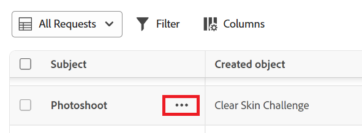

# Delete a Submitted Request re Request Draft

The highlighted information on this page refers to functionality not yet generally available. It is available only in the Preview environment for all customers, or in the Production environment for customers who enabled fast releases.

You can delete submitted requests or request drafts that you created in the new requesting experience. Workfront administrators and Planning workspace administrators can also delete requests.

In the legacy requesting experience, you can delete request drafts. You cannot delete submitted requests.

For information, see:

* [Create and submit Adobe Workfront requests](../../../manage-work/requests/create-requests/create-submit-requests.md) 
* [Create requests from drafts](../../../manage-work/requests/create-requests/create-requests-from-drafts.md)

You can delete drafted requests after they are saved as drafts if you no longer find them relevant. You cannot recover deleted draft requests.

## Access requirements

+++ Expand to view access requirements for the functionality in this article.

<table style="table-layout:auto"> 
 <col> 
 <col> 
 <tbody> 
  <tr> 
   <td role="rowheader">Adobe Workfront package</td> 
   <td> 
Any 
 </td> 
  </tr> 
  <tr> 
   <td role="rowheader">Adobe Workfront license</td> 
   <td> 
Contributor or higher

   
Request or higher

    </td> 
  </tr> 
  <tr> 
   <td role="rowheader">Access level configurations</td> 
   <td> 
You must be a Workfront administrator or Planning workspace administrator to delete requests that you did not create.

You must have edit access to Issues to delete drafts in the legacy requesting experience.
  </td> 
  </tr> 
  <tr> 
   <td role="rowheader">Object permissions</td> 
   <td> 
You must have created the request or draft to delete it in the new requesting experience.

You must have edit access to Issues to delete drafts in the legacy requesting experience.
  </td> 
  </tr> 
  <tr> 
   <td role="rowheader"> Product</td> 
   <td> <ul><li>Adobe Workfront</li><li>You must have Adobe Workfront Planning to view Planning requests or request forms</td> 
  </tr> 
 </tbody> 
</table>

For information, see [Access requirements in Workfront documentation](/help/quicksilver/administration-and-setup/add-users/access-levels-and-object-permissions/access-level-requirements-in-documentation.md). 

+++

## Delete  requests or request drafts in the new requesting experience

You can delete requests in the Requests area of Workfront, or in the My Requests widget in Home.

* Workfront administrators can delete requests and drafts in their organization.
* Workfront Planning workspace administrators can delete requests and drafts in the Planning workspace that they administer.
* Users can delete requests and drafts that they submitted.

To delete a request or draft in the new requesting experience:

1. To access the Requests list, click the **[!UICONTROL Main Menu]** icon  in the upper-right corner of Adobe Workfront, or (if available), click the **[!UICONTROL Main Menu]** icon  in the upper-left corner, then click **[!UICONTROL Requests]**.

1. To access the My Requests widget in Home:
   
   1. Click the **[!UICONTROL Main Menu]** icon  in the upper-right corner of Adobe Workfront, or (if available), click the **[!UICONTROL Main Menu]** icon  in the upper-left corner, then click **[!UICONTROL Home]**.
   1. Locate the My Requests widget. 

      For more information on the My Requests widget, see [Use the My Requests widget](/help/quicksilver/workfront-basics/using-home/using-the-home-area/my-requests-widget.md).

1. In the Requests list or the My Requests widget, hover over the request or draft that you want to delete.

   A three-dot More menu appears.
    

1. Click the **More** menu to the right of the request or draft name, then click **Delete**. 

     Or

     Right-click on the selected request, then click **Delete**.

     >[!TIP]
     >
     >When you do not have access to create issues, you receive a warning that your administrator restricted you from creating requests.

1. In the dialog that opens, click **Delete**.

   The request or draft is deleted.

## Delete request drafts in the legacy requesting experience

### Prerequisites for deleting request drafts

You must do the following before you can delete&nbsp;a request draft:

* Start creating a request. This saves the request as a draft automatically in the Drafts section .

  For information about creating requests, see [Create and submit Adobe Workfront requests](../../../manage-work/requests/create-requests/create-submit-requests.md).

### Delete a request draft

{{step1-to-requests}}

1. Select **Drafts** in the left panel.

   All drafts for all request queues display in this list. 

1. (Optional) Click **Filter by request type** in the upper-right corner of the list of drafts, then select the request queue that contains the drafts you want to display. 
1. Select a draft in the list, then click **Delete** at the top of the list.
1. Click **Yes, Delete it**.

   The draft is deleted and cannot be recovered.
