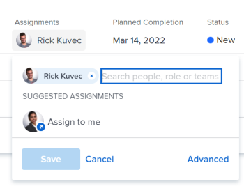

# Assign tasks

{{highlighted-preview}}

You can assign tasks to users, job roles, or teams to indicate who is responsible for completing the tasks. You can assign a task to more than one resource at a time.

>[!TIP]
>
>You can assign multiple users, job roles, or teams. You can assign only active users, job roles, and teams.
>
>If a user, job role, or a team was assigned before they were deactivated, they remain assigned to the work item. In this case, we recommend the following: 
>
>* Reassign the work item to active resources. 
>* Associate the users in a deactivated team with an active team and reassign the work item to the active team. 
>

The number of users assigned to a task and the schedule of the task Owner can modify the planned dates of a task which results in changing the timeline of the project. For information about the impact of assigning multiple users to a task, see [Overview of modifying task assignments](../../../manage-work/tasks/assign-tasks/modify-task-assignments-overview.md).

In addition to this article, we recommend that you read the following articles for more information about assigning tasks:

* [Overview of modifying task assignments](../../../manage-work/tasks/assign-tasks/modify-task-assignments-overview.md) 
* [Smart assignments overview](../../../manage-work/tasks/assign-tasks/smart-assignments.md) 
* [Make smart assignments](../../../manage-work/tasks/assign-tasks/make-smart-assignments.md) 
* [Create advanced assignments](../../../manage-work/tasks/assign-tasks/create-advanced-assignments.md) 
* [Modify multiple user assignments in a task list](../../../manage-work/tasks/assign-tasks/modify-multiple-assignments-in-task-list.md) 
* [Edit tasks](../../../manage-work/tasks/manage-tasks/edit-tasks.md) 
* [Plan a project overview](../../../manage-work/projects/planning-a-project/plan-project.md) 
* [Overview of the task Planned Completion Date](../../../manage-work/tasks/task-information/task-planned-completion-date.md) 
* [Set the project Planned Completion Date](../../../manage-work/projects/planning-a-project/project-planned-completion-date.md) 
* [Configure system-wide project preferences](../../../administration-and-setup/set-up-workfront/configure-system-defaults/set-project-preferences.md) 
* [Overview of assigning work in the Workload Balancer](../../../resource-mgmt/workload-balancer/assign-work-in-workload-balancer.md)

## Access requirements

<!--drafted for P&P - replace table below with this:

<table style="table-layout:auto"> 
 <col> 
 <col> 
 <tbody> 
  <tr> 
   <td role="rowheader">Adobe Workfront plan*</td> 
   <td> 
Any
 </td> 
  </tr> 
  <tr> 
   <td role="rowheader">Adobe Workfront license*</td> 
   <td> 
Current license: Standard
 
   Or
   
Legacy license: Work or higher

   </td> 
  </tr> 
  <tr> 
   <td role="rowheader">Access level configurations*</td> 
   <td> 
Edit access to Projects and Tasks
 
View or higher access to Users
 
<b>NOTE</b>
   
   If you still don't have access, ask your Workfront administrator if they set additional restrictions in your access level. For information on how a Workfront administrator can modify your access level, see <a href="../../../administration-and-setup/add-users/configure-and-grant-access/create-modify-access-levels.md" class="MCXref xref">Create or modify custom access levels</a>.
 </td> 
  </tr> 
  <tr> 
   <td role="rowheader">Object permissions</td> 
   <td> 
Contribute or higher permissions to tasks
 
For information on requesting additional access, see <a href="../../../workfront-basics/grant-and-request-access-to-objects/request-access.md" class="MCXref xref">Request access to objects </a>.
 </td> 
  </tr> 
 </tbody> 
</table>

-->

You must have the following access to perform the steps in this article:

<table style="table-layout:auto"> 
 <col> 
 <col> 
 <tbody> 
  <tr> 
   <td role="rowheader">Adobe Workfront plan*</td> 
   <td> 
Any
 </td> 
  </tr> 
  <tr> 
   <td role="rowheader">Adobe Workfront license*</td> 
   <td> 
Work or higher
 </td> 
  </tr> 
  <tr> 
   <td role="rowheader">Access level configurations*</td> 
   <td> 
Edit access to Projects and Tasks
 
View or higher access to Users
 
<b>NOTE</b>
   
   If you still don't have access, ask your Workfront administrator if they set additional restrictions in your access level. For information on how a Workfront administrator can modify your access level, see <a href="../../../administration-and-setup/add-users/configure-and-grant-access/create-modify-access-levels.md" class="MCXref xref">Create or modify custom access levels</a>.
 </td> 
  </tr> 
  <tr> 
   <td role="rowheader">Object permissions</td> 
   <td> 
Contribute or higher permissions to tasks
 
For information on requesting additional access, see <a href="../../../workfront-basics/grant-and-request-access-to-objects/request-access.md" class="MCXref xref">Request access to objects </a>.
 </td> 
  </tr> 
 </tbody> 
</table>

*To find out what plan, license type, or access you have, contact your Workfront administrator.

## Considerations for multiple assignments to job roles, teams, and users

Consider the following when assigning multiple resources to a work item:

* Users can have more than one job role associated with their profile. For information about associating users with job roles, see [Edit a user's profile](../../../administration-and-setup/add-users/create-and-manage-users/edit-a-users-profile.md).

* If you assign more than one user to a task or issue, the first one user you select is designated automatically as the owner of the task or issue.
  For instructions on changing this, see the information about the Make Primary option in the article [Create advanced assignments](create-advanced-assignments.md).

* A team cannot be a Primary assignee on a task or issue. Only a user or a job role can be designated as a Primary on a task or issue. 

<!-- If a task is assigned to multiple teams, the primary team sees the Work On It button. waiting on team to verify if this is true. (Courtney)
You cannot make a team be a Primary on a task/ issue. (Alina) -->

* Tasks and issues on a project might be assigned first to one or more teams or job roles. When the project is ready to start, they might need to also be assigned to users:

  <table>
  <col> 
  <col> 
  <tbody>
  <tr>
   <td>Teams</td>
   <td>If you assign a task to a team and you also assign a user, the task remains assigned to the team and to the user, even if the user is not a member of the team.</td>
  </tr>
  <tr>
   <td>Job roles</td>
   <td>
If you assign a task or an issue to one or multiple roles and then you also assign a user, decides which job role to associate with the additional user (if any) according to the following rules:

     <ul>
      <li>If there is only one job role assigned and it matches the user's primary role (configured in their profile), the task or issue is assigned only to that user.</li>
      <li>If multiple roles are assigned and at least one of them matches one of the user's other roles, the task or issue is assigned to the user (the role is selected randomly if there are multiple matches), along with any additional roles that are assigned</li>
      <li>If at least one job role is assigned and there are no matches to the user's job roles, the task or issue is assigned to both the role or roles and to the user.</li>
     </ul>
   
For information about a user's primary role and other roles, see <a href="../../../administration-and-setup/add-users/create-and-manage-users/edit-a-users-profile.md">Edit a user's profile</a>.

   </td> 
     </tr>
  </tbody>
  </table> 

<!--

<h2>Considerations for multiple user assignments and using schedules</h2>

(NOTE: moved to the Modify task assignments overview standalone article)

You can assign multiple resources to a task. When you assign a user to a task, Workfront uses the user's schedule to calculate the planned dates for the task which ultimately determine the timeline of the project. Using the schedule of the user takes into account their time off, holidays, and weekend days which are considered non-working days when task activity cannot occur. 

When you assign multiple users to a task, your Workfront administrator or a group administrator determines which one of the following schedules Workfront uses to determine the planned dates of the tasks, based on schedules: 

<ul>
<li> 
<strong>The Primary Assignee's schedule</strong>: this is the schedule associated with the user designated as the task Owner.
 
For information about associating users with schedules, see <a href="../../../administration-and-setup/add-users/create-and-manage-users/edit-a-users-profile.md" class="MCXref xref">Edit a user's profile</a>.
 </li>
<li><strong>The Project's schedule</strong>: this is the schedule associated with the project. For adding a schedule to a project, see <a href="../../../manage-work/projects/manage-projects/edit-projects.md" class="MCXref xref">Edit projects</a>.</li>
</ul>

For information about setting up which schedule a project uses in the case of multiple assignments, see <a href="../../../administration-and-setup/set-up-workfront/configure-system-defaults/set-project-preferences.md" class="MCXref xref">Configure system-wide project preferences</a>. 

-->

## Assign a single task

1. Go to a task that you want to assign.
1. Click **Assign to** in the **Assignments** field in the header of the task or issue.

   Or

   Click the name of the assignments if the task or issue is already assigned.

   

1. Do one of the following:

   * Start typing the name of a user, role, or team that you want to assign, then click it when it appears on the list.

    
      >[!TIP]
      >
      >When adding a user assignment, notice the avatar, the user's Primary Role, or their email address to distinguish between users with identical names. Users must be associated with at least one job role to view it as you add them.
      >
      >When adding a job role assignment, you can search for the job role or location. Select the System/Default Job Role to use the default billing rate for the assignment, or select a Rate Card Job Role to use the billing rate from the rate card. For more information on rate cards, see [Manage rate cards](/help/quicksilver/administration-and-setup/set-up-workfront/configure-system-defaults/manage-rate-cards.md).

      
   * (Conditional) Click one of the names in the **Suggested assignments** list, if this list displays. For more information, see [Smart assignments overview](../../../manage-work/tasks/assign-tasks/smart-assignments.md). 
   
   * Click **Advanced**

     For information about how to make advanced assignments, see [Create advanced assignments](../../../manage-work/tasks/assign-tasks/create-advanced-assignments.md).

1. Click **Save**.
1. (Optional and conditional) Click the **X icon** next to the name of the assignment in the right panel of the task to remove an assignment, if you clicked **Advanced**.

## Assign a task in a list

You can assign tasks in a list or a report when any of the assignments fields are visible in the list's view. This is a faster way to assign tasks. This article describes how to modify assignments for one task in a list. For information about modifying multiple assignments for multiple tasks in a list, see [Modify multiple user assignments in a task list](../../../manage-work/tasks/assign-tasks/modify-multiple-assignments-in-task-list.md).

Depending on which field is visible in the view, you can assign the following entities to the task: 

| Field |Entities assigned  |
|---|---|
| **Assign To** |Assign one user  |
| **Assigned** |Assign one user |
| **Assignments** |Assign users, job roles, or teams |

To assign tasks in a list:

1. Go to a list of tasks that has the Assigned To, Assigned, or Assignments fields in the view.
1. (Optional) Click the **Autosave** drop-down menu and select from the following options: 

   | Option |Option description |
   |---|---| 
   | Autosave |Changes you make to the tasks are automatically saved and you cannot revert them |
   | Manual save |You must manually save your changes. You can revert your changes before you save them.  |
   | Timeline Planning |You must manually save your changes. You can revert your changes before you save them. Saving your changes and all the project dependencies is faster than when selecting Manual save.  |

      For more information about saving tasks as you edit them in a list, see [Edit tasks in a list](../../../manage-work/tasks/manage-tasks/edit-tasks-in-a-list.md).

1. To assign tasks do one of the following:

   * Click inside the **Assigned To** or **Assigned** fields and start typing the name of an active user that you want to assign to the task, then click it when it displays in the list.
   * Click inside the **Assignments** field and start typing the name of an active user, job role, or team that you want to assign to the task, then click it when it displays in the list.

      >[!TIP]
      >
      >When adding a user assignment, notice the avatar, the user's Primary Role, or their email address to distinguish between users with identical names. Users must be associated with at least one job role to view it as you add them.
      >
      >When adding a job role assignment, you can search for the job role or location. Select the System/Default Job Role to use the default billing rate for the assignment, or select a Rate Card Job Role to use the billing rate from the rate card. For more information on rate cards, see [Manage rate cards](/help/quicksilver/administration-and-setup/set-up-workfront/configure-system-defaults/manage-rate-cards.md).

1. (Conditional) When visible in the **Assignments** field, click the **People** icon  in the upper-right corner of the assignments box to open the **Advanced Assignments** box and create advanced assignments.

   <!--
   there is a People icon in NWE but it's hard to see - you need to assign the task to at least 2 users, not roles, or teams, before it shows up

   -->

   For more information, see [Create advanced assignments](../../../manage-work/tasks/assign-tasks/create-advanced-assignments.md).

   >[!TIP]
   >
   >You cannot make advanced assignments from the Assigned To or Assigned fields.

1. After adding your assignees to the task, press Enter or click anywhere on the page to save your changes if you selected Autosave. Otherwise, click **Save**.

## Assign multiple tasks to a user

1. Go to a list of tasks that you want to assign in bulk. 
1. (Conditional) Ensure that the **Autosave** option is selected if you are on a list of tasks under a project.

   >[!IMPORTANT]
   >
   >You cannot edit tasks in bulk when saving tasks manually on a project.

1. Select several tasks in the tasks list. 
1. Click **Edit**.

   The **Edit Tasks** dialog box opens.

1. In the **Assignments** area, select the **Assignee** box, then start typing the name of a user, job role, or team that you want to assign to all the tasks.

   >[!IMPORTANT]
   >
   >If any of the tasks is already assigned, the resources you indicate here are added to the tasks instead of replacing the existing resources on the tasks. 

1. (Optional) Select the radio button in the **Task Owner** column to indicate which resource is the primary assignee or the Owner of the task, when you assign more than one resource to the task. This is not available for teams. 
1. (Conditional) Specify the **Allocation %** for each resource assigned to the task if all the tasks you selected have a Duration Type of Effort Driven or Calculated Assignment. This indicates how much of their time these resources should spend on completing the task. This is only available for users and job roles.

   Or

   Specify the amount of **Hours** for each resource assigned to the task if all the tasks you selected have a Duration Type of Simple. The total of all hours for all resources should equal the number of Planned Hours for the task.

   >[!IMPORTANT]
   >
   >You cannot specify the allocation percentage or the number of hours per resource if the tasks you selected have different Duration Types or of the tasks you selected have different Duration Types.

   For information about Duration Type on tasks, see [Overview of Task Duration and Duration Type](../../../manage-work/tasks/taskdurtn/task-duration-and-duration-type.md).

1. (Optional) Select a role that the user should fulfill on the task from the **Pick a role** drop-down menu in the **Assignee's Role** column when you assign users to tasks. If you do not select a role, Workfront automatically selects the user's Primary Role. 

1. (Optional) If you want to remove existing assignees from all tasks do one of the following:

   1. Start typing the name of a user, role, or team you want to remove from the task, then select it when it appears on the list and click **Remove Assignee** to remove more assignees.
   1. Click **Remove All Existing Assignees** to remove all assignees from all selected tasks.

1. Click **Save Changes**.
1. (Optional and conditional) When the Assigned to or the Assignments fields display in your list of tasks, click inside one of these columns for a task, then click the **X icon** next to the name of an assignee to remove it from the task.

<!--

<h2>Considerations about unassigning tasks</h2>

(NOTE: moved this to the new article: /Content/Manage work/Tasks/Assign tasks/modify-task-assignments-overview.htm)

You can remove assignments from one task at a time, or you can remove assignments from multiple tasks in bulk.

For more information about removing assignments from tasks in bulk, see <a href="../../../manage-work/tasks/assign-tasks/modify-multiple-assignments-in-task-list.md" class="MCXref xref">Modify multiple user assignments in a task list</a>. 

Consider the following when removing assignments from tasks: 

<ul>
<li>When you unassign a user from a task, the task remains assigned to the job role that the user fulfilled on the task.</li>
<li>When you unassign a job role or a team from a task, the task remains unassigned if it is not assigned to any other resources. </li>
</ul>

-->

