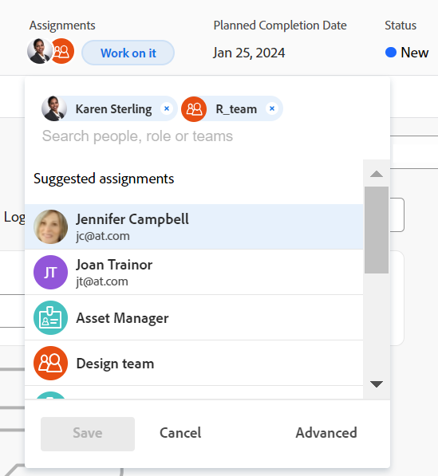
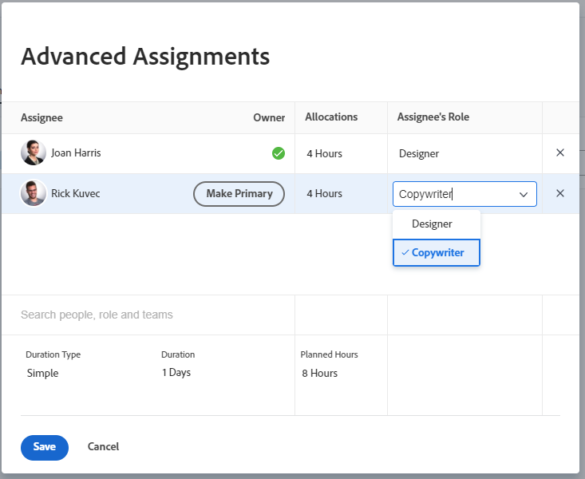

# Create advanced assignments

You can manage task or issue assignments by using Advanced Assignments.

You can adjust the following assignment information when making advanced assignments:

* Assign users to the task or issue (this can be accomplished outside of an advanced assignment).
* Adjust and redistribute the number of hours each assignee is allocated.
* Determine which user should be designated as the owner or the Primary assignee of the task or issue.
* Specify which role each user is fulfilling when working on the task or issue.
<!--* Override the billing rate for a job role.-->

>[!NOTE]
>
>When assigning users to work, their availability according to their schedules affects the Planned and Projected Dates of tasks and issues. For information about schedules, see [Create a schedule](../../../administration-and-setup/set-up-workfront/configure-timesheets-schedules/create-schedules.md).

## Areas of Adobe Workfront where you can make advanced assignments

This article describes how to access Advance Assignments in the task or issue's header.

In addition, you can make advanced assignments in the following areas of Workfront:

* In lists and reports when the Assignments field displays in the view.
* In the Assignments section when editing a task. For more information, see [Edit tasks](../../../manage-work/tasks/manage-tasks/edit-tasks.md).
* In the task or issue header, in the Assignments area.
* In the Workload Balancer. For more information, see [Assign work manually using the Workload Balancer](../../../resource-mgmt/workload-balancer/assign-work-in-workload-balancer-manually.md).

## Access requirements

You must have the following access to perform the steps in this article:

<table style="table-layout:auto"> 
 <col> 
 <col> 
 <tbody> 
  <tr> 
   <td role="rowheader">Adobe Workfront plan*</td> 
   <td> 
Any
 </td> 
  </tr> 
  <tr> 
   <td role="rowheader">Adobe Workfront license*</td> 
   <td> 
Work or higher
 </td> 
  </tr> 
  <tr> 
   <td role="rowheader">Access level configurations*</td> 
   <td> 
Edit access to Tasks and Issues
 
<b>NOTE</b>
   
   If you still don't have access, ask your Workfront administrator if they set additional restrictions in your access level. For information on how a Workfront administrator can modify your access level, see <a href="../../../administration-and-setup/add-users/configure-and-grant-access/create-modify-access-levels.md" class="MCXref xref">Create or modify custom access levels</a>.
 </td> 
  </tr> 
  <tr> 
   <td role="rowheader">Object permissions</td> 
   <td> 
Contribute or higher permissions to a the task or issue
 
For information on requesting additional access, see <a href="../../../workfront-basics/grant-and-request-access-to-objects/request-access.md" class="MCXref xref">Request access to objects </a>.
 </td> 
  </tr> 
 </tbody> 
</table>

&#42;To find out what plan, license type, or access you have, contact your Workfront administrator.

## Make advanced assignments

1. Go to the project where you want to assign a task or an issue. 
1. Click **Tasks** or **Issues** in the left panel, then click the name of a task or issue in the list.

   >[!TIP]
   >
   >You can make advanced assignments directly on the task or issue list if there are two or more people assigned. Click inside the **Assignments** field on the same line as the task or issue, then click the **People icon** to open the Advanced Assignments window. Skip to step 5 to continue creating advanced assignments.  
   >
   >

1. Click **Assign to** in the **Assignments** field in the header of the task or issue

   Or

   Click the name of the assignments if the task or issue is already assigned. 

1. Click **Advanced**.

   

1. In the **Search people, role and teams** field, start typing the name of a user, role, or team then click the name when it appears in the drop-down list.

   >[!NOTE]
   >
   >If the user's name contains a special character, you must include the special character in the search field.

1. (Optional) Continue adding assignees in the **Search people, role or teams** box to add multiple resources to the task or issue.

   >[!TIP]
   >
   >* You can assign multiple users, job roles, or teams. You can assign only active users, job roles, and teams.
   >
   >
   >* When adding a user assignment, notice the avatar, the user's Primary Role, or their email address to distinguish between users with identical names. 
   >Users must be associated with at least one job role to view it as you add them.
   >You must have the View Contact Info setting enabled in your access level for Users to view users' emails. For information, see [Grant access to users](../../../administration-and-setup/add-users/configure-and-grant-access/grant-access-other-users.md).
   >
   >
   >* If a user, job role, or a team was assigned before they were deactivated, they remain assigned to the work item. In this case, we recommend the following: 
   >   
   >   * Reassign the work item to active resources. 
   >   * Associate the users in a deactivated team with an active team and reassign the work item to the active team. 
   >
   
   <!-- SHOULD BE THIRD BULLET POINT IN TIP TABLE WHEN THIS FEATURE IS RELEASED 
    * When adding a job role assignment, you can search for the job role or location. Select the System/Default Job Role to use the default billing rate for the assignment, or select a Rate Card Job Role to override the rate at the assignment level. For more information on rate cards, see [Manage rate cards](/help/quicksilver/administration-and-setup/set-up-workfront/configure-system-defaults/manage-rate-cards.md).
    -->

1. For each user in the **Assignee** column, specify the following information:

   * **Owner**: Hover over the name of the assignee and click **Make Primary** in the Owner field if you want to mark the assignee as the task or issue owner. A green checkbox indicates that the specified user is the Primary Contact of the task or issue. Adobe Workfront marks the first user or job role that you assign to a task or issue as the Owner or Primary Assignment. A team cannot be designated the Primary Owner of a task or issue.

     >[!IMPORTANT]
     >
     >Depending on how your Workfront administrator or group administrator set up your project preferences, Workfront might use the schedule of the task owner to calculate the timeline of the task when you have multiple users assigned to the task. For information about multiple task assignees, see the "Assign multiple users to a task" section in the article [Assign tasks](../../../manage-work/tasks/assign-tasks/assign-tasks.md).

   * **Allocations** : When the Duration Type of a task is Simple, specify the number of hours each user or job role should be assigned to the task. The sum of all assigned hours for each user is equal to the number in the **Planned Hours** field at the bottom of the  Allocations  column. In all other cases, specify the percentage of time (or allocation)&nbsp;that you want the assignee to spend solving the task or issue.

     <!--   
     
(NOTE: make sure this is right in the new UI for both classic and QS???)
   
     -->

     >[!TIP]
     >
     >
     >   
     >   
     >   * After you manually modify assignment allocations on tasks, the Planned Hours of the tasks might update accordingly. For more information, see the section "Update task Planned Hours when managing user allocations" in the article [Planned Hours overview](../../../manage-work/tasks/task-information/planned-hours.md).
     >   * You cannot manually modify assignment allocations on issues. 
     >   * You cannot manually modify allocations for teams assigned to tasks.
     >   
     >

   * **Assignee's Role:** Select the role the user should use when fulfilling this assignment.  The Primary Role of the user displays by default. Click in the Assignee's Role box to select another role.  When you assign the task or the issue to a role first, and then add a user who can fulfill that role as a second assignment, the list of suggested users is filtered for the users who can fulfill the roles already assigned to the task and issue.

     

   <!--

   * **Location**: The location comes from the rate card, if a rate card attached to the project uses locations with the job roles. The location can't be changed. 

   * **Billing Rates**: The billing rate for a user comes from the system rate for the user or their associated job role. The billing rate for a job role comes from the system rate or from the rate card, if a rate card is attached to the project. Existing billing rates are not displayed in this field. Click in the field to change the billing rate for this specific task assignment.

   
-->   

   * **Duration Type**: This is only available for tasks. Click the name of the Duration Type and select a Duration Type from the drop-down menu. For information about Duration Types, see [Overview of Task Duration and Duration Type](../../../manage-work/tasks/taskdurtn/task-duration-and-duration-type.md).
   
   * **Duration:** You can update this field for a task when you have Manage permissions to the task.

     For more information, see [Overview of Task Duration and Duration Type](../../../manage-work/tasks/taskdurtn/task-duration-and-duration-type.md). When bulk editing assignment information, a similar dialogue box appears to assign users, hours, allocation, and task owner.
   
   * **Planned Hours**: When the Duration Type is Calculated Assignment or Simple, update the number of Planned Hours. The allocation percentages or the hours for each resource are distributed evenly as a result. Workfront calculates the Planned Hours when the Duration Type is Calculated Work or Effort Driven. For more information, see [Overview of Task Duration and Duration Type](../../../manage-work/tasks/taskdurtn/task-duration-and-duration-type.md).
     
     

1. Click **Save**.
