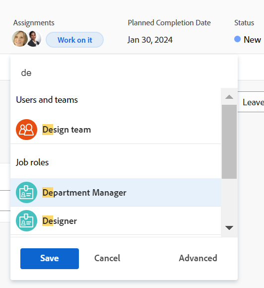

# Make smart assignments

<!--Audited: 07/2024-->

You can use smart assignments to identify who the best user is to complete the work. 

Smart assignments are suggestions for users, roles, or teams that Adobe Workfront presents to you when you assign work items to resources. Workfront bases its suggestions on an algorithm that determines the most appropriate resource for the job.

<!--There are two separate algorithms in Workfront that calculate smart assignments that work differently for tasks and for issues. -->

For more information about the criteria used in determining smart assignments, see [Smart assignments overview](/help/quicksilver/manage-work/tasks/assign-tasks/smart-assignments.md).

## Access requirements

+++ Expand to view access requirements for the functionality in this article.

<table style="table-layout:auto"> 
 <col> 
 <col> 
 <tbody> 
  <tr> 
   <td>Adobe Workfront package</td> 
   <td> 
Any
 </td> 
  </tr> 
  <tr> 
   <td>Adobe Workfront license</td> 
   <td> 
Standard

   
Work or higher

   </td> 
  </tr> 
  <tr> 
   <td>Access level configurations</td> 
   <td> 
Edit access to Tasks and Issues
 
View or higher access to Projects
 </td> 
  </tr> 
  <tr> 
   <td>Object permissions</td>
   <td>Contribute or higher permissions with the ability to make assignments on tasks and issues</td>
  </tr>
 </tbody>
</table>

For information, see [Access requirements in Workfront documentation](/help/quicksilver/administration-and-setup/add-users/access-levels-and-object-permissions/access-level-requirements-in-documentation.md).

+++

## Make smart assignments

Smart assignments are available in most locations where you can make assignments in Workfront.

1. Go to an the following areas the click the **Assignments** or **Assign this to** field: 

   * A task or issue list or report 
   * A task or issue header
   * The task or issue Summary panel
   * A task or issue in the Workload Balancer
   <!--* A New Task or New Issue box, as you add a new task or issue to a project-->
   
1. Place your cursor in the Assignments field, and wait for two seconds. 

   <!--
   For issues, the smart assignments display in the following sections: 
      * **Users and teams**
      * **Job roles**
        
        -->

   Smart assignments display in the following sections<!--, depending on which phase of the algorithm's calculation identified the assignments-->: 

      <!--* **Suggested assignments**: Displays assignments identified in the first phase of the task smart assignment algorithm. -->
      * **Users and teams** or **Job roles** <!--or **Rate card job roles**: Assignments identified in the second phase of the task smart assignment's algorithm calculation.-->

      
   
      For more information, see [Smart assignments overview](../../../manage-work/tasks/assign-tasks/smart-assignments.md).

1. Select the resource in the recommendations list by clicking their name. 

1. (Optional) Click **Assign to me** to assign the work item to yourself.

   >[!TIP]
   >
   >If there are no suggestions, the suggestion list does not open.

1. (Optional) If you do not want to use one of the recommended users from the smart assignments list, start typing the name of the desired resource and select the name when it appears in the list.
1. Click **Enter** to make the assignment.

   The selected user is assigned to the task or issue.
