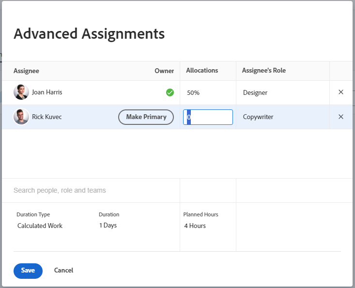

# Manage user or role allocation percentage on tasks

Allocation percentage represents the amount of time an assigned resource is planned to work on a task in a day. It is the percent of a work day (according to the user or project schedule) at which a resource is allocated throughout the duration of the task.

>[!NOTE]
>
>When assigning users to work, their availability according to their schedules affects the Planned and Projected Dates of tasks and issues. For information about schedules, see [Create a schedule](../../../administration-and-setup/set-up-workfront/configure-timesheets-schedules/create-schedules.md).

## Access requirements

You must have the following access to perform the steps in this article:

<table style="table-layout:auto"> 
 <col> 
 <col> 
 <tbody> 
  <tr> 
   <td role="rowheader">Adobe Workfront plan*</td> 
   <td> 
Any
 </td> 
  </tr> 
  <tr> 
   <td role="rowheader">Adobe Workfront license*</td> 
   <td> 
Work or higher
 </td> 
  </tr> 
  <tr> 
   <td role="rowheader">Access level configurations*</td> 
   <td> 
Edit access to Tasks
 
Note: If you still don't have access, ask your Workfront administrator if they set additional restrictions in your access level. For information on how a Workfront administrator can modify your access level, see <a href="../../../administration-and-setup/add-users/configure-and-grant-access/create-modify-access-levels.md" class="MCXref xref">Create or modify custom access levels</a>.
 </td> 
  </tr> 
  <tr> 
   <td role="rowheader">Object permissions</td> 
   <td> 
Contribute or higher permissions to the task
 
Edit permissions to update allocation percentage in the Edit Task box
 
For information on requesting additional access, see <a href="../../../workfront-basics/grant-and-request-access-to-objects/request-access.md" class="MCXref xref">Request access to objects </a>.
 </td> 
  </tr> 
 </tbody> 
</table>

&#42;To find out what plan, license type, or access you have, contact your Workfront administrator.

## Considerations about modifying percent allocations for tasks

* Users are allocated an equal percentage of time to tasks they are assigned to, by default. 
* You can manually modify the allocation percentage for users and job roles assigned to tasks only when the Duration Type of the task is Calculated Work or Effort Driven.

  For information, see [Overview of Task Duration and Duration Type](../../../manage-work/tasks/taskdurtn/task-duration-and-duration-type.md). 

* You cannot modify the percent allocation for teams assigned to tasks.
* You cannot modify the percentage allocation for users and job roles assigned to issues.

## Modify the user or role percent allocation for a task

1. Go to a task for whose resources you are changing the percent allocation.
1. Click the **More** menu  next to the name of the task, then click **Edit**.

   Or

   Click the **Assignments** area in the task header, then click&nbsp;**Advanced**.

1. Ensure that the **Duration Type** of the task is one of the following:

   * Calculated Work
   * Effort Driven

   >[!TIP]
   >
   >* For the Calculated Assignment Duration Type, Workfront uses the following formula to calculate the allocation percentage of each assignee: `Allocation Percentage = (Work Required / Number of days in the Duration) / Number of hours per work day / Number of assignees`.
   >* For the Simple Duration Type, you can estimate the hours assigned to each resource, not the allocation percentage. 

1. Click **Assignments**, then modify the **Allocations** for each task assignee.

   You can only modify the allocation percentage for user and job role assignments.

   You cannot modify the allocation percentage for a team assigned to a task.

   

1. Click **Save**.
