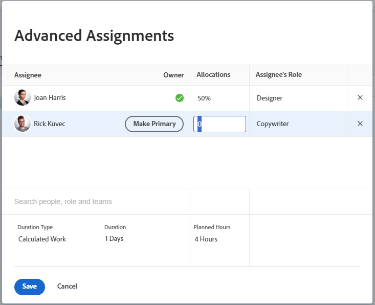
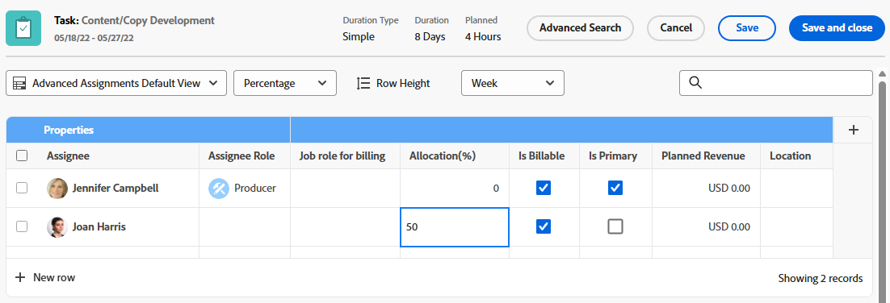

# Manage user or role allocation percentage on tasks

<!--remove new/old experience references when they remove the New/ Old experience toggle from the Edit Tasks box-->

<!--

 

The highlighted information on this page refers to functionality not yet generally available. It is available only in the Preview environment for all customers. The same features will also be available in the Production environment for all customers starting with  a week from the Preview release.      

For more information, see [Interface modernization](/help/quicksilver/product-announcements/product-releases/interface-modernization/interface-modernization.md).  

-->

Allocation percentage represents the amount of time an assigned resource is planned to work on a task in a day. It is the percent of a work day (according to the user or project schedule) at which a resource is allocated throughout the duration of the task.

You can modify the allocation percentage when you make advanced assignments on a task. 

>[!NOTE]
>
>When assigning users to work, their availability according to their schedules affects the Planned and Projected Dates of tasks and issues. For information about schedules, see [Create a schedule](../../../administration-and-setup/set-up-workfront/configure-timesheets-schedules/create-schedules.md).

## Access requirements

+++ Expand to view access requirements for the functionality in this article.

<table style="table-layout:auto"> 
 <col> 
 <col> 
 <tbody> 
  <tr> 
   <td>Adobe Workfront package</td> 
   <td> 
Any
 </td> 
  </tr> 
  <tr> 
   <td>Adobe Workfront license</td> 
   <td> 
Standard

   
Work or higher

   </td> 
  </tr> 
  <tr> 
   <td>Access level configurations</td> 
   <td>Edit access to Tasks</td> 
  </tr> 
  <tr> 
   <td>Object permissions</td>
   <td>
Contribute or higher permissions to the task

   
Edit permissions to update allocation percentage in the Edit Task box.

   <!--
   Not true anymore: 
   
<b>NOTE</b>

   
 You can no longer manage allocation percentage in the Edit task box when editing tasks in the new experience.
 
For information, see <a href="/help/quicksilver/manage-work/tasks/manage-tasks/edit-tasks.md">Edit tasks</a>.

   -->
   </td>
  </tr>
 </tbody>
</table>

For information, see [Access requirements in Workfront documentation](/help/quicksilver/administration-and-setup/add-users/access-levels-and-object-permissions/access-level-requirements-in-documentation.md).

+++

## Considerations about modifying percent allocations for tasks

* Users are allocated an equal percentage of time to tasks they are assigned to, by default. 
* You can manually modify the allocation percentage for users and job roles assigned to tasks only when the Duration Type of the task is Calculated Work or Effort Driven.

  For information, see [Overview of Task Duration and Duration Type](../../../manage-work/tasks/taskdurtn/task-duration-and-duration-type.md). 

* You cannot modify the percent allocation for teams assigned to tasks.
* You cannot modify the percentage allocation for users and job roles assigned to issues.

## Modify the user or role percent allocation for a task

1. Go to a task for whose resources you are changing the percent allocation.
1. Click the **Assignments** area in the task header, then click **Advanced**.

1. Ensure that the **Duration Type** of the task is one of the following:

   * Calculated Work
   * Effort Driven

   >[!TIP]
   >
   >* For the Calculated Assignment Duration Type, Workfront uses the following formula to calculate the allocation percentage of each assignee: `Allocation Percentage = (Work Required / Number of days in the Duration) / Number of hours per work day / Number of assignees`.
   >* For the Simple Duration Type, you can estimate the hours assigned to each resource, not the allocation percentage. 

1. Modify the **Allocations** field for each task assignee.

   You can only modify the allocation percentage for user and job role assignments.

   You cannot modify the allocation percentage for a team assigned to a task.

   You may see one of these screens depending on your organization's Workfront or Workflow package.

   

   

1. Click **Save**.
