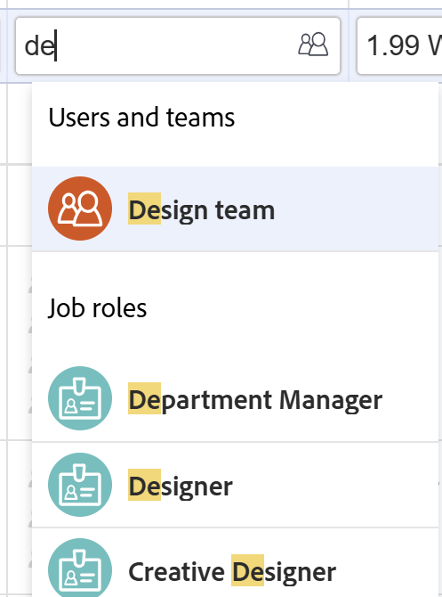
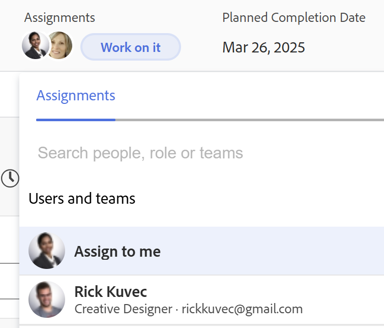
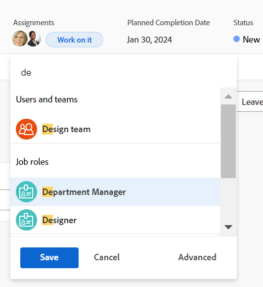
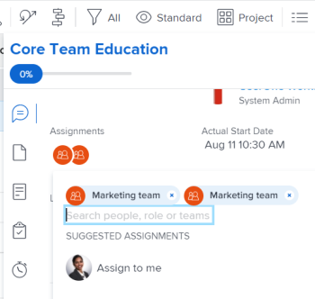
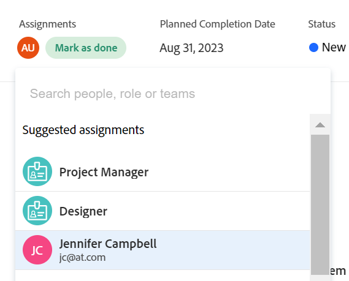
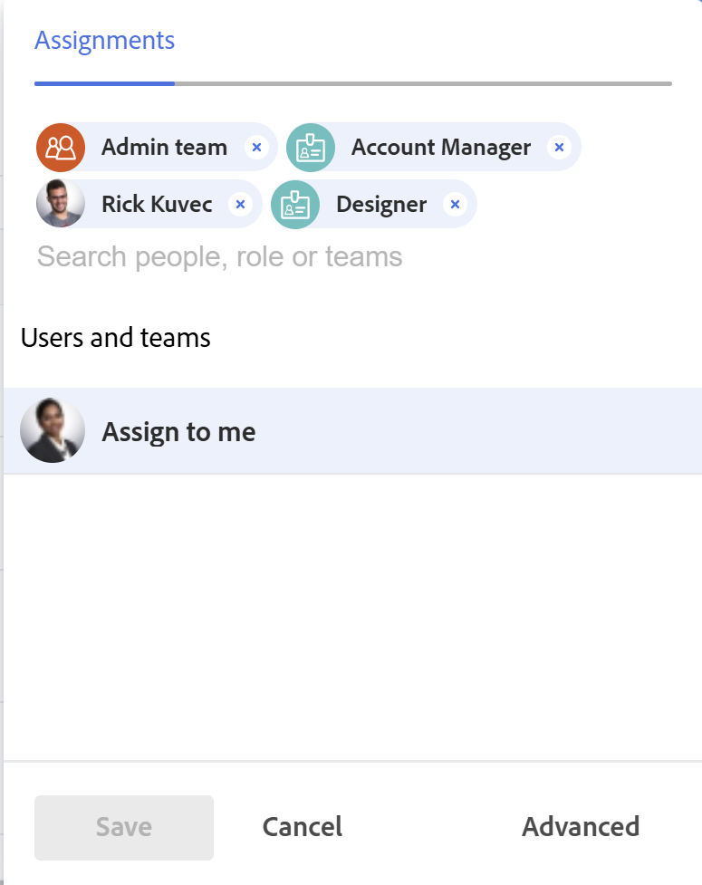
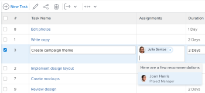

# Smart assignments overview

The highlighted information on this page refers to functionality not yet generally available. It is available only in the Preview environment for all customers.   
  
For information about the current release schedule, see [First Quarter 2024 release overview](/help/quicksilver/product-announcements/product-releases/24-q1-release-activity/24-q1-release-overview.md). 

When managing task and issues assignments, you can use smart assignments to identify who the best resource is to complete the work. Smart assignments are suggestions that Adobe Workfront presents to you when you assign work items to resources based on an algorithm that determines the most appropriate resource for the job. Smart assignments can be users, job roles, or teams. 

>[!NOTE]
>
>When suggesting users, smart assignments do not take into account the availability of the user. However, their availability according to their schedules affects the Planned and Projected Dates of tasks and issues when they are assigned. For information about schedules, see the article [Create a schedule](../../../administration-and-setup/set-up-workfront/configure-timesheets-schedules/create-schedules.md).

This article contains general information about smart assignments. For information about using smart assignments to assign tasks and issues to users, see [Make smart assignments](../../../manage-work/tasks/assign-tasks/make-smart-assignments.md).

## Smart assignments overview

Consider the following when working with smart assignments:

* The algorithm works independently for tasks and issues. This means that the list of suggested users for issues might differ from the list of suggested users for a task because Workfront builds the lists according to criteria pertaining to issues and tasks separately. 
* Smart assignments do not recommend job roles or teams. Instead, they are suggestions of users who are best fit to complete a task or an issue. 
* The suggested assignments are always active users. 
* The user listed first should be the best match for the task.

## Locate smart assignment suggestions

You can view smart assignments in the following areas where you can assign tasks or issues:

* An issue list or report in the Assignments column

  

 * A task list or report in the Assignments column 

    

* A task header in the Assignments field

  

* An issue header in the Assignments field

  

* The task or issue Summary panel in the Assignments area

  

* The Assignments field for an item listed in the Home area in the Assignments area, when you open a task or issue

  

* Workload Balancer in the Assigned this to area when you assign a task or issue

  

## Smart assignments criteria

Smart assignments work differently for tasks than for issues.  

### Smart assignments criteria for tasks

The task smart assignments calculation works in two phases which use two different algorithms.

Depending on which algorithm finds the smart assignment, the assignments are listed under two separate sections in the Assignments field. For information, see [Make smart assignments](/help/quicksilver/manage-work/tasks/assign-tasks/make-smart-assignments.md). 

#### First phase of smart assignment calculation for tasks 

In the first phase of calculating smart assignments, Workfront calculates a similarity score for every assignment. 

>[!NOTE]
>
>The first phase of the smart assignments calculation does not apply to the following task areas:
>
>* Bulk Assignments in the Workload Balancer.
>* Connected cards on boards.

The calculation for the similarity score and the order in which the assignments are listed take into account the following:  

* A score of 100% is given to an existing assignment where the task, project, and portfolio names are identical to the task you're trying to assign. The project and portfolio names of the task of an existing assignment must also match the project and portfolio of the task you are trying to assign.   

* If only some of this information from other assignments matches on the existing tasks, the score might be lower than 100%.  

  For example, if you are assigning a task called "My second task" on a project called "My project" in a portfolio called "My portfolio" and you have an existing task called "My task" in another project called "My project" in a portfolio called "My portfolio", the user assigned to "My task" might get a score of 95% because the name of the existing task and the task you're trying to assign now are similar, but not identical.  
 
    >[!TIP]
    >
    >  Workfront looks for matches only in the Name fields of tasks, projects, and portfolios and not in any other fields. 

* An assignment could get a higher score when they are assigned to a lot of tasks in the system that have similar names. For example, if a team called "Development" is assigned to 50% of the tasks in the system containing "AI" in the name and you are now assigning another task with "AI" in the name, the score of the "Development" team is higher. In this case, the names of  projects and portfolios are not as important.  

* Taking into account this scoring system, the first 7 suggestions are listed as smart assignments, in the descending order of their scores. Assignments with scores lower than 40% do not display.  

* If several assignments have identical scores, they display in order of the date on which the assignments were made, starting from the most recent date.  

  For example, if Rick was assigned to a similar task earlier today and Jennifer was assigned to a similar task two days ago, Rick displays first.  

* Assignments identified in this phase are listed in the **Suggested assignments** section of the Assignments field. 

* If there are no matches using this calculation, the second phase of smart assignments starts which is calculated using a different algorithm.  

#### Second phase of smart assignment calculation for tasks

If the first step of task smart assignments has found no matches, Workfront calculates smart assignments for tasks in the same way that it calculates them for issues.  

For more information, see the section [Smart assignments criteria for tasks and issues](#smart-assignments-criteria-for-tasks-and-issues) in this article. 

Assignments identified in this phase are listed in the **Results** section of the Assignments field. <!--update this to "Other assignments"-->

### Smart assignments criteria for tasks and issues 

 

>[!NOTE]
>
>The following criteria applies for tasks only when the first phase of the task smart assignment calculation did not find any matches. For information, see the section [First phase of smart assignment calculation for tasks](#first-phase-of-smart-assignment-calculation-for-tasks) in this article. The following criteria always applies for issues, by default. 

Users are recommended in the smart assignments drop-down list based on a combination of the following criteria (listed in order from most important to least important): 

 1. Users assigned to other work items in the past 30 days by the user making the assignment. The first 50 users that match this criteria display. The user that is most often assigned displays first. 

 2. If the work item is assigned to a team or a role, the list of suggested users is filtered further taking into account the existing assignments below. In this case, only the following users display in the list of suggestions: 
  
    * Users whose Home Team is the team assigned to the work item. 
    * Users whose Primary Role is the role assigned to the work item. 

>[!TIP]
>
>* If there is no role or team assigned on the task or issue, Workfront displays all the users assigned for the last 30 days, up to 50 users. 
>
>* If you have not made any assignments in the past 30 days, only users that belong to either the assigned team or have the role assigned to the work item display in the smart assignments list. 

<!--the commented out piece in the tip above was live before but I am not totally sure that smart assignments look at your team. I think they look JUST at the team/ role assigned to the work item; see this help site request for more info: https://experience.adobe.com/#/@adobeinternalworkfront/so:hub-Hub/workfront/issue/62fd222200037eb87572c5b6ad6bf53e/overview -->
<!--

<h3>Smart assignments criteria for the Production environment</h3>

(NOTE: drafted,this was the case BEFORE we updated the logic in the WB - with the 21.4 release)

Smart assignments display on tasks and issues when the following conditions are met:

<ul>
<li>The task or issue is subordinate to a parent task or issue that has a user, team, or job role currently assigned. </li>
</ul>

Smart assignments display the top twenty recommendations based on a proprietary algorithm that uses your own team information.

Users are recommended in the smart assignments drop-down list based on a combination of the following criteria (listed in order from most important to least important):

<ul>
<li>The user has the team assigned to the task or issue designated as their Home Team</li>
<li>The user is also assigned to the parent task</li>
<li>The user has the same primary job role as is currently assigned to the task or issue</li>
<li>The user has the team assigned to the parent task or issue designated as their Home Team</li>
<li>The user is associated with the same primary job role currently assigned to the parent task</li>
<li>The user is a member of the same team as the user who assigned the task or issue and the team is designated as their Home Team</li>
<li>The user is a member of the same Home Group as the user who is assigning the task or issue</li>
<li>The user has the same primary job role as the user who is assigning the task or issue.</li>
</ul>

-->

<!--

<h2>Make smart assignments</h2>

(NOTE:&nbsp;this was moved to its own article: make-smart-assignments.) 

Smart assignments are available in most locations where you can make assignments in Workfront.

You can use smart assignments on tasks and issues that have previously been assigned to a job role or a team.
 <note type="note">
You must have a Plan or a Work license and have at least Contribute permissions to a task or an issue to be able to make assignments to the task or the issue. You must have the Make Assignments option enabled in your permission level to make assignments.
</note>

To use smart assignments:

<ol>
<li value="1">Navigate to an issue or a task and click one of the following fields to edit them:  
<ul>
<li>
The <strong>Assignments</strong> field in the task or issue header
</li>
<li>The <strong>Assignments</strong> field of a task or issue list using in-line editing in a task or issue list. </li>
<li>The <strong>Assignee</strong> field after you have clicked <strong>Advanced</strong> from a task or an issue. </li>
</ul></li>
<li value="2"> 
Place your cursor in the assignment field, and wait for two seconds, then the <strong>Suggestions</strong> list is displayed.
 
Users displayed in this list are the smart assignment suggestions for the task or the issue. 
 
  
 </li>
<li value="3"> 
Select the user in the recommendations list by clicking their name. 
 
If there are no suggestions, the suggestion list does not open.
 </li>
<li value="4">(Optional) If you do not want to use one of the recommended users from the smart assignments list, start typing the name of the desired user and select the name when it appears in the list.</li>
<li value="5">Click <strong>Enter</strong> to make the assignment. </li>
</ol>

-->
