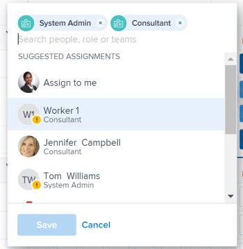

# Smart assignments overview

When managing task and issues assignments, you can use smart assignments to identify who the best user is to complete the work. Smart assignments are suggestions that Adobe Workfront presents to you when you assign work items to resources based on an algorithm that determines the most appropriate resource for the job.

>[!NOTE]
>
>Smart assignments do not take into account the availability of the user. However, their availability according to their schedules affects the Planned and Projected Dates of tasks and issues when they are assigned. For information about schedules, see the article [Create a schedule](../../../administration-and-setup/set-up-workfront/configure-timesheets-schedules/create-schedules.md).

This article contains general information about smart assignments.&nbsp;For information about using smart assignments to assign tasks and issues to users, see [Make smart assignments](../../../manage-work/tasks/assign-tasks/make-smart-assignments.md).

## Smart assignments overview

Consider the following when working with smart assignments:

* The algorithm works independently for tasks and issues.&nbsp;This means that the list of suggested users for issues might differ from the list of suggested users for a task because Workfront builds the lists according to criteria pertaining to issues and tasks separately. 
* Smart assignments do not recommend job roles or teams. Instead, they are suggestions of users who are best fit to complete a task or an issue. 
* The suggested assignments are always active users. 
* The user listed first should be the best match for the task.

## Locate smart assignment suggestions

You can view smart assignments in the following areas where you can assign tasks or issues:&nbsp;

* A task or issue list or report

  

* A task or issue header

  

* The task or issue Summary panel

  

* The Assignments field for an item listed in the Home area

  

* Resource Scheduling

  

* Workload Balancer

  

## Smart assignments criteria

Smart assignments display the top fifty recommendations based on a proprietary algorithm.

Users are recommended in the smart assignments drop-down list based on a combination of the following criteria (listed in order from most important to least important):

* Users assigned to other work items in the past 30 days by the user making the assignment. The first 50 users that match this criteria display. The user that is most often assigned displays first.

  If the work item is assigned to a team or a role, the list of suggested users is filtered further taking into account the existing assignments below. In this case, only the following users display in the list of suggestions:

   * Users whose Home Team is the team assigned to the work item. 
   * Users whose Primary Role is the role assigned to the work item.

     >[!TIP]
     >
     >If you're not part of any team and there is no role or team assigned on the task or issue, Workfront displays all the users assigned for the last 30 days, up to 50 users.

<!--

<h3>Smart assignments criteria for the Production environment</h3>

(NOTE: drafted,this was the case BEFORE we updated the logic in the WB - with the 21.4 release)

Smart assignments display on tasks and issues when the following conditions are met:

<ul>
<li>The task or issue is subordinate to a parent task or issue that has a user, team, or job role currently assigned. </li>
</ul>

Smart assignments display the top twenty recommendations based on a proprietary algorithm that uses your own team information.

Users are recommended in the smart assignments drop-down list based on a combination of the following criteria (listed in order from most important to least important):

<ul>
<li>The user has the team assigned to the task or issue designated as their Home Team</li>
<li>The user is also assigned to the parent task</li>
<li>The user has the same primary job role as is currently assigned to the task or issue</li>
<li>The user has the team assigned to the parent task or issue designated as their Home Team</li>
<li>The user is associated with the same primary job role currently assigned to the parent task</li>
<li>The user is a member of the same team as the user who assigned the task or issue and the team is designated as their Home Team</li>
<li>The user is a member of the same Home Group as the user who is assigning the task or issue</li>
<li>The user has the same primary job role as the user who is assigning the task or issue.</li>
</ul>

-->

<!--

<h2>Make smart assignments</h2>

(NOTE:&nbsp;this was moved to its own article: make-smart-assignments.) 

Smart assignments are available in most locations where you can make assignments in Workfront.

You can use smart assignments on tasks and issues that have previously been assigned to a job role or a team.
 <note type="note">
You must have a Plan or a Work license and have at least Contribute permissions to a task or an issue to be able to make assignments to the task or the issue. You must have the Make Assignments option enabled in your permission level to make assignments.
</note>

To use smart assignments:

<ol>
<li value="1">Navigate to an issue or a task and click one of the following fields to edit them:  
<ul>
<li>
The <strong>Assignments</strong> field in the task or issue header
</li>
<li>The <strong>Assignments</strong> field of a task or issue list using in-line editing in a task or issue list. </li>
<li>The <strong>Assignee</strong> field after you have clicked <strong>Advanced</strong> from a task or an issue. </li>
</ul></li>
<li value="2"> 
Place your cursor in the assignment field, and wait for two seconds, then the <strong>Suggestions</strong> list is displayed.
 
Users displayed in this list are the smart assignment suggestions for the task or the issue. 
 
  
 </li>
<li value="3"> 
Select the user in the recommendations list by clicking their name. 
 
If there are no suggestions, the suggestion list does not open.
 </li>
<li value="4">(Optional) If you do not want to use one of the recommended users from the smart assignments list, start typing the name of the desired user and select the name when it appears in the list.</li>
<li value="5">Click <strong>Enter</strong> to make the assignment. </li>
</ol>

-->

