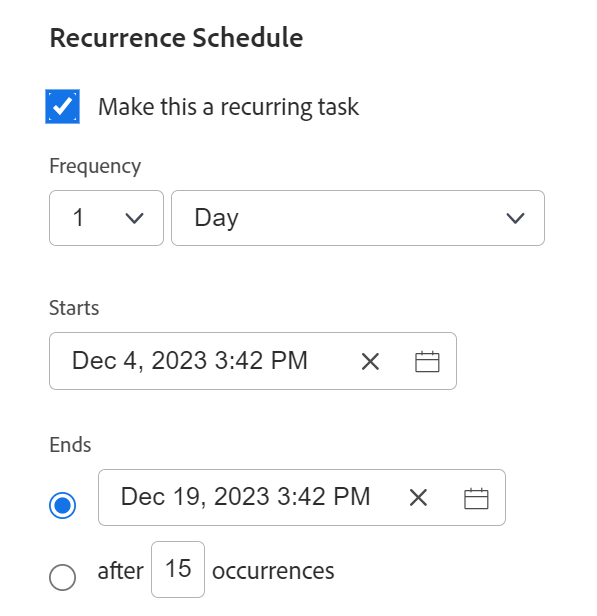
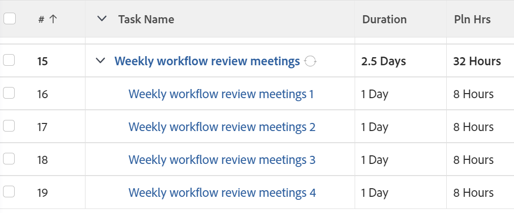

# Create recurring tasks

<!--Audited: 01/2024-->

You can create recurring tasks for tasks you have to repeat as part of a single project.

For general information about recurring tasks, including the impact of editing an existing recurring task, see [Recurring tasks overview](../../../manage-work/tasks/manage-tasks/recurring-tasks-overview.md).

## Access requirements

You must have the following access to perform the steps in this article:

<table style="table-layout:auto"> 
 <col> 
 <col> 
 <tbody> 
  <tr> 
   <td role="rowheader">Adobe Workfront plan*</td> 
   <td> 
Any
 </td> 
  </tr> 
  <tr> 
   <td role="rowheader">Adobe Workfront license*</td> 
   <td> 
New: Standard
 
   
Current: Work or higher
 </td> 
  </tr> 
  <tr> 
   <td role="rowheader">Access level configurations*</td> 
   <td> 
Edit access to Tasks and Projects
 </td> 
  </tr> 
  <tr> 
   <td role="rowheader">Object permissions</td> 
   <td> 
Contribute permissions to the project with ability to Add Tasks or higher
 
   
When you create a task you automatically receive Manage permissions to the task
 
   
 For information about task permissions, see <a href="../../../workfront-basics/grant-and-request-access-to-objects/share-a-task.md" class="MCXref xref">Share a task </a>.
  </td> 
  </tr> 
 </tbody> 
</table>

&#42;To find out what plan, license type, or access you have, contact your Workfront administrator. For more information about access requirements, see [Access requirements in Workfront documentation](/help/quicksilver/administration-and-setup/add-users/access-levels-and-object-permissions/access-level-requirements-in-documentation.md). 

## Create a recurring task

>[!NOTE]
>
>You cannot create a recurring task by modifying an existing task. You must create a task from scratch.

1. Go to the project where you want to create a recurring task, then click the **Tasks** section in the left panel.
1. Click **New Task**.

   The New Task dialog box displays.

   

1. Click **More options** then enter a name for the task in the **Task Name** field.
1. Continue updating the task the same way you would if you added a new task. For more information about adding a new task, see [Create tasks in a project](../../../manage-work/tasks/create-tasks/create-tasks-in-project.md).

   >[!TIP]
   >
   >   The Duration and the Planned Hours indicated for a new recurring task are the Duration and the Planned Hours of each occurrence. The Duration of the parent task is the time between the Planned Start Date of the earliest task and the Planned Completion Date of the latest task. The Planned Hours of the parent task is the total of all Planned Hours from all the occurrences.

1. Click **Overview** in the left panel.
1. Scroll down to the **Recurrence Schedule** section, then select the **Make this a recurring task** option.

   

1. In the **Frequency** drop-down list, select the number of time units when you want the task to occur and the type of time units. Select from the following options: 

   <table style="table-layout:auto"> 
    <col> 
    <col> 
    <thead> 
     <tr> 
      <th>Recurrence Type</th> 
      <th>Description</th> 
     </tr> 
    </thead> 
    <tbody> 
     <tr> 
      <td role="rowheader"><strong>Day</strong> </td> 
      <td> 
The task repeats every day, every 2 days, every 3 days, and so forth, depending on the cadence that you select. You can configure tasks to repeat up to every 6th day. The default setting is 1 Day. 
 </td> 
     </tr> 
     <tr> 
      <td role="rowheader"><strong>Working Day</strong> </td> 
      <td> 
 The task repeats every working day, every 2 working days, every 3 working days, and so forth, depending on the cadence that you select. You can configure tasks to repeat up to every 6th working day.
 
This option uses the default schedule that is defined by the system administrator, as described in <a href="../../../administration-and-setup/set-up-workfront/configure-timesheets-schedules/create-schedules.md" class="MCXref xref">Create a schedule</a>.
 </td> 
     </tr> 
     <tr> 
      <td role="rowheader"><strong>Week</strong> </td> 
      <td> 
 The task repeats every week, every 2 weeks, every 3 weeks, and so forth, depending on the cadence that you select.
 
In the <strong>Repeats</strong> field, select the day of the week when you want each task to occur. You can select multiple days. 
 </td> 
     </tr> 
     <tr> 
      <td role="rowheader"><strong>Month</strong> </td> 
      <td> 
The task repeats every month, every 2 months, every 3 months, and so forth, depending on the cadence that you select. You can select between 1 and 12 months. 
 
In the <strong>Repeats</strong> field, select from the following options when you want the task to occur:
 
       <ul> 
        <li> 
<strong>every month on day &lt;month date&gt;</strong> 
 
You can select days from 1 to 30 or you can select <strong>last</strong>. For example, you can select "every month on the 30th". 
 </li> 
        <li> 
<strong>every month on the &lt;number&gt; &lt;day of the week&gt;</strong> 
 
In the first drop-down menu, you can select a number between 1 and 4 for the number of the week in the month, or you can select "last". 
 
In the second drop-down menu, you can select any day of the week. 
 
For example, you can select "every month on the 2nd Tuesday". 
 </li> 
       </ul> </td> 
     </tr> 
    </tbody> 
   </table>

   >[!NOTE]
   >
   >If you have a Schedule Exception associated with the project's schedule, recurring tasks can't start during the exception. Recurring tasks that occur during the schedule exception are scheduled to start on the first business day that follows the exception. For more information on schedule exceptions, see the article [Create a schedule](../../../administration-and-setup/set-up-workfront/configure-timesheets-schedules/create-schedules.md).

1. In the **Starts** field, select the date and time when you want the recurring tasks to begin. 
1. In the **Ends** field, select the date and the time when you want the recurring tasks to complete

   Or

   Select **after `<number>` occurrences** to indicate how many times the recurring task should occur. Workfront creates the same number of recurrences for the tasks as the number you indicate in this field. 

1. Click **Create Task.**

   The task list displays. The recurring task is created as a parent, and all the recurrences are its children. Workfront auto-generated the names of the children tasks, using the name you entered for the parent followed by a number. The recurring tasks are placed at the end of the task list. 
   
   For more information about what fields are auto-filled from the parent recurring task, see [Recurring tasks overview](../../../manage-work/tasks/manage-tasks/recurring-tasks-overview.md).

   

1. (Optional) Modify each recurring task as you would any other task in the project.

   For example, you can add assignments, predecessors, durations, and modify any other information about the task, including custom fields.

   >[!IMPORTANT]
   >
   >Modifying the parent recurrence after the children have been modified individually may cause different information between the children or between the children and the parent. For more information, see [Recurring tasks overview](../../../manage-work/tasks/manage-tasks/recurring-tasks-overview.md).
