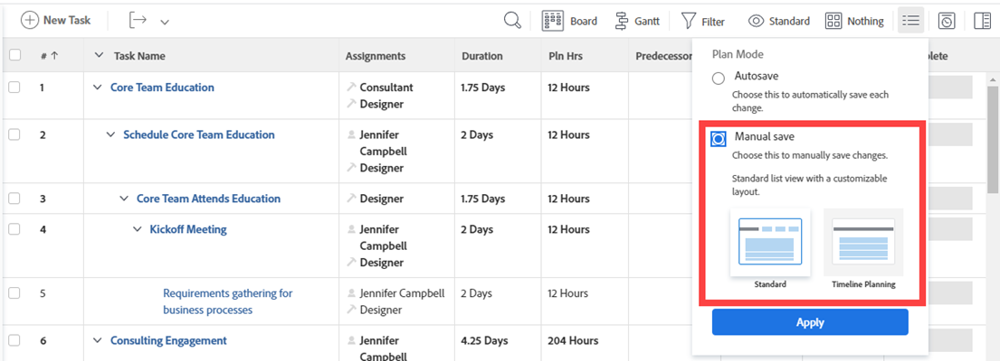
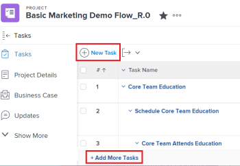
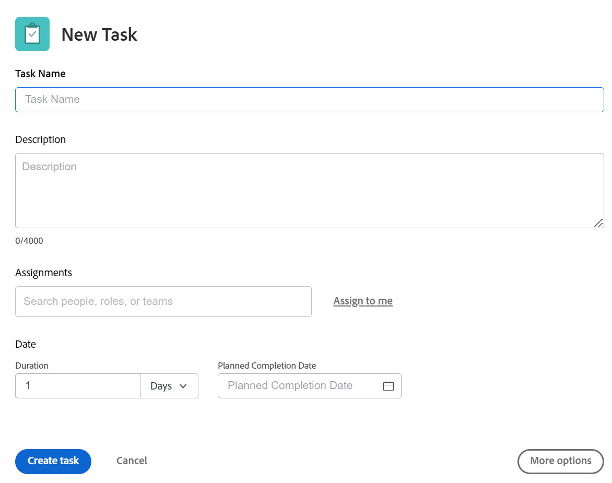
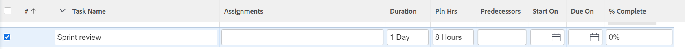

# Create tasks in a project

<!-- Audited: 1/2024 -->

You can create tasks in a project only after you create the project.

For example, after creating a project, you might want to add tasks and modify them to organize the project plan. For more information about creating a project, see [Create a project](../../../manage-work/projects/create-projects/create-project.md).

For information about creating personal tasks that are not in a project, see the [Create a personal task](../../../workfront-basics/using-home/using-the-home-area/create-work-items-in-home.md#create-a-personal-task) section in the article [Create work items from the Home area](../../../workfront-basics/using-home/using-the-home-area/create-work-items-in-home.md).

This article describes how you create tasks from scratch. You can also create tasks in the following ways:

* By copying or duplicating existing tasks. For information, see [Copy and duplicate tasks](../../../manage-work/tasks/manage-tasks/copy-and-duplicate-tasks.md).
* By moving tasks from one project to another. For information, see [Move tasks](../../../manage-work/tasks/manage-tasks/move-tasks.md).

## Access requirements

+++ Expand to view access requirements for the functionality in this article.

<table style="table-layout:auto"> 
 <col> 
 <col> 
 <tbody> 
  <tr> 
   <td role="rowheader">Adobe Workfront plan</td> 
   <td> 
Any
 </td> 
  </tr> 
  <tr> 
   <td role="rowheader"> 
Adobe Workfront license
 </td> 
   <td>
Current: Work or higher
 
   Or
   
New: Standard
 </td> 
  </tr> 
  <tr> 
   <td role="rowheader">Access level configurations*</td> 
   <td> 
Edit access to Tasks and Projects
</td> 
  </tr> 
  <tr> 
   <td role="rowheader">Object permissions</td> 
   <td> 
Contribute permissions to the project with ability to Add Tasks or higher
 
When you create a task you automatically receive Manage permissions to the task
 
 For information about task permissions, see <a href="../../../workfront-basics/grant-and-request-access-to-objects/share-a-task.md" class="MCXref xref">Share a task </a>. 
 
For information on requesting additional permissions, see <a href="../../../workfront-basics/grant-and-request-access-to-objects/request-access.md" class="MCXref xref">Request access to objects </a>.
 </td> 
  </tr> 
 </tbody> 
</table>

For more detail about the information in this table, see [Access requirements in Workfront documentation](/help/quicksilver/administration-and-setup/add-users/access-levels-and-object-permissions/access-level-requirements-in-documentation.md).

+++

## Create tasks in a project

1. Go to the project where you want to create a task.
1. Click **Tasks** in the left panel. 
1. (Conditional) If you are currently viewing the task list in an agile view, click the **List View** icon  in the upper-right corner to display the task list. 
1. (Optional) Click the **Plan Mode** icon  and select **Manual Save**, then select either **Standard** or **Timeline Planning**. This disables the **Autosave** option which is enabled by default.

   

   >[!TIP]
   >
   >You can reverse your changes when you select Manual Save.

1. Create a new task by doing one of the following:

   * Click **New Task** at the top of the task list.
   * Click **Add More Tasks** at the bottom of the task list.

   

1. (Conditional)&nbsp;If you clicked **New Task** do the following:

   1. Specify any of the fields on the limited list of fields inside the **New Task** box, then click&nbsp;**Create Task** if you want to quickly create a task.

      Or

      To update all fields for the task, click **More Options** to open the **Create Task** box.

      

      The **Create Task** box opens.

      

      &nbsp;

      >[!NOTE]
      >
      >Depending on how your Workfront administrator sets up our Layout Template, the fields in the Create Task box might display different fields in your environment. For information, see [Customize the Details view using a layout template](../../../administration-and-setup/customize-workfront/use-layout-templates/customize-details-view-layout-template.md).

   1. Specify information for the following areas in the left panel of the Create Task box:

      * Task Name
      * Overview
      * Assignments
      * Custom Forms
      * Finance
      * Settings

        For information about defining all task-related fields on a task, see [Edit tasks](../../../manage-work/tasks/manage-tasks/edit-tasks.md).

   1. (Conditional and optional) If you want the task to be recurring, update the **Recurrence Frequency** field. For more information about creating recurring tasks, see [Create recurring tasks](../../../manage-work/tasks/create-tasks/create-recurring-tasks.md).
   1. (Optional) Click **Documents** in the left panel to attach a document to the new task, then click **Add or link files** to add a document to the task from your computer, another service, or to link documents and folders from your computer or another service.

1. (Conditional) If you clicked **Add More Tasks** in step 5, start entering the task information using in-line editing, then press Enter.

   <!--
   
(NOTE: ensure this stays accurate)

   -->

   We recommend using this option especially when adding multiple tasks to the list.

   

1. (Conditional) Do one of the following:

   * If you clicked **New Task** in step 5, click **Create task** to save your changes and add the new task to your project.

     <!--   
     
(NOTE: is this step still right?)
   
     -->

   * If you clicked **Add More Tasks** in step 5 do the following:

     <!--   
     
(NOTE: is this step still right?) 
   
     -->

      1. Click anywhere in the browser to submit your changes, or press Enter.
      1. (Optional) In the task list, select the newly created task, then click **Indent**.

         This makes the new task a child or subtask of the previous task.

         For more information about children tasks, see [Create subtasks](/help/quicksilver/manage-work/tasks/create-tasks/create-subtasks.md). 
      
      1. (Conditional) If you disabled the **Autosave** option after pressing **Add More Tasks**, you may do the following:

         * Click **Undo** at any time to reverse your last change, or **Cancel** to reverse all the changes you made to the task list. 
         * If you previously clicked **Undo**, click **Redo** to re-apply the last change you canceled.
         * Click **Save** to save your changes to the task list.
