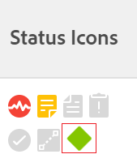
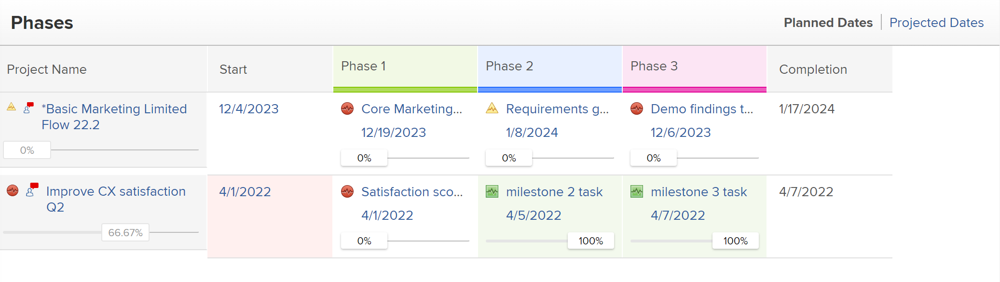

# Associate milestones with tasks

<!--Audited: 01/2024-->

You can associate milestones with tasks to indicate when you reach important steps in the lifetime of the project.

## Access requirements

+++ Expand to view access requirements for the functionality in this article.

<table style="table-layout:auto"> 
 <col> 
 <col> 
 <tbody> 
  <tr> 
   <td role="rowheader">Adobe Workfront plan*</td> 
   <td> 
Any
 </td> 
  </tr> 
  <tr> 
   <td role="rowheader">Adobe Workfront license*</td> 
   <td> 
New license: Standard
 
   
Current license: Work or higher
 
   </td> 
  </tr> 
  <tr> 
   <td role="rowheader">Access level configurations*</td> 
   <td> 
Edit access to Tasks
 
<b>NOTE</b>
   
   If you don't have access, ask your Workfront administrator if they set additional restrictions in your access level. For information on how a Workfront administrator can modify your access level, see <a href="../../../administration-and-setup/add-users/configure-and-grant-access/create-modify-access-levels.md" class="MCXref xref">Create or modify custom access levels</a>.
 </td> 
  </tr> 
  <tr> 
   <td role="rowheader">Object permissions</td> 
   <td> 
Manage permissions to the task
 
For information on requesting additional access, see <a href="../../../workfront-basics/grant-and-request-access-to-objects/request-access.md" class="MCXref xref">Request access to objects </a>.
 </td> 
  </tr> 
 </tbody> 
</table>

To find out what plan, license type, or access you have, contact your Workfront administrator.

+++

## Prerequisites

Before you can associate a milestone with a task, the following must exist:

* The Workfront administrator must create a milestone path, as described in [Create a milestone path](../../../administration-and-setup/customize-workfront/configure-approval-milestone-processes/create-milestone-path.md).

* You must associate a Milestone Path to a project. 

   For information, see [Edit projects](/help/quicksilver/manage-work/projects/manage-projects/edit-projects.md). 

* In order to associate a milestone path with a project, the project must be in Planning or Current status.

   >[!TIP]
   >
   >To get the best overview of the progress of milestones in your projects using the Milestone view, you should create parent tasks and associate them with each major phase of your project. Then, associate these parent tasks with each of the milestones of your milestone path.

## Associate a milestone with a task

After a milestone path is associated with a project, tasks can be assigned a milestone.

1. Go to a task, then click the **More** icon  to the right of the task name, then **Edit**.

   Tasks and Milestones have a 1:1 relationship. You cannot attach the same milestone to multiple tasks. Each task can be linked to a single milestone, or each milestone can be mapped to one task.

1. Click **Settings**, then select a milestone in the **Milestone** field for the task. 
1. Click **Save**.
1. (Optional) In a list of tasks, add the **Status Icons** column to identify which tasks have milestones. The Milestone diamond indicator displays in the Status Icons column. 

   For information, see [Create or edit views in Adobe Workfront](/help/quicksilver/reports-and-dashboards/reports/reporting-elements/create-edit-views.md). 

   

1. (Optional) Go to a list of projects, select the **Milestone** view to identify the progress of your milestone tasks.

   
