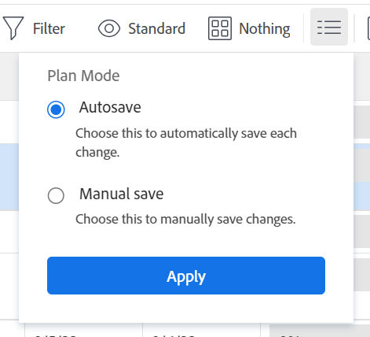
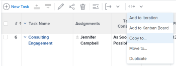
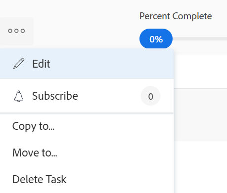
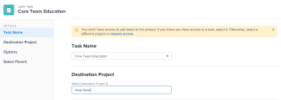
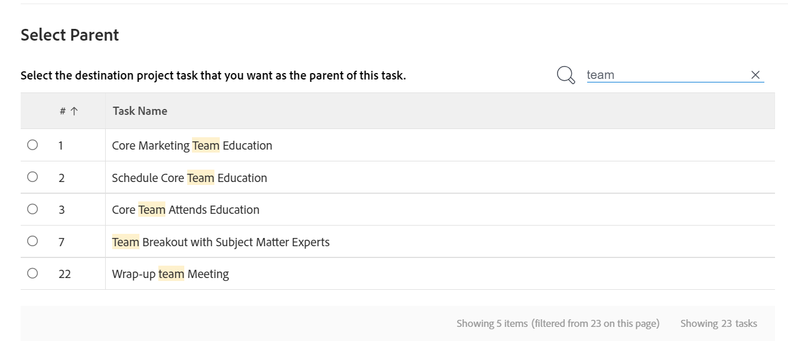
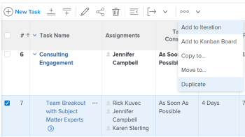

# Copy and duplicate tasks

You can copy a task from a project to another project, or you can duplicate a task within the same project.

You can copy or duplicate one or several tasks or parent tasks at a time.

## Access requirements

<!-- drafted for P&P:

<table style="table-layout:auto"> 
 <col> 
 <col> 
 <tbody> 
  <tr> 
   <td role="rowheader">Adobe Workfront plan*</td> 
   <td> 
Any 
 </td> 
  </tr> 
  <tr> 
   <td role="rowheader">Adobe Workfront license*</td> 
   <td> 
Current license: Standard
 
   Or
   
Legacy license: Work or higher 
 </td> 
  </tr> 
  <tr> 
   <td role="rowheader">Access level configurations*</td> 
   <td> 
Edit access to Tasks and Projects
 
<b>NOTE</b>
   
   If you still don't have access, ask your Workfront administrator if they set additional restrictions in your access level. For information on how a Workfront administrator can modify your access level, see <a href="../../../administration-and-setup/add-users/configure-and-grant-access/create-modify-access-levels.md" class="MCXref xref">Create or modify custom access levels</a>.
 </td> 
  </tr> 
  <tr> 
   <td role="rowheader">Object permissions</td> 
   <td> 
Manage permissions to a task
 
Contribute or higher permissions to the project
 
   
For information on requesting additional access, see <a href="../../../workfront-basics/grant-and-request-access-to-objects/request-access.md" class="MCXref xref">Request access to objects </a>.
 </td> 
  </tr> 
 </tbody> 
</table>
--> 

You must have the following access to perform the steps in this article:

<table style="table-layout:auto"> 
 <col> 
 <col> 
 <tbody> 
  <tr> 
   <td role="rowheader">Adobe Workfront plan*</td> 
   <td> 
Any
 </td> 
  </tr> 
  <tr> 
   <td role="rowheader">Adobe Workfront license*</td> 
   <td> 
Work or higher 
 </td> 
  </tr> 
  <tr> 
   <td role="rowheader">Access level configurations*</td> 
   <td> 
Edit access to Tasks and Projects
 
<b>NOTE</b> 
   
   If you still don't have access, ask your Workfront administrator if they set additional restrictions in your access level. For information on how a Workfront administrator can modify your access level, see <a href="../../../administration-and-setup/add-users/configure-and-grant-access/create-modify-access-levels.md" class="MCXref xref">Create or modify custom access levels</a>.
 </td> 
  </tr> 
  <tr> 
   <td role="rowheader">Object permissions</td> 
   <td> 
Manage permissions to a task 
 
Contribute or higher permissions to the project
 
For information on requesting additional access, see <a href="../../../workfront-basics/grant-and-request-access-to-objects/request-access.md" class="MCXref xref">Request access to objects </a>.
 </td> 
  </tr> 
 </tbody> 
</table>

&#42;To find out what plan, license type, or access you have, contact your Workfront administrator.

## Considerations for copying tasks

Consider the following when copying a task:

* When you copy a task from one project to another, the task dates might be recalculated. The recalculation will take into consideration the schedule that the new project uses and the project's Schedule From information.
* Custom forms are copied with the task. The information in the custom fields transfer to the copied tasks only when you select to copy Custom Data when copying the task. 
* You have a chance to select to copy some items associated with the task to the copied task during the copying process. However, by default, the following objects do not transfer to the copied task: 
   * Issues 
   * Logged hours 
   * User comments <!--not sure about this, enable only if requested by users and verified by Product: System activity comments transfer to the new task if they relate to information that you specifically select to be copied. For example, if you select to copy Expenses to the new task, system comments that identify adding expenses to the task will transfer to the copied task. -->
* The following items move to the copied task by default: 
   
   * Milestones are transferred to the copied task and removed from the original task.
   * Subtasks transfer to the new task. 

* You can copy one task at a time, or you can copy multiple tasks at a time when you edit tasks in a list. 

## Copy tasks in a list {#copy-tasks-in-a-list}

1. Go to the project that contains the task or tasks that you want to copy.

   Or

   Go to a task report. 

1. (Conditional) Click **Tasks** in the left panel, if you opened the project that contains the tasks. 
1. Click the **Plan Mode** icon , and ensure that the **Autosave** option is enabled.

   

   >[!IMPORTANT]
   >
   >You can copy tasks in a list only when automatically saving your changes. For information about saving options when editing tasks, see [Edit tasks in a list](../../../manage-work/tasks/manage-tasks/edit-tasks-in-a-list.md).

1. Select the task or tasks that you want to copy and do one of the following:

   * Click the **More menu** at the top of the task list, then click **Copy to**. 
   * Right click the selected tasks, then click **Copy to**.
   * When selecting one task, click the **More** menu  next to the task name in the list, then click **Copy to**.

   

1. Continue with copying the task, as described in the section [Copy a task at the task level](#copy-a-task-at-the-task-level) starting with Step 4. 

   <!--
      (NOTE: is this still accurate?!)
   -->

## Copy a task at the task level {#copy-a-task-at-the-task-level}

In addition to copying tasks in a list of tasks, you can also copy a task after you have opened it. 

1. Find a task in your Workfront system by searching for it.
1. Click the name of the task to open it. 
1. Click the **More** drop-down menu  next to the name of the task, then click **Copy** **to**.

   

   The Copy Task box displays. 

1. (Optional) Update the **Task Name**.

   >[!TIP]
   >
   >This field is dimmed and not editable when selecting to copy multiple tasks in a list. You can hover over the Task Name field and a list of all selected tasks displays.
   >
   >

1. Type the name of the **Destination Project** where you want to copy the task in the **Select Destination Project** field. 

   >[!TIP]
   >
   >* The name of the project is case sensitive. 
   >* You can also start typing the Reference Number or enter the ID of the project. This might help you distinguish between projects with identical names. 
   >* Only 100 projects display in the list.

   The current project name displays by default. If you want to copy the task within the same project, leave this field unchanged. 

1. (Conditional) Click **request access** to request access to the project, if you don't have access to the selected project.
1. (Conditional) Continue to copy the task to the selected destination project without requesting access if you have access to add tasks to one of the tasks on the destination project.

   

   >[!TIP]
   >
   >Similar messages display if the project selected is in pending approval, completed, or dead, when the Workfront administrator prevents adding tasks to these projects. For more information, see [Configure system-wide project preferences](../../../administration-and-setup/set-up-workfront/configure-system-defaults/set-project-preferences.md).

1. Click **Options** in the left panel, then deselect the task attributes that you do not want to copy with the task. All options are selected by default.

   >[!TIP]
   >
   >Selecting then deselecting **Select all** deselects all the options.

   Deselect from the following options to not transfer them to the copied task. The following table describes what happens when the options are deselected: 

   <table style="table-layout:auto"> 
    <col> 
    <col> 
    <tbody> 
     <tr> 
      <td role="rowheader">Constraint</td> 
      <td> 
The task constraint is set to As Soon As Possible or As Late As Possible based on the project Schedule Mode setting.
 
 When selected, the current constraint of the task transfers to the copied task. 
 
Note: When moving or copying a task with date-specific constraints to another project and the constraint dates of the task are outside the dates of the new project, either the Task Constraint changes to As Soon as Possible or As Late as Possible or the Planned Start or Planned Completion dates of the projects are adjusted. Some examples of date-specific constraints are Must Start On, Must Finish On, Start No Earlier Than, Start No Later Than, etc. For information about task constraints and how task constraints or project dates can be affected, see <a href="../../../manage-work/tasks/task-constraints/task-constraint-overview.md" class="MCXref xref">Task Constraint overview</a> and look for a specific constraint.
 </td> 
     </tr> 
     <tr> 
      <td role="rowheader">Assignments</td> 
      <td> 
All the assignments are removed from the task. 
 </td> 
     </tr> 
     <tr> 
      <td role="rowheader">Approval Process</td> 
      <td>All approval processes are removed from the task.</td> 
     </tr> 
     <tr> 
      <td role="rowheader">Progress</td> 
      <td>The task status is New. Otherwise, the copied task keeps the status of the existing task.</td> 
     </tr> 
     <tr> 
      <td role="rowheader">Financial Information</td> 
      <td>The financial information of the task is removed.</td> 
     </tr> 
     <tr> 
      <td role="rowheader">All Predecessors</td> 
      <td> 
This means that the dependencies will not carry over to the copied tasks. 
 
When selected, the predecessors within the group of copied tasks are preserved, others are deleted.
 </td> 
     </tr> 
     <tr> 
      <td role="rowheader">Documents</td> 
      <td> 
The documents attached to the task are not transferred to the copied task. This includes versions, proofs, and linked documents.
 
This does not include document approvals. Document approvals can never be copied when a task is copied.
 </td> 
     </tr> 
     <tr> 
      <td role="rowheader">Reminder Notifications</td> 
      <td>The task reminders do not transfer to the copied task. </td> 
     </tr> 
     <tr> 
      <td role="rowheader">Expenses</td> 
      <td>The expenses logged on the task do not transfer to the copied task. </td> 
     </tr> 
     <tr> 
      <td role="rowheader">Permissions</td> 
      <td>Workfront removes the names of all the entities displaying in the Sharing list of the task. </td> 
     </tr> 
     <tr> 
      <td role="rowheader">Custom Data</td> 
      <td> 
The values for the custom fields are cleared and the custom forms are transferred to the copied task. 
 
When selected, both the forms and the values for the custom fields transfer to the copied task. 
 </td> 
     </tr> 
    </tbody> 
   </table>

1.  (Optional) Click **Select Parent** in the left panel, then select the task in the destination project that you want to become the parent of the copied task.

      >[!TIP]
      >
      >When selecting to copy multiple tasks in a list, all selected tasks become the children of the selected parent.

      Select a parent by doing one of the following:

      * In the task list, select one of the parents in the project plan.
      * Click the search icon  and search for a parent task by name.

      The task displays in the list.

      

1. Select the radio button for the parent, after you have found it. 

   If you do not select a parent task, the tasks are copied as main tasks rather than subtasks and they are placed at the end of the task list on the destination project. 

1. Click **Copy task**

   Or

   Click **Copy tasks** when you select multiple tasks in a list. 
   The copied tasks are now on the specified project and are either subtasks to the selected parent task, or the last tasks on the project.

## Duplicate tasks

You can quickly duplicate a task in a task list, if you need an identical task on the same project.

* [Considerations for duplicating tasks](#considerations-for-duplicating-tasks) 
* [Duplicate tasks](#duplicate-tasks)

### Considerations for duplicating tasks {#considerations-for-duplicating-tasks}

* You can duplicate a task in a task list only when the list is sorted by task number.
* The new task will have the same name as the original task.
* You cannot select what information is duplicated to the new task. Almost all the information from the original task will be transferred to the duplicated task, including parent relationship, by default. 
* The following items are not transferred to the new task:

   * Logged hours
   * Notes
   * Issues
   * Only the predecessors which are in the same group of copied tasks are also copied with their successor tasks.

     **EXAMPLE** 
     
     For example, if you copy Task 2 and its predecessor, Task 1, at the same time, then you have a copy of Task 2 and a copy of Task 1. The copy of Task 1 will be the predecessor of the copy of Task 2. But if you copy just Task 2 without copying its predecessor, then its copy will have no predecessor.

* When you duplicate a parent task, all children tasks are also duplicated, even when the children tasks are not selected. 
* You can duplicate one or multiple tasks at the same time.

  However, you cannot duplicate multiple tasks that are not sequential at the same time. 

* Milestones are moved to the new task and removed from the original task.

### Duplicate tasks

1. Go to the project that contains the task or tasks that you want to duplicate.
1. Click **Tasks** in the left panel.
1. Do one of the following:

   * (Conditional) Click the **Plan Mode** icon  and ensure the **Autosave** option is enabled, select the tasks you want to duplicate, then click the **More menu**  > **Duplicate**.

     

   * (Conditional) Click the **Plan Mode** icon  > **Manual save** > **Standard** or **Timeline Planning**, then do the following:

      1. Select the task or tasks you want to duplicate, and click **Duplicate**. 
      1. (Optional) Click **Undo** to reverse your changes and not duplicate the tasks.
      1. (Optional and conditional) Click **Redo** if you had previously clicked **Undo**, to keep the changes and duplicate the tasks.
      
      1. Click **Save** to save your changes.

         The tasks are duplicated and are added to the same project as the original tasks.
