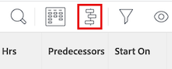
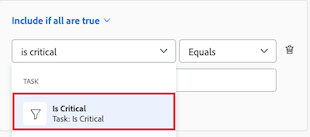
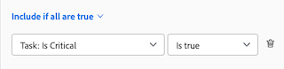

# Overview of the project Critical Path

<!-- Audited: 5/2025 -->

Determining a project's Critical Path is an automatic way for Adobe Workfront to flag a sequence of tasks in a project that have the potential to impact the project's timeline. Tasks that can impact the project's timeline are flagged as Critical Path tasks.

The following features can impact the Critical Path of a project:

* The Work Breakdown Structure of the project.

  For more information, see [Determine Work Breakdown Structure in a project](../../../manage-work/projects/planning-a-project/determine-project-work-breakdown-structure.md).

* The time (duration) that each task will take to complete.
* The dependencies between the tasks.

  Consider the following:

   * When a task on the Critical Path has a predecessor relationship, its predecessors and successors are also on the Critical Path if the changes on  the predecessors' or successors' dates directly impact their dependents.

     >[!TIP]
     >
     >When a task's successor date doesn't directly impact the date of their dependent tasks or the project's dates, the successor task isn't on the Critical Path. 
     >
     >
     >     >
     >

   * When a subtask is identified as a Critical Path task, the parent task is also identified as a Critical Path task if the Projected Start Date and parent task's time is the same as that of the subtask.

Taking these features into consideration, the system calculates the Critical Path by using the longest path between the earliest task and the task that determines the end of the project. The Critical Path Calculation takes into account what is the earliest and latest time that each task can start and finish by without making the project longer. This process determines which tasks are "critical" (and belong to the longest path) and which ones have "total float" (can be delayed without making the project longer).

Any delay in the activity of a task on the Critical Path directly impacts the Projected Completion Date of the project (there is no float on the critical path).

## Access requirements

+++ Expand to view access requirements for the functionality in this article.

You must have the following access to perform the steps in this article:

<table style="table-layout:auto"> 
 <col> 
 <col> 
 <tbody> 
  <tr> 
   <td role="rowheader">Adobe Workfront plan</td> 
   <td> 
Any
 </td> 
  </tr> 
  <tr> 
   <td role="rowheader">Adobe Workfront license</td> 
   <td> 
   
New: Standard

   
Or

   
Current: Work or higher

    </td> 
  </tr> 
  <tr> 
   <td role="rowheader">Access level configurations</td> 
   <td> 
View or higher access to Tasks
 
Note: If you still don't have access, ask your Workfront administrator if they set additional restrictions in your access level. For information on how a Workfront administrator can modify your access level, see <a href="../../../administration-and-setup/add-users/configure-and-grant-access/create-modify-access-levels.md" class="MCXref xref">Create or modify custom access levels</a>.
 </td> 
  </tr> 
  <tr> 
   <td role="rowheader">Object permissions</td> 
   <td> 
View or higher permissions on a task 
 
For information on requesting additional access, see <a href="../../../workfront-basics/grant-and-request-access-to-objects/request-access.md" class="MCXref xref">Request access to objects </a>.
 </td> 
  </tr> 
 </tbody> 
</table>

For more detail about the information in this table, see [Access requirements in Workfront documentation](/help/quicksilver/administration-and-setup/add-users/access-levels-and-object-permissions/access-level-requirements-in-documentation.md).

 +++

## View the Critical Path

You can view the tasks that belong to the Critical Path in the following areas of the Workfront application:

* [View the Critical Path in the Gantt chart](#view-the-critical-path-in-the-gantt-chart) 
* [View the Critical Path in a task list or report](#view-the-critical-path-in-a-task-list-or-report)

### View the Critical Path in the Gantt chart {#view-the-critical-path-in-the-gantt-chart}

To view tasks on the Critical Path in the Gantt chart:

{{step1-to-projects}}

1. In the project list, select a project.

1. In the left panel, click **Tasks**. The **Tasks** tab opens.

1. In the upper-right corner of the task list, click the **Gantt Chart** icon.

      

1. In the upper-right corner of the Gantt chart section, click the **Options** icon , then select the **Critical Path** option in the drop-down that appears. The tasks that are on the Critical Path now have a red line above their timeline.

   

### View the Critical Path in a task list or report {#view-the-critical-path-in-a-task-list-or-report}

To view which tasks are on the critical path in a list of tasks:

{{step1-to-projects}}

1. In the project list, select a project.

1. In the left panel, click **Tasks**. The **Tasks** tab opens.

1. Click the **View** icon , then select **Status**. The tasks that are on the Critical Path display a **Critical Path** flag in the **Flags** column of the list.

   Or

   Click the **Filter** icon , then select **+ New Filter**.
1. In the first field, type in *Is Critical*, then select it when it appears under the **Tasks** section in the list.

      

1. Ensure **Is true** is selected in the second drop-down menu.

      

1. Close the filters panel. The tasks list now only displays tasks that are on the Critical Path.
