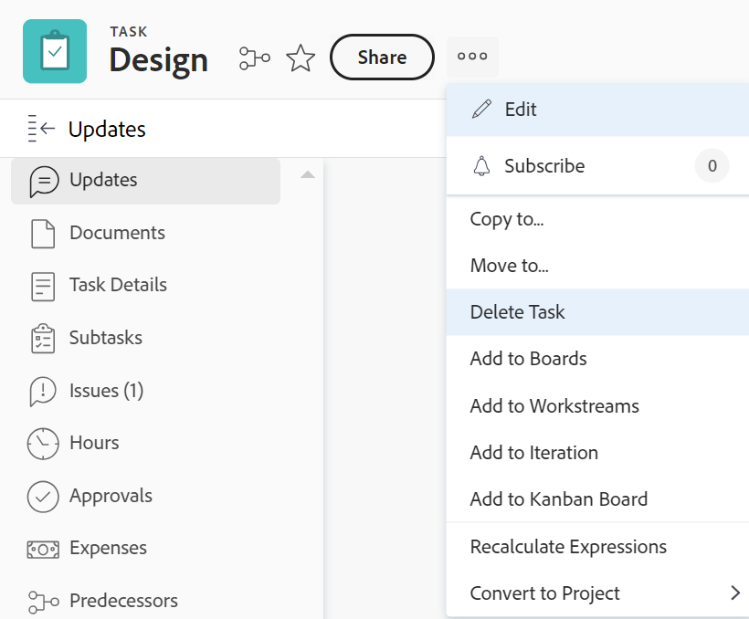

# Delete tasks

You can delete tasks that might be duplicates, or have been created in error.

For tasks that have historical information (updates, changes of schedule, status, or other fields), we recommend that you close them or mark them Dead, instead of deleting them.&nbsp;This helps you keep the historical information for your projects.

## Access requirements

You must have the following access to perform the steps in this article:

<table style="table-layout:auto"> 
 <col> 
 <col> 
 <tbody> 
  <tr> 
   <td role="rowheader">Adobe Workfront plan*</td> 
   <td> 
Any
 </td> 
  </tr> 
  <tr> 
   <td role="rowheader">Adobe Workfront license*</td> 
   <td> 
Work or higher
 </td> 
  </tr> 
  <tr> 
   <td role="rowheader">Access level configurations*</td> 
   <td> 
Edit access to Tasks and Projects with access to&nbsp;Delete
 
Note: If you still don't have access, ask your Workfront administrator if they set additional restrictions in your access level. For information about access to tasks, see <a href="../../../administration-and-setup/add-users/configure-and-grant-access/grant-access-tasks.md" class="MCXref xref">Grant access to tasks</a>. For information on how a Workfront administrator can change your access level, see <a href="../../../administration-and-setup/add-users/configure-and-grant-access/create-modify-access-levels.md" class="MCXref xref">Create or modify custom access levels</a>. 
 </td> 
  </tr> 
  <tr> 
   <td role="rowheader">Object permissions</td> 
   <td> 
Contribute permissions to the project with ability to Add Tasks or higher
 
When you create a task you automatically receive Manage permissions to the task
 
 For information about task permissions, see <a href="../../../workfront-basics/grant-and-request-access-to-objects/share-a-task.md" class="MCXref xref">Share a task </a>. 
 
For information on requesting additional permissions, see <a href="../../../workfront-basics/grant-and-request-access-to-objects/request-access.md" class="MCXref xref">Request access to objects </a>.
 </td> 
  </tr> 
 </tbody> 
</table>

&#42;To find out what plan, license type, or access you have, contact your Workfront administrator.

## Understand the process of deleting tasks

* [Limitations for deleting tasks](#limitations-for-deleting-tasks) 
* [The impact of deleting tasks](#the-impact-of-deleting-tasks)

### Limitations for deleting tasks  {#limitations-for-deleting-tasks}

* When a project has a status of Complete you can delete tasks only if your Workfront administrator or a group administrator has allowed this in your Project Preferences area. For information about setting up project preferences, see [Configure system-wide project preferences](../../../administration-and-setup/set-up-workfront/configure-system-defaults/set-project-preferences.md).

* If the task has logged hours, the Workfront  or group administrator must allow the deletion of these tasks by configuring the Task & Issue Preferences in your Workfront instance. This also applies when you try to delete projects that have tasks with hours logged on them. 

  <!--
  (NOTE: the last statement is NWE&nbsp;only; not possible in classic)
  -->

  For more information about enabling the deletion of tasks where hours are logged, see the "Deletion" section in [Configure system-wide task and issue preferences](../../../administration-and-setup/set-up-workfront/configure-system-defaults/set-task-issue-preferences.md).

### The impact of deleting tasks {#the-impact-of-deleting-tasks}

When you delete a task, you impact other objects linked to the task.

The following objects attached to a task are also deleted when you delete a task:

* Documents

  You cannot delete a task that has a document which has been checked out attached to it. For more information about checking out documents, see [Check out documents](../../../documents/managing-documents/check-out-documents.md).

* Issues
* Subtasks
* Notes
* Approvals

Depending on how your Workfront administrator configures the Project, Task, or Issue Deletion Preferences in the Timesheet & Hour Preferences of your Workfront instance, hours logged for the tasks are handled in one of the following ways when deleting a task:

* Move to the project and will not be restored on the task, if the task is later restored.
* Are deleted and will be restored on the task, if the task is later restored.

  This also applies when you try to delete projects that have tasks with hours logged on them.

  <!--
  <MadCap:conditionalText data-mc-conditions="QuicksilverOrClassic.Draft mode">
  (NOTE: this stays NWE; not possible in classic;)
  </MadCap:conditionalText>
  -->

  For more information about configuring the deletion preferences for hours logged on issues, see [Configure timesheet and hour preferences](../../../administration-and-setup/set-up-workfront/configure-timesheets-schedules/timesheet-and-hour-preferences.md).

* Expenses on the task will move to the project.

* The users assigned to the task or to the task approval remain on the project team.

  For more information about project teams, see [Project Team overview](../../../manage-work/projects/planning-a-project/project-team-overview.md).

## Delete tasks

* [Delete multiple tasks in a project simultaneously](#delete-multiple-tasks-in-a-project-simultaneously) 
* [Delete a single task](#delete-a-single-task)

### Delete multiple tasks in a project simultaneously  {#delete-multiple-tasks-in-a-project-simultaneously}

1. Click the **Main Menu** icon  in the upper-right corner of Adobe Workfront.

1. Click **Projects**. 
1. Click the project name that contains the tasks you want to delete.
1. Click **Tasks** in the left panel.  
1. Do one of the following:

   1. (Conditional) When the **Autosave** toggle is enabled:

      1. Select the tasks you want to delete, then click **More**
      1. Click **Delete**, then **Yes, Delete It** to confirm the deletion.

         The tasks are deleted.

   1. (Conditional) Click the **Plan Mode** icon and select **Manual save** if you want to reverse the changes you make to the task list.

      

      Do the following:

      1. Select the tasks you want to delete. 
      1. Click **Delete**.
      1. (Optional) Click **Undo** to reverse your change and not delete the tasks.
      1. Click **Redo** if you want to keep the change and delete the task.
      1. Click **Save** to delete the tasks.

         Tasks are deleted only after you save your changes.

### Delete a single task {#delete-a-single-task}

1. Click the **Main Menu** icon  in the upper-right corner of Adobe Workfront.

1. Click **Projects**.  
1. Click the project name that contains the task you want to delete.
1. Click **Tasks** in he left panel. 
1. Click the name of the task you want to delete.
1. Click the **More** icon in the upper-right corner.

   

1. Click **Delete Task**.
1. If the deletion is allowed, click **Yes, Delete it**.

   Your Workfront administrator or group administrator might not allow the deletion of tasks where hours are logged.

   For more information about the access and permissions needed to delete a task, see the section [Limitations for deleting tasks](#limitations-for-deleting-tasks) in this article.

## Restore deleted tasks

A Workfront or group administrator can restore tasks within 30 days after they are deleted, as described in [Restore deleted items](../../../administration-and-setup/manage-workfront/manage-deleted-items/restore-deleted-items.md).
