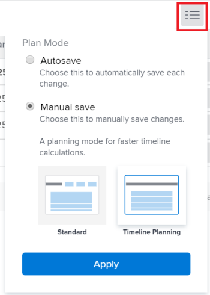

# Edit tasks in a list {#edit-tasks-in-a-list}

You can edit task information in a list of tasks by editing the fields displayed in the list. For information about other ways to edit tasks, see [Edit tasks](../../../manage-work/tasks/manage-tasks/edit-tasks.md).

## Access requirements

You must have the following access to perform the steps in this article:

<table style="table-layout:auto"> 
 <col> 
 <col> 
 <tbody> 
  <tr> 
   <td role="rowheader">Adobe Workfront plan*</td> 
   <td> 
Any
 </td> 
  </tr> 
  <tr> 
   <td role="rowheader">Adobe Workfront license*</td> 
   <td> 
Work or higher
 </td> 
  </tr> 
  <tr> 
   <td role="rowheader">Access level configurations*</td> 
   <td> 
Edit access to Tasks and&nbsp;Projects
 
Note: If you still don't have access, ask your Workfront administrator if they set additional restrictions in your access level. For information on how a Workfront administrator can change your access level, see <a href="../../../administration-and-setup/add-users/configure-and-grant-access/create-modify-access-levels.md" class="MCXref xref">Create or modify custom access levels</a>.
 </td> 
  </tr> 
  <tr> 
   <td role="rowheader">Object permissions</td> 
   <td> 
Contribute or higher permissions to the task and the project
 
For information on requesting additional access, see <a href="../../../workfront-basics/grant-and-request-access-to-objects/request-access.md" class="MCXref xref">Request access to objects </a>.
 </td> 
  </tr> 
 </tbody> 
</table>

&#42;To find out what plan, license type, or access you have, contact your Workfront administrator.

## Considerations about editing tasks in a list {#considerations-about-editing-tasks-in-a-list}

Editing tasks in a list is a fast way to make changes to multiple tasks simultaneously, with a clear view of how your changes might affect the project timeline.

Consider the following when editing tasks in a list:

* Unlike needing Manage permissions to the task when editing it in the Edit Box, you can edit a task in a list only with Contribute permissions to the task. This allows you to edit the following limited information for the task:

   * Description
   * Status
   * Percent Complete
   * Custom&nbsp;Form information

     >[!NOTE]
     >
     >You can edit a task custom field in a list only if you have permissions to update the field.

   * Log hours
   * Modify Assignments
   * View finance information 
   * Add expenses, tasks, or issues

* You can edit a task in the following lists:

   * The Tasks  section  of the project
   * The Subtasks  section  of the project
   * A task report

     >[!NOTE]
     >
     >By default, Workfront automatically saves your changes to tasks in the Subtasks  section or in a task report.

* You can control when Workfront saves the changes you make to the tasks in a list. Your changes can be saved automatically or you can manually save them.

  For information about configuring when Workfront saves changes you make to tasks in a list, see the [Select a save option when editing tasks in a list](#select-a-save-option-when-editing-tasks-in-a-list) section in this article.

* Other users must refresh their pages before they can view the updates you make to a task. 

## Select a save option when editing tasks in a list {#select-a-save-option-when-editing-tasks-in-a-list}

You can decide where the changes you make to tasks in a list are saved automatically, as they occur, or if you want to manually save each change.

>[!IMPORTANT]
>
>Depending on whether you save the tasks automatically or manually, you might overwrite someone else's information as you are editing tasks in a list. For information about how Workfront saves changes on tasks that you make concurrently with other users, see [Overview of saving concurrent changes within a task list](../../../manage-work/tasks/manage-tasks/save-concurrent-changes-in-a-task-list.md).

When you save your changes in a list for a project that has either Automatic or Automatic and On Change selected as the Update Type, Workfront updates the project timeline, along with all in-project and cross-project dependencies. Timeline calculations can take a long time if the project is large or if there are a lot of dependencies. Some methods of editing a task list can be faster than others, depending on the method you select to save your changes.

You can control when Workfront saves the changes you make to the tasks in a list. The following scenarios exist:&nbsp;

* You can have Workfront automatically save the changes, after each update.

  For information, see the section [Edit tasks in a list and automatically save changes](#edit-tasks-in-a-list-and-automatically-save-changes) in this article. 

* You can have control over when you apply multiple changes at a time by manually using a Save button.

  For information, see the section [Edit tasks in a list and manually save changes](#edit-tasks-in-a-list-and-manually-save-changes) in this article.

### Edit tasks in a list and automatically save changes {#edit-tasks-in-a-list-and-automatically-save-changes}

>[!TIP]
>
>Saving your changes and all the project dependencies might be slower if your project has more than 2000 tasks or if it has a lot of dependencies.

Consider the following when saving your task list changes automatically:

* You can apply a custom view to the task list and edit any task-related fields that you have access to update. 
* You cannot reverse auto-saved changes. This is the default setting. 
* Workfront recalculates the timeline of the project and all the in-project and cross-projects dependencies automatically after every change, when the project Update Type is Automatic or Automatic and On Change. For information about the project Update Type, see [Select the project Update Type](../../../manage-work/projects/manage-projects/select-project-update-type.md).

To edit tasks in a list and save changes automatically:

1. Go to the project, then click the **Tasks** section.
1. Click the **Plan mode menu**  at the top of the list and make sure that the **Autosave** option is selected.

   

1. Edit any field that you have permissions to update manually.

   

1. (Optional) Press **Escape** to cancel your changes.
1. Press Enter to save your changes to the tasks and to the project timeline. 
1. (Optional) Right click a task you want to modify.

   Or

   Click the **More** menu  to the right of the task name. 

1. (Optional) Select from the following options:

   <table style="table-layout:auto"> 
    <col> 
    <col> 
    <tbody> 
     <tr> 
      <td role="rowheader"><strong>Open in a new tab</strong></td> 
      <td>Opens the task in a new browser tab. </td> 
     </tr> 
     <tr> 
      <td role="rowheader"><strong>Edit</strong></td> 
      <td>
Opens the <strong>Edit Task</strong> box, where you can edit the task.

For information about editing a task, see <a href="#edit-tasks-in-a-list" class="MCXref xref">Edit tasks in a list</a>.
</td> 
     </tr> 
     <tr> 
      <td role="rowheader">Delete</td> 
      <td>
Deletes the task.

For information about deleting tasks, see <a href="../../../manage-work/tasks/manage-tasks/delete-tasks.md" class="MCXref xref">Delete tasks</a>.
</td> 
     </tr> 
     <tr> 
      <td role="rowheader">Indent</td> 
      <td>
Indents the task by one level. 

This option displays only on stand-alone tasks.
</td> 
     </tr> 
     <tr> 
      <td role="rowheader">Outdent</td> 
      <td>
Outdents the task by one level. 

This option displays only on children tasks. 
</td> 
     </tr> 
     <tr> 
      <td role="rowheader">Insert Task Above</td> 
      <td>Inserts a task above the selected task.</td> 
     </tr> 
     <tr> 
      <td role="rowheader">Insert Task Below</td> 
      <td>Inserts a task under the selected task</td> 
     </tr> 
     <tr> 
      <td role="rowheader">Duplicate</td> 
      <td>
Creates a duplicate version of the task within the same project. 
</td> 
     </tr> 
     <tr> 
      <td role="rowheader">Copy To</td> 
      <td>
Copies the task to another project.

For information about copying and duplicating tasks, see <a href="../../../manage-work/tasks/manage-tasks/copy-and-duplicate-tasks.md" class="MCXref xref">Copy and duplicate tasks</a>.
</td> 
     </tr> 
     <tr> 
      <td role="rowheader">Move To</td> 
      <td>
Moves the task to another project.

For information about moving tasks, see <a href="../../../manage-work/tasks/manage-tasks/move-tasks.md" class="MCXref xref">Move tasks</a>.
</td> 
     </tr> 
    </tbody> 
   </table>

   Changes are saved automatically and you cannot reverse them.

### Edit tasks in a list and manually save changes {#edit-tasks-in-a-list-and-manually-save-changes}

You can manually save changes you make to tasks in a list. When you save changes this way, you have the flexibility to reverse them before saving.

>[!TIP]
>
>* You cannot reverse changes you make to tasks in a list when you are editing them in the Subtasks  section  or in a task report.
>* There are no limitations on how many changes you can reverse. You can reverse all of them one by one until you reach the original state of the tasks. 
>

Consider the following when saving changes in a task list manually:

* In order to save task list changes manually, you need permissions to Manage both the tasks and the project. 
* You cannot edit the project. The option to edit the project is disabled. 
* You cannot update information in the header of the project. You can only do the following when manually saving the changes in the task list:

   * Subscribe to the project.
   * Add the project to your list of favorites. 
   * Open a task by clicking the its name in the list.

* dit the tasks in bulk. The Edit icon is disabled when selecting multiple tasks. 
* Workfront triggers notifications about the changes you make to the tasks only after you save your changes.

There are two ways to manually save changes to tasks in a list. These two ways are described below.

* [Save changes in a task list manually when you select the Manual save Standard option](#save-changes-in-a-task-list-manually-when-you-select-the-manual-save-standard-option) 
* [Save changes in a task list manually when you select the Manual save Timeline Planning option](#save-changes-in-a-task-list-manually-when-you-select-the-manual-save-timeline-planning-option)

#### Save changes in a task list manually when you select the Manual save Standard option {#save-changes-in-a-task-list-manually-when-you-select-the-manual-save-standard-option}

>[!TIP]
>
>If your project has more than 2000 tasks, or if it has a lot of dependencies, it might take a while to visually identify the changes you make to your tasks and how these changes affect all the project dependencies. In this case, saving your changes might take longer if your project has more than 2000 tasks or if it has a lot of dependencies.

Consider the following when updating tasks in a list after selecting the Manual save Standard option:

* You can apply a custom view to the task list and edit any task-related fields that you have permissions to Manage in that view.
* Workfront calculates the timeline of the project and all the in-project and cross-project dependencies after you click Save, when the project Update Type is Automatic or Automatic and On Change. For information about the project Update Type, see [Select the project Update Type](../../../manage-work/projects/manage-projects/select-project-update-type.md).

To edit tasks in a list when selecting the Manual save Standard option:

1. Go to a project, then click the **Tasks** section .
1. Click the **Plan Mode** menu  at the top of the list and select **Manual save**, then click **Standard** > **Apply**.

   

   A toolbar setting displays with options to undo, redo, and save your changes.

   

1. Click inside any field that you have permissions to update manually. The field becomes editable and you can make your changes.

   

1. Press Enter to temporarily save the changes you made.
1. (Optional) Click the **Undo icon**  to reverse a change and return a field to its original state.
1. (Optional and conditional) Click the **Redo icon**  to restore the change you reversed. 

1. (Optional) Right-click a task you want to modify.

   Or

   Click the **More** menu . 

1. (Optional) Select from the following options:

   <table style="table-layout:auto"> 
    <col> 
    <col> 
    <tbody> 
     <tr> 
      <td role="rowheader"><strong>Open in a new tab</strong> </td> 
      <td>Opens the task in a new browser tab. </td> 
     </tr> 
     <tr> 
      <td role="rowheader">Delete</td> 
      <td>For information about deleting tasks, see <a href="../../../manage-work/tasks/manage-tasks/delete-tasks.md" class="MCXref xref">Delete tasks</a>.</td> 
     </tr> 
     <tr> 
      <td role="rowheader">Indent</td> 
      <td> 
Indents the task by one level. 
 
This option displays only on stand-alone tasks.
 </td> 
     </tr> 
     <tr> 
      <td role="rowheader">Outdent</td> 
      <td> 
Outdents the task by one level. 
 
This option displays only on children tasks. 
 </td> 
     </tr> 
     <tr> 
      <td role="rowheader">Insert Task Above</td> 
      <td>Inserts a task above the selected task.</td> 
     </tr> 
     <tr> 
      <td role="rowheader">Insert Task Below</td> 
      <td>Inserts a task under the selected task</td> 
     </tr> 
     <tr> 
      <td role="rowheader">Duplicate</td> 
      <td> 
Creates a duplicate version of the task within the same project. 
 
For information about copying and duplicating tasks, see <a href="../../../manage-work/tasks/manage-tasks/copy-and-duplicate-tasks.md" class="MCXref xref">Copy and duplicate tasks</a>.
 </td> 
     </tr> 
    </tbody> 
   </table>

1. Workfront updates all in-project and cross-project dependencies when you make changes to the timeline of tasks. 
1. Click **Save** when you want to keep your task changes permanently and save the timeline of the project.

#### Save changes in a task list manually when you select the Manual save Timeline Planning option {#save-changes-in-a-task-list-manually-when-you-select-the-manual-save-timeline-planning-option}

Saving your changes and all the project dependencies is faster. This is not available for projects with more than 2000 tasks.

>[!IMPORTANT]
>
>We recommend that you use this option when editing a large list of tasks of more than a few hundred that have a lot of dependencies. Using this option allows you to visually identify your changes much faster than using the Manual save option.

Consider the following when using the Manual save Timeline Planning option in a task list:

* You cannot apply  Manual save  Timeline Planning option to projects that have more than 2000 tasks. 
* You cannot apply a custom view, filter, or grouping to the task list. The View, Filter, and Grouping drop-down menus, as well as the Agile view icon, are disabled. The view that is applied by default contains a limited number of fields. 
* The timeline of the project and all the in-project dependencies are calculated automatically after each change when the project Update Type is Automatic or Automatic and On Change. 
* The cross-project dependencies are calculated after you click Save, when the project Update Type is Automatic or Automatic and On Change. For information about the project Update Type, see [Select the project Update Type](../../../manage-work/projects/manage-projects/select-project-update-type.md).

To edit tasks in a list when using the Manual save Timeline Planning option:

1. Go to a project, then click the **Tasks** section. 
1. Click the **Plan Mode** menu  at the top of the list and select **Manual save**, then click **Timeline Planning**> **Apply**.

   This option is dimmed for projects with more than 2000 tasks.

   

   >[!TIP]
   >
   >When you navigate away from this page, Workfront re-enables the Autosave option.

   Notice the following changes in the list:

   * The View, Grouping, and Filter drop-down menus are removed and the view is replaced by the following fields:

      * Task Number
      * Task Name
      * Constraint Type
      * Duration
      * Planned Start Date
      * Planned Completion Date
      * Predecessors
      * Assignments
      * Status
      * Percent Complete

   * The Agile view icon is removed. 
   * A toolbar setting displays with options to undo, redo, and save your changes.

     

1. Edit any field that you have permissions to update manually.

   

1. Press Enter to temporarily save the changes you made.
1. (Optional) Click the **Undo icon**  to reverse a change and return a field to its original state.
1. (Optional and conditional) Click the **Redo icon**  to reinstate the change you reversed. 

1. (Optional) Right click a task you want to modify

   Or

   Click the **More** menu . 

1. Select from the following options:

   <table style="table-layout:auto"> 
    <col> 
    <col> 
    <tbody> 
     <tr> 
      <td role="rowheader"><strong>Open in a new tab</strong> </td> 
      <td>Opens the task in a new browser tab. </td> 
     </tr> 
     <tr> 
      <td role="rowheader">Delete</td> 
      <td>For information about deleting tasks, see <a href="../../../manage-work/tasks/manage-tasks/delete-tasks.md" class="MCXref xref">Delete tasks</a>.</td> 
     </tr> 
     <tr> 
      <td role="rowheader">Indent</td> 
      <td> 
Indents the task by one level. 
 
This option displays only on stand-alone tasks.
 </td> 
     </tr> 
     <tr> 
      <td role="rowheader">Outdent</td> 
      <td> 
Outdents the task by one level. 
 
This option displays only on children tasks. 
 </td> 
     </tr> 
     <tr> 
      <td role="rowheader">Insert Task Above</td> 
      <td>Inserts a task above the selected task.</td> 
     </tr> 
     <tr> 
      <td role="rowheader">Insert Task Below</td> 
      <td>Inserts a task under the selected task</td> 
     </tr> 
     <tr> 
      <td role="rowheader">Duplicate</td> 
      <td> 
Creates a duplicate version of the task within the same project. 
 
For information about copying and duplicating tasks, see <a href="../../../manage-work/tasks/manage-tasks/copy-and-duplicate-tasks.md" class="MCXref xref">Copy and duplicate tasks</a>.
 </td> 
     </tr> 
    </tbody> 
   </table>

1. Workfront updates all in-project and cross-project dependencies when you change the timeline of a task. 
1. Click **Save** when you want to keep your task changes permanently and save the timeline of the project.

## Edit a task in a list using the Summary

1. Go to the project containing tasks you want to edit.
1. Click**Tasks** in the left panel.

   The list of tasks on the project displays. 

1. Click the More menu  after the task name, then click **Open Summary**. Select the task you want to edit, then click the **Open Summary icon**  in the upper-right corner of the list.

   The **Summary** opens.

   

1. (Optional) Click the **X icon** in the upper-right of the Summary to close the panel and edit the tasks inline.

   Follow the steps about editing a task in a list to inline edit the task.

   For information about editing the task in a list, see [Considerations about editing tasks in a list](#considerations-about-editing-tasks-in-a-list) in this article. 

1. (Optional) Type an update for the task in the **Updates** area. 
1. Click any of the following icons or areas to go to the task and edit information at the task level:

   | Documents  |Click **Click here to add** to add documents to the task. |
   |---|---|
   | Details  |Click to update information about the task. |
   | Custom Forms  |Click to add or remove Custom Forms or update information on the forms.  |
   | Hours  |Click to log hours. |
   | Approvals  |Click to add task approvals.  |

   {style="table-layout:auto"}

1. Click the back button on your browser to return to the task list when you finish updating the task.

## Edit tasks in bulk

You can edit multiple tasks all at once. Ensure you have manage permissions to the tasks to be able to edit them.

1. Go to a project containing tasks you want to edit in bulk. 
1. Click **Tasks** in the left panel. 
1. Ensure that the **Autosave** option is selected.

   >[!IMPORTANT]
   >
   >You cannot edit tasks in bulk when saving tasks manually.

   For more information about ways of saving changes to tasks in a list, see the section [Considerations about editing tasks in a list](#considerations-about-editing-tasks-in-a-list) in this article. 

1. Select several tasks in the tasks list. 
1. Click the **Edit icon** .

   The **Edit Tasks** dialog box opens.

1. Specify the information you want to change for all the tasks you selected.

   Editing the information on all tasks is identical to editing information on one task. If you want to edit task Duration, the tasks selected must have the same Task Constraint; otherwise, the **Duration** field does not populate.

   For more information about editing a task, see [Edit tasks](../../../manage-work/tasks/manage-tasks/edit-tasks.md).

   >[!NOTE]
   >
   >The information you are changing on all the tasks selected will override the existing information on individual tasks, except for the **Assignments** field. Adding a new assignee in bulk edit will add that assignee to all the selected tasks. If other assignees are assigned to the selected tasks, they will remain assigned in addition to the one added through bulk edit.

1. Click **Custom Forms** to edit the custom forms attached to all the tasks selected. Only active custom forms display in the list.

   If the tasks selected do not have any common custom forms, no forms are listed in this section.

   You can edit only the fields on the forms that are attached to all tasks selected and which you have permissions to edit. 

1. (Optional) In the Custom Forms section, select the **Recalculate Custom Expressions** option to ensure that all Calculated Custom Fields that are on the custom forms attached to the tasks selected are up to date. 
1. Click **Save Changes**.

   All changes you made are now visible on all the selected tasks.

For information about bulk editing custom forms, see the section "Edit multiple Custom Forms when bulk-editing objects" in [Manage custom forms attached to objects](../../../workfront-basics/work-with-custom-forms/manage-custom-forms-attached-to-objects.md).
