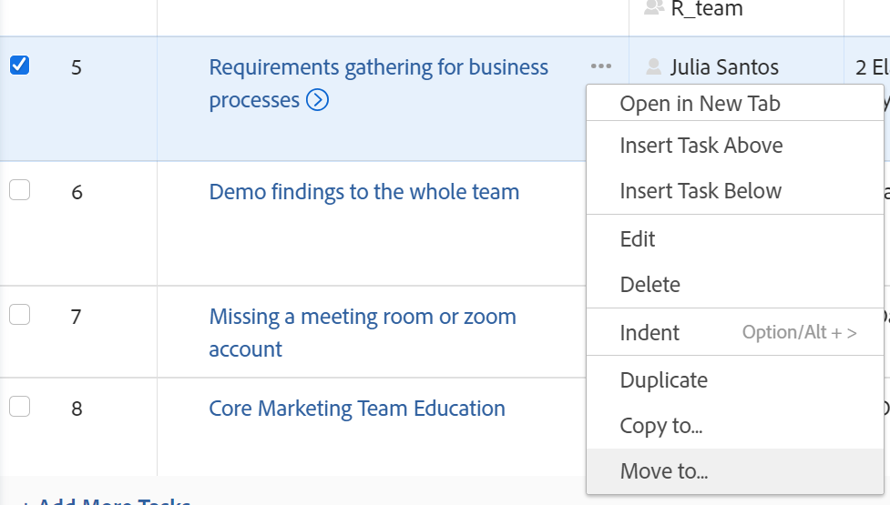
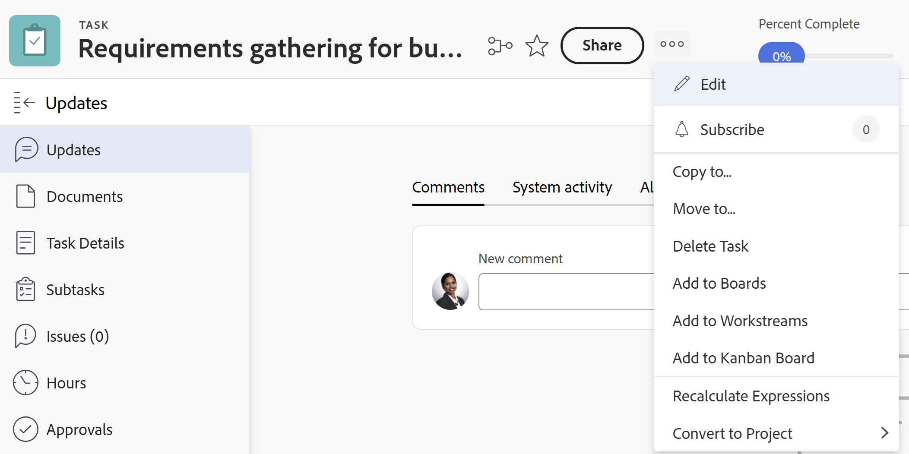
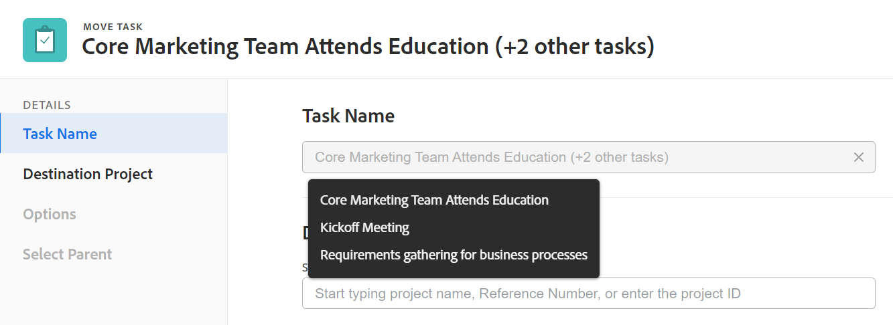
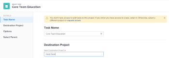

# Move tasks

You can move tasks in Adobe Workfront between the following objects:

* An ad hoc task to a project.
* A task from a project to another project.
* A task from a project under a different parent in another project. 
* A task within the same project under a different parent.

You can move a task at the task level or you can move a task from a list of tasks.
You can move a single task, or you can move several tasks at a time, from a list of tasks. 

## Access requirements

You must have the following access to perform the actions in this article:

<table style="table-layout:auto"> 
 <col> 
 <col> 
 <tbody> 
  <tr> 
   <td role="rowheader">Adobe Workfront plan*</td> 
   <td> 
Any
 </td> 
  </tr> 
  <tr> 
   <td role="rowheader">Adobe Workfront licenses*</td> 
   <td> 
Work or higher
 </td> 
  </tr> 
  <tr> 
   <td role="rowheader">Access level configurations*</td> 
   <td> 
Edit access to Tasks and Projects
 
<b>NOTE</b> 
   
   If you still don't have access, ask your Workfront administrator if they set additional restrictions in your access level. For information on how a Workfront administrator can modify your access level, see <a href="../../../administration-and-setup/add-users/configure-and-grant-access/create-modify-access-levels.md" class="MCXref xref">Create or modify custom access levels</a>.
 </td> 
  </tr> 
  <tr> 
   <td role="rowheader">Object permissions</td> 
   <td> 
Manage permissions to the tasks
 
Contribute or higher permissions to the project with ability to Add Tasks
 
For information on requesting additional access, see <a href="../../../workfront-basics/grant-and-request-access-to-objects/request-access.md" class="MCXref xref">Request access to objects </a>.
 </td> 
  </tr> 
 </tbody> 
</table>

*To find out what plan, license type, or access you have, contact your Workfront administrator.

## Considerations for moving tasks

Consider the following when moving a task: 

* When you move a task from one project to another, the task dates might be recalculated. The recalculation will take into consideration the schedule that the new project uses and the project's Schedule From information.

* You have a chance to select to move some items associated with the task to the moved task during the moving process. However, by default, the following objects transfer to the moved task:

   * Issues
   * Logged hours
   * User comments
   * Custom forms and custom field information
   * Subtasks

The following items do not move with the task, by default:

* Milestones are transferred to the copied task and removed from the original task.

## Move tasks in a list

1. Go to the project that contains the task or tasks that you want to move.
1. Click **Tasks** in the left panel to display the task list. 
1. Click the **Plan Mode** icon  and ensure that the **Autosave** toggle is enabled, then select the task or tasks that you want to move.

   

   >[!IMPORTANT]
   >
   >You cannot move tasks when the **Autosave** toggle is disabled.

1. (Optional and conditional) If you want to move the selected tasks within the same project, click the tasks you selected, drag them and drop them where you want them moved on the project.

   After you dropped the tasks in the correct place on the project, the changes you made to the task hierarchy are saved immediately. All the information associated with each task is moved with the tasks.

1. (Conditional) Select the task or tasks that you want to move and do one of the following:

   * Click the **More** menu  at the top of the task list, then click **Move to**. 
   * Right click the selected tasks, then click **Move to**.
   * When selecting one task, click the **More** menu  next to the task name in the list, then click **Move to**.

   

   The Move Task box displays

1. Continue with moving the task, as described in the section [Move a task at the task level](#move-a-task-at-the-task-level) in this article, starting with Step 4. 

   <!--
   is this still accurate?!
   -->

## Move a task at the task level {#move-a-task-at-the-task-level}

In addition to moving tasks from a list of tasks, you can also move a task at the task level, after you have opened it. 

1. Find a task in your Workfront system by searching for it.
1. Click the name of the task to open it.
1. Click the **More** drop-down menu  next to the name of the task, then click **Move to**. The Move Task box displays.

   

1. (Optional) Update the **Task Name**. The task moves with the new name in the new location. Workfront does not record the original name of the task.

   >[!TIP]
   >
   >The Task Name field is dimmed and not editable when selecting to move multiple tasks in a list. You can hover over the Task Name field and a list of all selected tasks displays.
   >
   >
   >

1. Type the name of the **Destination Project** where you want the task to move in the **Select Destination Project** field.

   If you want to move the task within the same project, type the name of the current project.

   >[!TIP]
   >
   >* The name of the project is case sensitive. 
   >* You can also start typing the Reference Number or enter the ID of the project. This might help you distinguish between projects with identical names. 
   >* Only 100 projects display in the list.

1. (Conditional) Click **Request access** to request access to the project, if you don't have access to the selected project. 
1. (Conditional) Continue to move the task to the selected destination project without requesting access if you have access to add tasks to one of the tasks on the destination project.

   

   >[!TIP]
   >
   >Similar messages display if the project selected is in pending approval, completed, or dead, when the Workfront administrator prevents adding tasks to these projects. For more information, see [Configure system-wide project preferences](../../../administration-and-setup/set-up-workfront/configure-system-defaults/set-project-preferences.md).

1. (Optional) Click **Options** in the left panel

   Or

   Scroll down to the **Options** section in the Move Task box, then deselect any of the items listed in the table below to remove them from the moved tasks . All options are selected by default.

   >[!IMPORTANT]
   >
   >Deselecting items in the Options list results in loss of data. Information from the existing task will be removed and cannot be recovered.

   <table style="table-layout:auto"> 
    <col> 
    <col> 
    <tbody> 
     <tr> 
      <td role="rowheader">Select all</td> 
      <td>Deselect this option to remove all information from the task when moving it to its new location. </td> 
     </tr> 
     <tr> 
      <td role="rowheader">Constraint</td> 
      <td> 
The task constraint is set to As Soon As Possible or As Late As Possible based on the project Schedule Mode setting.
 
 When selected, the current constraint of the task transfers with the task. 
 
      
<b>NOTE</b> 
      
      When moving or copying a task with date-specific constraints to another project and the constraint dates of the task are outside the dates of the new project, either the Task Constraint changes to As Soon as Possible or As Late as Possible or the Planned Start or Planned Completion dates of the projects are adjusted. 
      
      The following are examples of date-specific constraints:
      <ul>
      <li> Start On</li>
      <li> Must Finish On</li>
      <li> Start No Earlier Than</li>
      <li> Start No Later Than</li>
      </ul>
      
      For information about task constraints and how task constraints or project dates can be affected, see <a href="../../../manage-work/tasks/task-constraints/task-constraint-overview.md" class="MCXref xref">Task Constraint overview</a> and look for a specific constraint.
 </td> 
     </tr> 
     <tr> 
      <td role="rowheader">Assignments</td> 
      <td> 
All the assignments are removed from the task. 
 </td> 
     </tr> 
     <tr> 
      <td role="rowheader">Approval Process</td> 
      <td>All approval processes are removed from the task.</td> 
     </tr> 
     <tr> 
      <td role="rowheader">Progress</td> 
      <td>The task status is New. Otherwise, the existing task status is preserved. </td> 
     </tr> 
     <tr> 
      <td role="rowheader">Financial Information</td> 
      <td>The financial information of the task is removed and the Workfront updates the task Cost Type to No Cost and the task Revenue Type as Not Billable. </td> 
     </tr> 
     <tr> 
      <td role="rowheader">All Predecessors</td> 
      <td> 
When selected, the dependency becomes a cross-project predecessor when you move the task to another project. 
 </td> 
     </tr> 
     <tr> 
      <td role="rowheader">Documents</td> 
      <td> 
The documents attached to the task are not transferred to the moved task. This includes versions, proofs, and linked documents.
 
This does not include document approvals. Document approvals can never be moved when a task is moved.
 
      <b>NOTE</b>
    
    If you opt to not have the documents moved with the task, the documents will be deleted and placed in the Recycle Bin for 30 days. An administrator can restore them and they will be restored on the moved task. 
    
    If the task is deleted after it's moved, the restored documents will be placed in the Documents area of the user page of the administrator who restores them.
      
      </td> 
     </tr> 
     <tr> 
      <td role="rowheader">Reminder Notifications</td> 
      <td>The task reminders do not transfer to the moved task. </td> 
     </tr> 
     <tr> 
      <td role="rowheader">Expenses</td> 
      <td>The expenses logged on the task do not transfer to the moved task. </td> 
     </tr> 
     <tr> 
      <td role="rowheader">Permissions</td> 
      <td> 
Workfront removes the names of all the entities displaying in the Sharing list of the task. 
 </td> 
     </tr> 
    </tbody> 
   </table>

 

1. (Optional) Click **Select Parent** in the left panel

   Or

   Scroll to the **Select Parent** section, then select the task in the destination project that you want to become the parent of the moved task.

   >[!TIP]
   >
   >When selecting to move multiple tasks in a list, all selected tasks become the children of the selected parent.

   Select a parent by doing one of the following:

   * In the task list, select one of the parents in the project plan.
   * Click the search icon  and search for a parent task by name.

   The task displays in the list.

   

1. Select the radio button for the parent, after you have found it.

   If you do not select a parent task, the tasks are moved as main tasks rather than subtasks and they are placed at the end of the task list on the destination project.

1. Click **Move task**

   Or

   Click **Move tasks** when you select multiple tasks in a list. 
   
   The moved tasks are now on the specified project and are either subtasks to a parent task, or the last tasks on the project.
