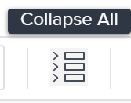

# Manage task finances in the Task Details  section

<!--

(NOTE: some of the information (fields) in this article is also in the Edit tasks article; if you need to update one field, to it in both articles)

-->

You can view or edit the financial information of a task by accessing the Overview area of the Task Details  section. There is a limited number of fields that you can view or edit in this area. 

For information about editing all financial information for a task see [Edit tasks](../../../manage-work/tasks/manage-tasks/edit-tasks.md).

## Access requirements

+++ Expand to view access requirements for the functionality in this article. 

<table style="table-layout:auto"> 
 <col> 
 <col> 
 <tbody> 
  <tr> 
   <td role="rowheader">Adobe Workfront package</td> 
   <td> 
Any
 </td> 
  </tr> 
  <tr> 
   <td role="rowheader">Adobe Workfront license</td> 
   <td>
Standard
 
   
Work or higher
 </td> 
  </tr> 
  <tr> 
   <td role="rowheader">Access level configurations</td> 
   <td> 
Edit access to Projects and Tasks
 
View access to Financial Data or higher
 
You must have Edit access to Financial Data to edit financial information on tasks
 </td> 
  </tr> 
  <tr> 
   <td role="rowheader">Object permissions</td> 
   <td> 
View permissions to the task that include View Finance or higher
 
You must have Manage permissions on the task that include Edit Finance to edit financial information on tasks
</td> 
  </tr> 
 </tbody> 
</table>

For more information, see [Access requirements in Workfront documentation](/help/quicksilver/administration-and-setup/add-users/access-levels-and-object-permissions/access-level-requirements-in-documentation.md).

+++

<!--Old:
<table style="table-layout:auto"> 
 <col> 
 <col> 
 <tbody> 
  <tr> 
   <td role="rowheader">Adobe Workfront plan*</td> 
   <td> 
Any
 </td> 
  </tr> 
  <tr> 
   <td role="rowheader">Adobe Workfront license*</td> 
   <td> 
Work or higher
 </td> 
  </tr> 
  <tr> 
   <td role="rowheader">Access level configurations*</td> 
   <td> 
Edit access to Projects and Tasks
 
View access to&nbsp;Financial&nbsp;Data or higher
 
You must have Edit access to&nbsp;Financial Data to edit financial information on tasks
 
Note: If you still don't have access, ask your Workfront administrator if they set additional restrictions in your access level. For information on how a Workfront administrator can change your access level, see <a href="../../../administration-and-setup/add-users/configure-and-grant-access/create-modify-access-levels.md" class="MCXref xref">Create or modify custom access levels</a>.
 </td> 
  </tr> 
  <tr> 
   <td role="rowheader">Object permissions</td> 
   <td> 
View permissions to the task that include View Finance or higher
 
You must have Manage permissions on the task that include Edit Finance to edit financial information on tasks
 
For information on requesting additional access, see <a href="../../../workfront-basics/grant-and-request-access-to-objects/request-access.md" class="MCXref xref">Request access to objects </a>.
 </td> 
  </tr> 
 </tbody> 
</table>-->

## Edit task finances in the Task Details section

1. Go to a project where you want to view a task.

   >[!NOTE]
   >
   >To find a task, you can also search for it, and click the name to access the task. For more information on searching for objects in Workfront, see [Search Adobe Workfront](../../../workfront-basics/navigate-workfront/search/search-workfront.md).

1. Click **Tasks** in the left panel. 
1. Click the name of a task that you want to view.
1. Click **Task Details**.
1. (Optional) Click the **Collapse all** icon in the top right of the Task Details page.

   

   >[!NOTE]
   >
   >Depending on how your Workfront administrator or Group administrator sets up our Layout Template, the fields in the Task Details section might be rearranged or not display. For information, see [Customize the Details view using a layout template](../../../administration-and-setup/customize-workfront/use-layout-templates/customize-details-view-layout-template.md).

1. Click **Finance** to expand and view the financial information for the task.

   Click the **Edit** icon  in the upper-right corner of the Details section, then click&nbsp;**Finance**. 

1. Edit any field that is available for editing, by single-clicking the field or click **+Add** to add information to an empty field.
1. Review or edit the following information  in the **Finance** area : 

   <table style="table-layout:auto"> 
    <col> 
    <col> 
    <tbody> 
     <tr> 
      <td role="rowheader">Cost Type</td> 
      <td> 
Specify the Cost Type for the task. This is going to determine how the cost of the task is calculated, based on the number of hours on the tasks. 
 
Select from the following options: 
 
       <ul> 
        <li> 
No Cost
 </li> 
        <li> 
Fixed Hourly 
 </li> 
        <li> 
 User Hourly 
 </li> 
        <li> 
 Role Hourly
 </li> 
       </ul> 
For more information about tracking costs, see <a href="../../../manage-work/projects/project-finances/track-costs.md" class="MCXref xref">Track costs</a> . Your Workfront administrator or a group administrator selects the default Cost Type setting for the tasks in your system or your group. For information about setting project defaults, see <a href="../../../administration-and-setup/set-up-workfront/configure-system-defaults/set-project-preferences.md" class="MCXref xref">Configure system-wide project preferences</a> .
 </td> 
     </tr> 
     <tr> 
      <td role="rowheader">Revenue Type</td> 
      <td> 
Specify the Revenue Type for the task. This is going to determine how the Revenue on the task is calculated, based on the number of hours on the tasks. 
 
Select from the following options: 
 
       <ul> 
        <li> 
 Not Billable 
 </li> 
        <li> 
User Hourly 
 </li> 
        <li> 
Role Hourly 
 </li> 
        <li> 
Fixed Hourly 
 </li> 
        <li> 
User Hourly w/Cap 
 </li> 
        <li> 
Role Hourly w/Cap 
 </li> 
        <li> 
User Hourly Plus Fixed 
 </li> 
        <li> 
Role Hourly Plus Fixed 
 </li> 
        <li> 
Fixed Revenue 
 </li> 
       </ul> 
For more information about tracking revenue, see<a href="../../../manage-work/projects/project-finances/billing-and-revenue-overview.md" class="MCXref xref">Overview of Billing and Revenue</a> . 
 
Your Workfront administrator or group administrator selects the default Revenue Type setting for the tasks in your system or your group. For information about setting project defaults, see <a href="../../../administration-and-setup/set-up-workfront/configure-system-defaults/set-project-preferences.md" class="MCXref xref">Configure system-wide project preferences</a>.
 </td> 
     </tr> 
     <tr> 
      <td role="rowheader">Planned Cost</td> 
      <td> 
This is a calculation that shows the cost of the task based on the planned hours, the cost type, and the hourly rate for users or job roles. For more information about tracking costs, see <a href="../../../manage-work/projects/project-finances/track-costs.md" class="MCXref xref">Track costs</a>. 
 </td> 
     </tr> 
     <tr> 
      <td role="rowheader">Actual&nbsp;Cost</td> 
      <td> 
 This is a calculation that shows the cost of the task based on the actual hours, the cost type, and the hourly rate for users or job roles. For more information about tracking costs, see <a href="../../../manage-work/projects/project-finances/track-costs.md" class="MCXref xref">Track costs</a>.
 </td> 
     </tr> 
     <tr> 
      <td role="rowheader">Planned Revenue</td> 
      <td> 
This is a calculation that shows the revenue associated with the task based on the planned hours, the revenue type, and the hourly rate for users or job roles. For more information about tracking costs, see <a href="../../../manage-work/projects/project-finances/track-costs.md" class="MCXref xref">Track costs</a>.
 </td> 
     </tr> 
     <tr> 
      <td role="rowheader">Actual&nbsp;Revenue</td> 
      <td> 
This is a calculation that shows the revenue associated with the task based on the actual hours, the revenue type, and the hourly rate for users or job roles. For more information about tracking costs, see <a href="../../../manage-work/projects/project-finances/track-costs.md" class="MCXref xref">Track costs</a>.
 </td> 
     </tr> 
     <tr> 
      <td role="rowheader"><strong>CPI/SPI/CSI</strong> </td> 
      <td> 
These are task performance metrics that show how your task is performing, at a given time. Their values are calculated based on the Performance Index Method of the project. For more information see the following articles:
 
       <ul> 
        <li> 
<a href="../../../manage-work/projects/project-finances/calculate-cpi.md" class="MCXref xref">Calculate Cost Performance Index (CPI)</a> 
 </li> 
        <li> 
<a href="../../../manage-work/projects/project-finances/calculate-spi.md" class="MCXref xref">Calculate Schedule Performance Index (SPI) </a> 
 </li> 
        <li> 
 
<a href="../../../manage-work/projects/project-finances/calculate-csi.md" class="MCXref xref">Calculate Cost Schedule Performance Index (CSI)</a> 
 
 </li> 
       </ul> </td> 
     </tr> 
     <tr> 
      <td role="rowheader">Estimate at Completion (EAC)</td> 
      <td> 
This is a calculation that shows the total cost of your task, at completion. For more information about estimate at completion, see <a href="../../../manage-work/projects/project-finances/calculate-eac.md" class="MCXref xref">Calculate Estimate At Completion (EAC)</a>.
 </td> 
     </tr> 
    </tbody> 
   </table>

1. (Conditional) If you are editing the fields in the Finance section, click **Save****Changes**.
