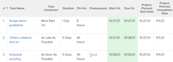

# Task Constraint overview: Earliest Available Time

Earliest Available Time is a Task Constraint that schedules a task to begin at the earliest available time after considering any predecessor relationships.

For information about how to update the Task Constraint on a task, see [Update the Task Constraint of a task](../../../manage-work/tasks/task-constraints/update-task-constraint-of-task.md).

<!--

(NOTE: replaced with new article linked above) 

-->

<!--

To update the Task Constraint to Earliest Available Time:

-->

   <!--
   <li value="1" data-mc-conditions="QuicksilverOrClassic.Draft mode">Go to a task whose constraint you want to modify. </li>
   -->

   <!--
   
Click <strong>Edit Task</strong>.

   -->

   <!--
   
Click the <strong>More</strong> icon  next to the task name, then click <strong>Edit</strong>.

   -->

   <!--
   
In the <strong>Overview</strong> section, expand the <strong>Task Constraint</strong> drop-down menu.

   -->

   <!--
   
Select <strong>Earliest Available Time</strong>.

   -->

   <!--
   <li value="5" data-mc-conditions="QuicksilverOrClassic.Draft mode">Click <strong>Save Changes</strong>.</li>
   -->

## The difference between Earliest Available Time and As Soon As Possible

<!--

(NOTE: [! This section is duplicated in "Earliest Available Time"])

-->

The Earliest Available Time constraint differs from the As Soon As Possible constraint when all of the following criteria exist:

* The project is scheduled From Completion 
* Tasks in the project have a predecessor relationship 
* The predecessor task has a flexible task constraint

In this situation:

* **Earliest Available Time:** Using the Earliest Available Time constraint on the successor task gives priority to the predecessor's flexible constraint.

  **EXAMPLE** 
  
  Task A is a predecessor to Task B. Task B has the Earliest Available Time constraint and Task A has the As Late As Possible constraint. In this situation, Task B is scheduled as close to the completion of the project as possible.

  

* **As Soon As Possible:** In this scenario, using the As Soon As Possible constraint on the successor task gives the priority to the successor task.

  **EXAMPLE**
  
  Task A is a predecessor to Task B. Task B has the As Soon As Possible constraint and Task A has the As Late As Possible constraint. In this situation, Task B is scheduled as close to the start of the project as possible.

  
