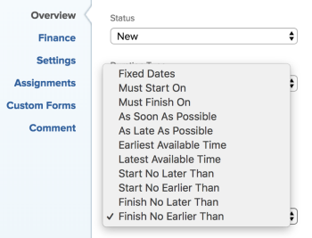

# Task Constraint overview: Finish No Earlier Than

Finish No Earlier Than (FNET) is a Task Constraint that schedules a task to complete after the date you specify.

## Overview of the Finish No Earlier Than constraint

Consider the following when using the Finish No Earlier Than (FNET) constraint for a task:

* You should use this constraint when the project is scheduled From Completion Date. In this case, you can provide a soft constraint on the task before forcing other dependent tasks to show At Risk. 
* When you use FNET on a project scheduled**From Start Date**, then the constraint schedules the task as it would schedule it if the constraint were As Soon As Possible. 
* When you move or copy a task with a FNET constraint to another project, the constraint of the task or the dates of the project might change depending on what the constraint dates are and what the Start and Completion Dates of the project are. The following scenarios exist:

   * When the destination project is scheduled From Start:

      * When the constraint date of the task is earlier than the project Planned Start Date, the task constraint changes to As Soon As Possible. 
      * When the constraint date of the task is later than the project Planned Completion Date, the project Planned Completion Date changes to match the completion constraint date of the task.

   * When the destination project is scheduled From Completion:

      * When the constraint date of the task is later than the Project Completion Date, the task constraint changes to As Late As Possible. 
      * When the constraint date of the task is earlier than the Planned Start Date of the project, the project Planned Start Date changes to match the start constraint date of the task.

   * Regardless of the schedule of the project, when the constraint date of the task is within the Start and Completion Dates of the project, there are no changes to the Task Constraint or the project dates.

  For information about moving tasks, see [Move tasks](../../../manage-work/tasks/manage-tasks/move-tasks.md). For information about copying tasks, see [Copy and duplicate tasks](../../../manage-work/tasks/manage-tasks/copy-and-duplicate-tasks.md).

  For information about how to update the Task&nbsp;Constraint on a task, see [Update the Task Constraint of a task](../../../manage-work/tasks/task-constraints/update-task-constraint-of-task.md).

<!--

<h2>Use the Finish No Earlier Than constraint</h2>

(NOTE: replaced with new article linked above)&nbsp;

To update the Task Constraint to Finish No Earlier Than:

<ol>
<li value="1">Go to a task whose Task Constraint you want to update.</li>
<li value="2"> 
Click the <strong>More</strong> icon  next to the task name, then click <strong>Edit</strong>.
 </li>
<li value="3"> 
In the <strong>Overview</strong> section, expand the <strong>Task Constraint</strong> drop-down menu.
 </li>
<li value="4"> 
Select <strong>Finish No Earlier Than</strong>.
 
  
 </li>
<li value="5"> 
Specify a <strong>Planned Completion Date</strong>.
 
The task must complete no earlier than this date. 
 </li>
<li value="6">Click <strong>Save Changes.</strong> </li>
</ol>

-->
