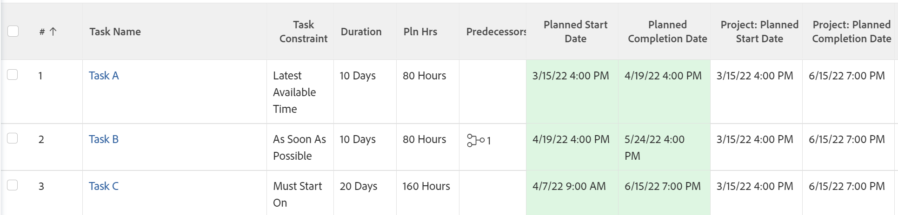
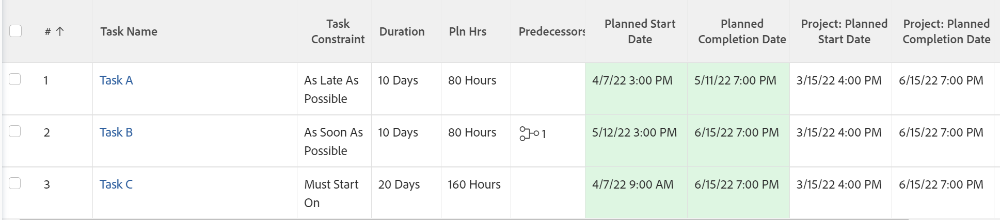

# Task Constraint overview: Latest Available Time

Latest Available Time (LAT) is a type of Task Constraint in Adobe Workfront.

## Use the Latest Available Time Task Constraint

You can use the LAT constraint when you want to schedule a task to begin at the latest available time after considering predecessor-successor relationships in the project.

This constraint differs from As Soon As Possible in that it will not force predecessors or successors to be rescheduled. Rather, it will only affect the schedule of the task it is associated with, setting it to the latest available time based on its relationship to other tasks.

For information about how to update the Task Constraint on a task, see [Update the Task Constraint of a task](../../../manage-work/tasks/task-constraints/update-task-constraint-of-task.md).

<!--

To update the Task Constraint to Latest Available Time:

(NOTE: replaced with new article linked above) 

<ol>
<li value="1">Go to a task whose Task Constraint you want to update.</li>
<li value="2"> 
Click the <strong>More</strong> icon  next to the task name, then click <strong>Edit</strong>.
 </li>
<li value="3">In the <strong>Overview</strong> section, expand the <strong>Task Constraint</strong> drop-down menu.</li>
<li value="4"> 
Select <strong>Latest Available Time</strong>.
 </li>
<li value="5">Click <strong>Save Changes</strong>.</li>
</ol>

-->

## The difference between Latest Available Time and As Late As Possible

<!--

(NOTE: [! This section is duplicated in "As Late As Possible"] - inserted snippet in both (Alina)) 

-->

The Latest Available Time constraint differs from the As Late As Possible constraint when the following criteria exist:

* The project is scheduled From Start Date
* Tasks in the project have a predecessor relationship 
* The successor task has a flexible task constraint

In this situation:

* **Latest Available Time:** Using the Latest Available Time constraint on the predecessor task gives priority to flexible constraint of the successor.

  **Example:** For example, Task A is a predecessor to Task B. Task A has the Latest Available Time constraint and Task B has the As Soon As Possible constraint. In this situation, Task A is scheduled as close to the start of the project as possible.

  

* **As Late As Possible:** In this scenario, using the As Late As Possible constraint on the predecessor task gives the priority to the predecessor task.

  **Example:** For example, Task A is a predecessor to Task B. Task A has the As Late As Possible constraint and Task B has the As Soon As Possible constraint. In this situation, Task A is scheduled as close to the end of the project as possible.

  

<!--

(NOTE: this content was here before but it was wrong - according to this issue in Hub, per Dev, the correct functionality is in the snippet above: https://hub.workfront.com/task/6193c6910004bce9de07cda7757f3ce8/updates?email-source=subscribedCommunication) 

The Latest Available Time constraint differs from the As Late As Possible constraint when the following criteria exist:

<ul>
<li> The project is scheduled From Completion </li>
<li> Tasks in the project have a predecessor relationship </li>
<li> The predecessor task has a flexible task constraint </li>
</ul>

 In this situation: 

<ul>
<li> 
<strong>Latest Available Time:</strong> Using the Latest Available Time constraint on the successor task gives priority to flexible constraint of the predecessor.
 
For example, Task A is a predecessor to Task B. Task B has the Latest Available Time constraint and Task A has the As Soon As Possible constraint. In this situation, Task B is scheduled as close to the start of the project as possible.
 </li>
<li> 
<strong>As Late As Possible:</strong> In this scenario, using the As Late As Possible constraint on the successor task gives the priority to the successor task.
 
For example, Task A is a predecessor to Task B. Task B has the As Late As Possible constraint and Task A has the As Soon As Possible constraint. In this situation, Task B is scheduled as close to the end of the project as possible.
 </li>
</ul>

-->
