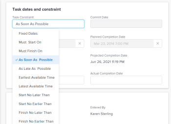

# Update the Task Constraint of a task

Task constraints determine when a task should start and end on a project. For more information, see [Task Constraint overview](../../../manage-work/tasks/task-constraints/task-constraint-overview.md).

## Access requirements

+++ Expand to view access requirements for the functionality in this article. 

<table style="table-layout:auto"> 
 <col> 
 <col> 
 <tbody> 
  <tr> 
   <td role="rowheader">Adobe Workfront package</td> 
   <td> 
Any
 </td> 
  </tr> 
  <tr> 
   <td role="rowheader">Adobe Workfront license</td> 
   <td>
Standard
 
   
Work or higher
 </td> 
  </tr> 
  <tr> 
   <td role="rowheader">Access level configurations</td> 
   <td> 
View or higher access to Projects
 
Edit access to Tasks
</td> 
  </tr> 
  <tr> 
   <td role="rowheader">Object permissions</td> 
   <td> 
Manage access to the task
</td> 
  </tr> 
 </tbody> 
</table>

For more information, see [Access requirements in Workfront documentation](/help/quicksilver/administration-and-setup/add-users/access-levels-and-object-permissions/access-level-requirements-in-documentation.md).

+++

<!--Old:

<table style="table-layout:auto"> 
 <col> 
 <col> 
 <tbody> 
  <tr> 
   <td role="rowheader">Adobe Workfront plan*</td> 
   <td> 
Any 
 </td> 
  </tr> 
  <tr> 
   <td role="rowheader">Adobe Workfront license*</td> 
   <td> 
Work or higher
 </td> 
  </tr> 
  <tr> 
   <td role="rowheader">Access level configurations*</td> 
   <td> 
View or higher access to Projects
 
Edit access to Tasks
 
Note: If you still don't have access, ask your Workfront administrator if they set additional restrictions in your access level. For information on how a Workfront administrator can modify your access level, see <a href="../../../administration-and-setup/add-users/configure-and-grant-access/create-modify-access-levels.md" class="MCXref xref">Create or modify custom access levels</a>.
 </td> 
  </tr> 
  <tr> 
   <td role="rowheader">Object permissions</td> 
   <td> 
Manage access to the task 
 
For information on requesting additional access, see <a href="../../../workfront-basics/grant-and-request-access-to-objects/request-access.md" class="MCXref xref">Request access to objects </a>.
 </td> 
  </tr> 
 </tbody> 
</table>-->

## Update the Task&nbsp;Constraint of a task

1. Click **Main Menu** >&nbsp;**Projects**, then click a project to access it.
1. Click the **Tasks** section in the left panel. 
1. Click **Task Details** in the left panel, then in the Overview area click **Task Constraint**.

   

1. Select from the following options

   | Fixed Dates |For information, see [Task Constraint overview: Fixed Dates](../../../manage-work/tasks/task-constraints/fixed-dates.md).  |
   |---|---|
   | Must Start On |For information, see [Task Constraint overview: Must Start On](../../../manage-work/tasks/task-constraints/must-start-on.md).  |
   | Must Finish On |For information, see [Task Constraint overview: Must Finish On](../../../manage-work/tasks/task-constraints/must-finish-on.md).  |
   | As Soon As Possible |For information, see [Task Constraint overview: As Soon As Possible](../../../manage-work/tasks/task-constraints/as-soon-as-possible.md). |
   | As Late As Possible |For information, see [Task Constraint overview: As Late As Possible](../../../manage-work/tasks/task-constraints/as-late-as-possible.md).  |
   | Earliest Available Time |For information, see [Task Constraint overview: Earliest Available Time](../../../manage-work/tasks/task-constraints/earliest-available-time.md).  |
   | Latest&nbsp;Available Time |For information, see [Task Constraint overview: Latest Available Time](../../../manage-work/tasks/task-constraints/latest-available-time.md).  |
   | Start No Later Than |For information, see [Task Constraint overview: Start No Later Than](../../../manage-work/tasks/task-constraints/start-no-later-than.md). |
   | Start No Earlier Than |For information, see [Task Constraint overview: Start No Earlier Than](../../../manage-work/tasks/task-constraints/start-no-earlier-than.md).  |
   | Finish No Later Than |For information, see [Task Constraint overview: Finish No Later Than](../../../manage-work/tasks/task-constraints/finish-no-later-than.md).  |
   | Finish No&nbsp;Earlier Than |For information, see [Task Constraint overview: Finish No Earlier Than](../../../manage-work/tasks/task-constraints/finish-no-earlier-than.md).  |

   {style="table-layout:auto"}

1. Click **Save**&nbsp;**Changes**.

&nbsp;
