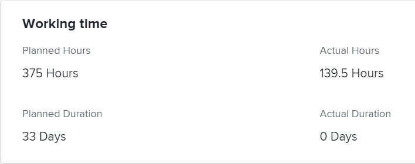
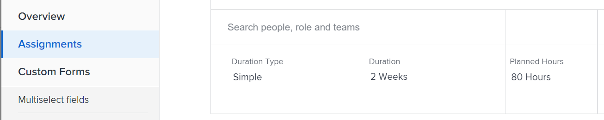
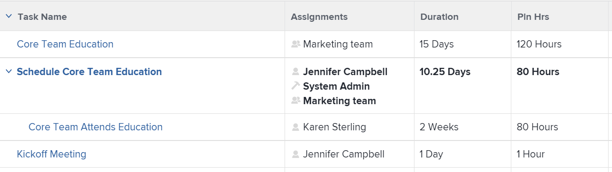
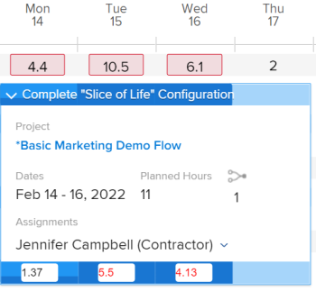
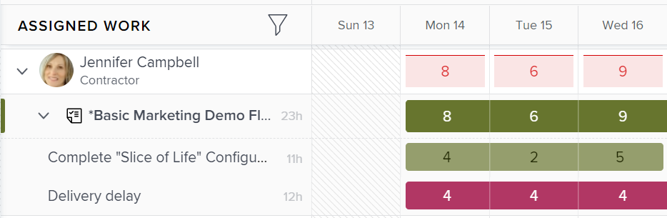
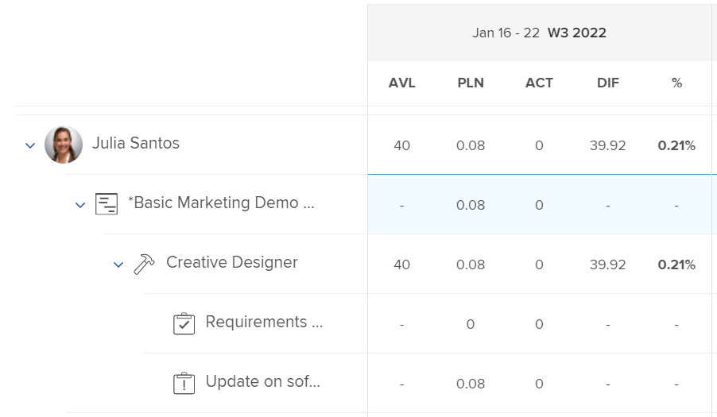

# Planned Hours overview

<!-- Audited: 01/2024 -->

The Planned Hours associated with a task, issue, or project represent the amount of time required for the assigned users to complete the task, issue, or project.

## Considerations about Planned Hours in Adobe Workfront

* Planned Hours are primarily associated with work items (tasks and issues) in Adobe Workfront. The Planned Hours from work items roll up to the Planned Hours of their projects. 
* By default, Workfront distributes task and issue Planned Hours equally to all the days in the Duration of the task or issue. 
* When users and roles are assigned to tasks and issues, the Planned Hours from the tasks and issues become associated with user or role assignments. 
* You must define the value of Planned Hours for tasks and issues if you want to use the Resource Management tools in Workfront. 
* You can modify the value of Planned Hours on tasks only for some Duration Types.

  For more information about modifying Planned Hours on tasks in relation to the Duration Type of the tasks, see the section [Update task Planned Hours based on Duration Type](#update-task-planned-hours-based-on-duration-type) in this article. 

* You can modify the value of Planned Hours on issues at any time. 
* You cannot modify the value of Planned Hours of projects or of parent tasks, as they are a calculated total of all Planned Hours of all their tasks and subtasks. 
* Managing user allocations using resource management tools might change the number of Planned Hours of tasks, issues, and projects, and that of the assignments associated with work items.

## Planned Hours on tasks vs. Planned Hours on projects {#planned-hours-on-tasks-vs-planned-hours-on-projects}

Planned Hours from tasks roll up to the Planned Hours of the project. Planned Hours from issues don't always roll up to the project's Planned Hours.

This section describes differences between the task and project Planned Hours. It also describes where you can view issue Planned Hours that roll up to the project.

### Planned Hours on tasks {#planned-hours-on-tasks}

The Planned Hours of a task indicate the amount of time estimated that the actual work on the task might take. By default, Workfront distributes the total amount of planned hours evenly for each day within the duration of each task. The daily amount of planned hours becomes the daily allocations for the task. If the task is assigned to multiple resources, each resource is allocated an equal amount of daily hours, by default.

Using the Workload Balancer, you can modify the daily allocations for the users assigned to the tasks. This can also update the Planned Hours of the task when the task Duration Type is Simple. For more information, see the "Update task Planned Hours when managing user allocations" section in the article [Manage user allocations in the Workload Balancer](../../../resource-mgmt/workload-balancer/manage-user-allocations-workload-balancer.md).

When a task contains subtasks, the Planned Hours of the parent task is the sum of all Planned Hours on any subtasks. You cannot update the Planned Hours of a parent task.

>[!NOTE]
>
>Unlike Planned Hours, Actual Hours on a parent task are hours logged directly on the parent task. They do not represent a sum of the Actual Hours of the children tasks.   
>For more information about Actual Hours, see [View Actual Hours](../../../manage-work/tasks/task-information/actual-hours.md).

### Planned Hours on projects {#planned-hours-on-projects}

You cannot edit the amount of Planned Hours on a project. Planned Hours on a project are a calculated sum of all Planned Hours from all the tasks on the project.

Whether issues are included in the calculation for Planned Hours depends on the location within the project where you are viewing Planned Hours. You can view project Planned Hours in the following locations within a project:

* **Project Details section and the Edit Project box**: Only the Planned Hours for the tasks on the project are taken into account. The Planned Hours for the issues on the project are not taken into account when viewing the total number of Planned Hours for the project in the Project Details  section  or the Edit Project box.

* **The Workload Balancer**: Only the Planned Hours associated with the tasks visible in the Workload Balancer display in the Workload Balancer for projects. User daily allocations can change the project&nbsp;daily Planned Hours in the Workload Balancer. 
* **Utilization section**: The Planned Hours associated with the users assigned to the tasks and the issues on the project are taken into account when viewing the total number of Planned Hours for the project in the Utilization section.
* **Role Allocation panel** in the task list: The Planned Hours for the tasks and the issues on the project that are assigned to a job role or a user associated with a job role display in this area. Planned Hours associated with tasks and issues that are unassigned or assigned to teams do not display in this area. For more information, see [View project Planned Hours in the Role Allocation panel](../../../manage-work/projects/planning-a-project/view-planed-hours-in-role-allocation-panel.md).

## Distribution of Planned Hours across the Duration of a task

By default, Workfront distributes the Planned Hours evenly across the Duration of a task, allocating an equal number of Planned Hours for each day of the task, according to the availability of the project schedule.

For example, if a task is set to start at 4 PM and the schedule has one hour left in the first day of the task, Workfront puts one Planned Hour in the first day of the task Duration, then divides the remainder of the Planned Hours equally between the rest of the days in the task Duration.

>[!NOTE]
>
>The Planned Hours per Day or the daily allocation is the allocation of Planned Hours for each day during the Duration of the task. If the task has one assignment, then this number represents the Planned Hours per Day per assignment. If the task has multiple assignments, the Planned Hours per Day per assignment is different than the Planned Hours per Day for the task. There is no visual representation in Workfront for the Planned Hours per Day per assignment, for tasks with multiple assignments.

## Locate and understand Planned Hours values

You can find Planned Hours values in various areas of Workfront.

The number of Planned Hours displayed either originates from the work items on the project or are calculated differently depending on what area and on what object you view them in.

You can locate Planned Hours in the following areas of Workfront:

* [The Details section of a project, task or issue](#the-details-section-of-a-project-task-or-issue) 
* [The Edit Task or Edit Issue box](#the-edit-task-or-edit-issue-box) 
* [Reports](#reports) 
* [The Workload Balancer](#the-workload-balancer) 
* [The Resource Planner](#the-resource-planner) 
* [The Utilization report](#the-utilization-report) 
* [The Role Allocation panel](#the-role-allocation-panel)

### The Details section of a project, task or issue {#the-details-section-of-a-project-task-or-issue}

The Planned Hours in the Details section of a task, issue, or project are the total Planned Hours associated with the item.

For more information about project Planned Hours, see the [Planned Hours on tasks vs. Planned Hours on projects](#planned-hours-on-tasks-vs-planned-hours-on-projects) section in this article.

### The Edit Task or Edit Issue box {#the-edit-task-or-edit-issue-box}

The Planned Hours in the Edit box of a task or issue are the total Planned Hours of the respective item.

For more information about project Planned Hours, see the [Planned Hours on tasks vs. Planned Hours on projects](#planned-hours-on-tasks-vs-planned-hours-on-projects) section in this article.

For tasks, you can edit the amount of Planned Hours only for certain Duration Types. For information, see the [Update task Planned Hours based on Duration Type](#update-task-planned-hours-based-on-duration-type) section in this article.

You can view the individual allocation of Planned Hours for each user or job role assigned to the task or issue in the Assignments area.

### Reports {#reports}

You can add the Planned Hours field in project, task, and issue reports.

The Planned Hours column is included in the Standard view of a task list, by default.

The Planned Hours in a task, issue, or project report are the total Planned Hours of the respective item as they display in the Details  section  or the Edit box of the items.

For information about creating reports, see [Create a custom report](../../../reports-and-dashboards/reports/creating-and-managing-reports/create-custom-report.md).

>[!NOTE]
>
>If you create a Project (Financial Data) report and group it by date, the Planned Hours might display a portion of the Planned Hours of the project depending on the timeline of the tasks on the project. By default, Workfront distributes the Planned Hours of tasks equally for each day of the task Duration. The Planned Hours for a certain time frame match the equal distribution set by Workfront for that time frame in the Project (Financial Data) report.

<!--
### The Scheduling areas  {#the-scheduling-areas}

The Planned Hours for tasks and issues display in the Scheduling areas in the Planned Hours field.

You can view the daily allocation of Planned Hours for each user assigned to a task or an issue in the Scheduling areas.

The daily hour amount represents one of the following:

* the default amount equally distributed by Workfront for each day of the Duration of the tasks or issues
* the adjusted daily allocation managed by resource managers.

  For information about adjusting daily allocations in the Scheduling tools, see [Manage user allocations in the Scheduling areas](../../../resource-mgmt/resource-scheduling/manage-allocations-scheduling-areas.md).
-->

### The Workload Balancer {#the-workload-balancer}

The following Planned Hours for tasks, issues, and projects display in the Workload Balancer to the right of the task, issue, or project name:

* For tasks and issues, the Planned Hours associated with them displays. 
* For projects, a total of Planned Hours from the tasks and issues visible on the screen display.

  >[!TIP]
  >
  >The Workload Balancer does not display all the Planned Hours of a project as visible in the project Details area.

You can view the daily allocation of Planned Hours for each user assigned to a task or an issue in the Workload Balancer.

The daily hour amount of Planned Hours represents one of the following:&nbsp;

* the default amount equally distributed by Workfront for each day of the Duration of the tasks, issues, or the project
* the adjusted daily allocation managed by resource managers

  For information about adjusting daily allocations in the Workload Balancer, see [Manage user allocations in the Workload Balancer](../../../resource-mgmt/workload-balancer/manage-user-allocations-workload-balancer.md).

### The Resource Planner {#the-resource-planner}

The Resource Planner displays Planned Hours for projects, tasks, and issues.

You can view weekly allocations of Planned Hours for the users and job roles associated with work items in the PLN column of the Resource Planner.

>[!TIP]
>
>Daily allocation adjustments in the Workload Balancer influence weekly allocations for tasks and issues in the Resource Planner.

The number of Planned Hours for each object differ depending on which view you apply to the&nbsp;Resource Planner. For more information, see [Overview of hours, FTE, and cost information in the Project and Role views of the Resource Planner](../../../resource-mgmt/resource-planning/overview-of-planner-hour-fte-cost-information-in-role-project-views.md).

The weekly hour amount of Planned Hours for tasks and issues represents one of the following:

* the default weekly amount equally distributed by Workfront for each day of the Duration of the tasks or issues 
* the adjusted weekly allocation managed by resource managers in the Workload Balancer

  For information about adjusting daily allocations in the Workload Balancer, see [Manage user allocations in the Workload Balancer](../../../resource-mgmt/workload-balancer/manage-user-allocations-workload-balancer.md).

The weekly amount for projects, users, and roles is influenced by the weekly amounts of Planned Hours for the tasks and issues associated with them.

### The Utilization report {#the-utilization-report}

The project Planned Hours are the ones associated with the assignments on each task and issue.

>[!IMPORTANT]
>
>Note that the Planned Hours in the Utilization report are associated with the assignments and not with the tasks and issues themselves. The Planned Hours in the Utilization report do not always match the Planned Hours on the tasks and issues of the project.&nbsp;However, the Planned Hours do match the hours associated with the assignments on tasks and issues.

You can view the following types of Planned Hours in the Utilization report:

* the total Planned Hours of all assignments on the project for the overall life of the included projects
* the total Planned Hours of all assignments only for the specified date range (you can specify an individual week or month).

  When the user daily allocation for hours has been adjusted using the Workload Balancer, the Planned Hours for a specific date range can be affected if the dates selected in the Utilization report contain only a portion of a task's or issue's Duration. For information about adjusting daily allocations for users, see [Manage user allocations in the Workload Balancer](../../../resource-mgmt/workload-balancer/manage-user-allocations-workload-balancer.md).

For more information, see [View resource utilization information](../../../resource-mgmt/resource-utilization/view-utilization-information.md).

### The Role Allocation panel

The Planned Hours in the Role Allocation panel represent the number of Planned Hours associated with each job role assigned to the tasks or issues on the project for the total duration of the project. The number matches the role Planned Hours from the Resource Planner.

>[!TIP]
>
>Note that the Planned Hours associated with users does not display in the Role Allocation panel.

For more information, see [Show role allocation for projects and initiatives in the Workload Balancer](../../../scenario-planner/show-role-allocation-workload-balancer.md).

## Update task Planned Hours based on Duration Type {#update-task-planned-hours-based-on-duration-type}

You can update the total Planned Hours on tasks when editing tasks only if the tasks have a certain Duration Type.

The following scenarios exist:

* You can modify Planned Hours for tasks only when using the Calculated Assignment or Simple Duration Types when editing a task.

  For more information about the Calculated Assignment Duration Type, see [Duration Type overview: Calculated Assignment](../../../manage-work/tasks/taskdurtn/calculated-assignment.md).

  For more information about the Simple Duration Type, see [Duration Type overview: Simple](../../../manage-work/tasks/taskdurtn/simple-duration-type.md).

* You can update task Planned Hours in the Workload Balancer only for Simple Duration Type tasks when you manage users' allocations to tasks. For information about managing user allocations in the Workload Balancer, see [Manage user allocations in the Workload Balancer](../../../resource-mgmt/workload-balancer/manage-user-allocations-workload-balancer.md).
* You cannot modify Planned Hours for tasks with a Duration Type of Effort Driven or Calculated Work. In these cases, Workfront determines Planned Hours based on the task's Duration; however, in this case the Planned Hours are always equal to the Duration (in hours) and they are not impacted by the percent allocation of the assigned resources.

  For more information about the Effort Driven Duration Type, see [Duration Type overview: Effort Driven](../../../manage-work/tasks/taskdurtn/effort-driven.md).

  For more information about the Calculated Work Duration Type, see [Duration Type overview: Calculated Work](../../../manage-work/tasks/taskdurtn/calculated-work.md).

## Update task Planned Hours when managing user allocations

You can update Planned Hours for tasks when you manually update the user or job role allocations to tasks. This is possible only when tasks have a Duration Type of Simple.

For more information, see [Duration Type overview: Simple](../../../manage-work/tasks/taskdurtn/simple-duration-type.md).

You can update either the overall allocation of the users and roles assigned to the task, or the user daily allocations when using the Workload Balancer.

For information about managing overall user and job role allocations for tasks, see [Manage user and role allocation hours on tasks](../../../manage-work/tasks/assign-tasks/manage-allocation-hours-on-tasks.md).

For information about managing daily allocations for tasks, see [Manage user allocations in the Workload Balancer](../../../resource-mgmt/workload-balancer/manage-user-allocations-workload-balancer.md).

The following scenarios exist when manually updating user or job role allocations for tasks:

* When you have not manually updated the individual user or role allocations to trigger a change to the task Planned Hours, the Planned Hours remain unchanged when you add, remove, or replace assignments on the task. When adding a new assignment to the task, the individual allocations are redistributed between all the assignees. 
* When you have manually updated the allocations to trigger a change to the task Planned Hours, the Planned Hours decrease when you remove assignments from the task. They remain unchanged when you replace an assignment. 
* When you have manually updated the allocations to trigger a change to the task Planned Hours and you add an assignment to the task, the new assignment is allocated 0 hours by default. You must manually update their allocation to the task, which might affect the Planned Hours. 
* When you have not manually updated the allocations to trigger a change to the task Planned Hours and you remove all the assignments to the task, the Planned Hours remain unchanged. 
* When you have manually updated the allocations to trigger a change to the task Planned Hours and you remove all the assignments to the task, the Planned Hours are also removed and the Planned Hours of the task become 0.

>[!NOTE]
>
>For example, if a task has 10 Planned Hours and you have two assignees, they are allocated 5 hours each, by default.
>
>* If you don't update the individual user allocation or the daily allocations using the Workload Balancer and you remove any or all of the assignees from the task, the task Planned Hours remain 10 hours. 
>* If you manually change the assignments' allocations to 4 and 6 hours, respectively, and you remove the user allocated to 6 hours as well as their job role, the task Planned Hours updates to 4 hours. If you also remove the user that is allocated to 4 hours but keep the job role associated with the removed user, the Planned Hours of the task remain 4 hours. If you remove the last user who is allocated to 4 hours as well as their job role and the task remains unassigned, the task Planned Hours become 0.

## Update task Planned Hours automatically using Work Effort

When you use Work Effort to estimate the effort needed for a task to complete, the amount of Planned Hours for the tasks updates automatically. This is possible only for tasks with a Simple Duration Type.

For information about using Work Effort to estimate task effort, see [Work Effort overview](../../../manage-work/tasks/task-information/work-effort.md).

<!--

(NOTE: this issue has the explanation of how Planned Hours should work - from Vazgen and Anna: https://hub.workfront.com/issue/6217dced00730b7034c4b808339a35ce/

-->

<!--

Details of their comments: 

-->

<!--

Anna Asatryan

3/22/2022 At 3:16 PM

&nbsp;

to Mark Paul, Corrie Butler, Arman Simonyan, Gagik Khalatyan, Alina Wilson, Artur Sargsyan, Vazgen Babayan, Anna Asatryan

I have done some rough calculations on what the planned hours/revenues should look like Book.xlsx . And if we look, for example at the 2 users highlighted in one of the screenshots their planned hours look way off from what the calculation looks like in the spreadsheet (i.e. equally distributed allocation). When looking at the Workload balancer (the second screenshot), as an example for the user Yashas Mitta, I can see that the allocation has been modified. Obviously the utilization report calculates the allocations based on the modified contouring using the new work per day calculation. The project financial report uses the old, equal distribution of allocation along the full duration of the task. Hence. there is a difference when grouping per periods.

Vazgen Babayan

I believe we will need to prioritise syncing the project financial data report with the new work per day.

Alina Wilson

@Anna Asatryan , do you have a definition of what we should say in documentation (glossary, for example) for how the Planned Hours (or Planned Revenue) is calculated, keeping in mind that we don't document the concept of "workPerDay". We call them "daily allocations", for example, but let me know if that's accurate, too.

Vazgen Babayan

Last Thursday at 3:13 PM

I think an important note here is that regardless the calculation, even if the both views used the same formula, they will not display the same data, because the underlying data sources are different. The Financial Data report does not respect user-entered allocations in Workload Balancer at this moment. So there will be a clear discrepancy, as Anna showed in her message. My recommendation for communication will be to explain that the data sources are different so there can be a mismatch in data and that we will look into addressing that on our roadmap.

Alina Wilson

So far, I hear you guys say this (with my questions for confirmation/ comments in bold):

- the utilization report calculates the allocations based on the modified contouring using the new work per day calculation (so this is what we see in the Workload Balancer, right?)

- the project financial report uses the old, equal distribution of allocation along the full duration of the task (this is before the daily allocations for example were modified in the WB, right?)

I have these additional questions:

- what does the Project Details show? Which Planned Hours, for instance - because earlier, we had a question about this also. - which numbers?

- what does any Planned Hours/ Planned Revenue field that can be pulled in any other report (outside of Financial Data and Utilization reports) show? - which numbers?

- are there any other areas I am not thinking of that we need to document, @Corrie Butler

I will try to document all the possible areas where these display but please help. Thanks!

Vazgen Babayan

Last Saturday at 3:41 PM

<ul>
<li> 
Confirming the first two points 
 </li>
</ul>

For the following questions

<ul>
<li> 
Project details show an aggregated sum of task planned hours. It doesn't have anything to do with the work per day because it always deals with total numbers for the whole duration of the Project/Task.
 </li>
<li> 
Same thing applies to the Planned Hours and Planned Revenue fields in reports - they show totals for the whole Project/Task duration and thus have no use of work per day.
 </li>
<li> 
Can't think of any other fields related to this right now.
 </li>
<li> 
In general, if I were to summarize the system behavior, it's as follows:
 </li>
<li> 
Every area that only deals with total numbers of Planned Hours / Planned Revenue, uses the numbers entered on the tasks. Those are Task / Project Details, reports exposing those fields.
 </li>
<li> 
Areas that deal with time-sensitive portions of Planned Hours / Planned Revenue, use work per day. Those are all Resource Management tools - Workload Balancer, Resource Planner, Utilization Report, importing projects via Scenario Planner.
 </li>
<li> 
All the areas in the second point support user-edited allocations made in Workload Balancer.
 </li>
<li> 
Scheduling area and Project Financial Data reports use the old version of the work per day, which doesn't respect user-edited allocations from Workload Balancer.
 </li>
<li> 
Scheduling will be removed this year, and we need to do work to move the Project Financial Data reports to the new work per day sometime after Q3.
 </li>
</ul>

Alina Wilson

@Vazgen Babayan , one clarifying question: when you say "Scheduling and Project Financial Data reports use the old version of the work per day, which doesn't respect user-edited allocations from WB" - you mean that those use the system default which spreads the allocations evenly, correct? Because you can edit (daily) allocations in Scheduling tools, but it doesn't use that, correct? It uses the default of the daily allocation that the system figures out when dividing the Planned Hours by the number of days in the Duration. Please let me know. And thanks!

Anna Asatryan

Yesterday at 11:42 AM

@Alina Wilson , that's correct, when saying "Scheduling and Project Financial Data reports use the old version of the work per day, which doesn't respect user-edited allocations from WB" Vazgen meant that it spreads the allocation evenly.

As for the scheduling, the allocation modification that's being done there isn't reflected anywhere else in the application other than in the Scheduling itself. That's probably one of the reasons it's being deprecated.

-->

<!--

   

-->

<!--

(NOTE: everything below is drafted because I replaced it with the table above)

-->

<!--

You can find the Planned Hours information on tasks, issues, or projects in the following locations:

-->

<!--

The Planned Hours in the Details  section  of a task, issue, or project are the total Planned Hours of the respective item. 

Finding the Planned Hours in the Details  section  is identical for tasks, issues, and projects. 
 <note type="tip">
You cannot edit the Planned Hours of projects manually, as they are a calculation of all Planned Hours of all the tasks on the project.
</note>

To locate the Planned Hours value on the Details  section  of a task: 

<ol>
<li value="1">Go to a task for which you want to review the Planned Hours.</li>
<li value="2"> 
Click <strong>Task Details</strong> in the left panel. 
 </li>
<li value="3"> 
Click the <strong>Overview</strong> area and notice the Planned Hours value.
 
This value represents the time it would take the user assigned to the task to complete it. 
 </li>
</ol>

-->

<!--

<h3> </h3>

The Planned Hours in the Edit box of a task, issue, or project are the total Planned Hours of the respective item. 

Finding the Planned Hours while editing a task or an issue is identical. 
 <note type="tip">
You cannot edit the Planned Hours of projects manually, as they are a calculation of all Planned Hours of all the tasks on the project.
</note>

To locate the value of Planned Hours while editing a task:

<ol>
<li value="1">Go to the task or issue you want to view Planned Hours for.</li>
<li value="2"> 
Click the <strong>More</strong> icon  next to the task name, then click <strong>Edit</strong>.
 
The Planned Hours are located in the <strong>Overview</strong> section. 
 </li>
</ol>

-->

<!--

The Planned Hours column is included in the Standard view of a task list, by default. For issues and projects, you can add it to the view, when you are editing the view or when you build a report. 

The Planned Hours in a task, issue, or project report are the total Planned Hours of the respective item as they display in the Details  section  or the Edit box of the items. 

Adding the Planned Hours column to a project view is similar to building a view in a project report. 

To show Planned Hours in a project report:

<ol>
<li value="1"> 
Click the <strong>Main Menu</strong> icon  in the upper-right corner of Workfront, then click <strong>Reports</strong>. 
 </li>
<li value="2">Click <strong>New Report</strong>, then choose <strong>Project</strong> as your object.</li>
<li value="3">Click <strong>Add Column</strong>, and start typing <strong>Planned Hours</strong> when the <strong>Show in this column</strong> drop-down field is displayed. Select the field when it appears in the list.</li>
<li value="4"> 
Click <strong>Save + Close</strong> to save the report. 
 
The Planned Hours column shows the total number of Planned Hours on each project. 
 </li>
</ol>

-->

<!--

Planned Hours in Resource Management tools
 <note type="important">
When viewing Planned Hours in the Resource Management tools by a specific time frame, the daily allocations for each work item and the daily allocations for the resources assigned to the work items during that time frame can influence the daily Planned Hours of projects or work items.
</note>

You can see the value of Planned Hours for your tasks, issues, or projects when using the following Resource Management tools:

<ul>
<li> 
Resource Planner
 
For information about using the Resource Planner, see <a href="../../../resource-mgmt/resource-planning/get-started-resource-planner.md" class="MCXref xref">Resource Planner overview</a>.
 </li>
<li> 
Utilization Report.
 
For information about the utilization report, see <a href="../../../reports-and-dashboards/reports/using-built-in-reports/resource-utilization-report.md" class="MCXref xref">Overview of the Resource Utilization report</a>.
 </li>
<li>

Workload Balancer or Scheduling areas in the following sections:

<ul>
<li>Scheduling or Workload Balancer sections in the Resourcing area</li>
<li>Scheduling or Workload Balancer section at the project level</li>
<li>Schedule or Workload Balancer section at the team level</li>
</ul>

 
For information about scheduling resources, see <a href="../../../resource-mgmt/resource-scheduling/get-started-resource-scheduling.md" class="MCXref xref">Get started with Resource Scheduling</a>.
 
For information about the Workload Balancer, see <a href="../../../resource-mgmt/workload-balancer/overview-workload-balancer.md" class="MCXref xref">Workload Balancer overview</a>. 
 </li>
<li> 
<b>Role Allocation panel</b> in the project  task list or  Workload Balancer: The Planned Hours for the tasks and the issues on the project that are assigned to a job role or a user associated with a job role are taken into account in this area. For more information, see <a href="../../../manage-work/projects/planning-a-project/view-planed-hours-in-role-allocation-panel.md" class="MCXref xref">View project Planned Hours in the Role Allocation panel</a>. 
 </li>
</ul>

-->
