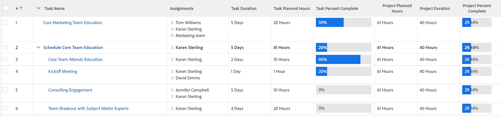
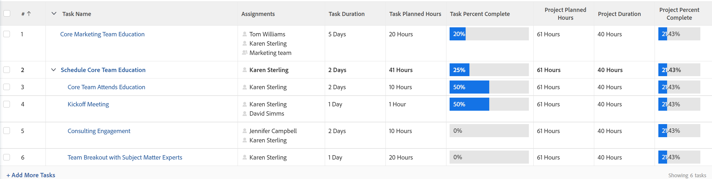

# Project Percent Complete overview

<!-- Audited 01/2024 -->

The Percent Complete value of a project is calculated based on either the Duration or Planned Hours of tasks in the project. Your Adobe Workfront administrator or a group administrator defines which value is taken into account when calculating percent complete in your system when they configure information in the Project Preferences area. 

For information about configuring project preferences, see [Configure system-wide project preferences](../../../administration-and-setup/set-up-workfront/configure-system-defaults/set-project-preferences.md).

The Percent Complete of a parent task is based on the  Duration or Planned Hours of each of its subtasks.

Similarly, the Percent Complete of a project is based on the durations or planned hours of each main task in the project. 

The main tasks are the parent tasks and the standalone tasks which have no children.

>[!TIP]
>
>Main tasks are not indented in a project plan.

## How Workfront calculates Percent Complete

### Update the Percent Complete on a task {#update-the-percent-complete-on-a-task}

You can modify the percent complete of a task manually. This is not a calculation.

Workfront uses the percent complete of an individual task to calculate the percent complete of its parent task or the percent complete of the project.

For information about updating the percent complete of a task, see [View and update Percent Complete for tasks](../../../manage-work/projects/updating-work-in-a-project/view-update-percent-complete-for-tasks.md).

### How Workfront calculates Percent Complete on a parent task {#how-workfront-calculates-percent-complete-on-a-parent-task}

Depending on what your Workfront or group administrator selected in the Project Preferences at the system or group level, the percent complete for a parent task is calculated either based on the Duration or the Planned Hours of tasks.

Consider the following scenarios:

* If the system calculates the percent complete based on Planned Hours, the parent task percent complete is calculated using the following formula:

  `Parent Task Percent Complete = (((Task 1 Planned Hours * Task 1 Percent Complete) + (Task 2 Planned Hours * Task 2 Percent Complete))/Total Planned Hours of Parent)*100`

  The Total Planned Hours of the parent represent the sum of all Planned Hours of each of the children. 

  

* If the system calculates the percent complete based on the  Duration, the parent task percent complete is calculated using the following formula:

  `Parent Task Percent Complete = (((Task 1 Duration * Task 1 Percent Complete) + (Task 2 Duration * Task 2 Percent Complete))/ Total Duration of Parent)*100`

    

  >[!IMPORTANT]
  >
  >The Total Duration of the Parent Task is the total of all the durations of the children tasks. For example, a parent task with two children that have a respective Duration of 1 Day and 2 Days has a Total Duration of 3 Days, even when the two children can start on the same day.

### How Workfront calculates Percent Complete on a project {#how-workfront-calculates-percent-complete-on-a-project}

Depending on what your Workfront or group administrator selected in the Project Preferences at the system or group level, the percent complete for a project is calculated either based on the Duration or the Planned Hours of the main tasks on the project.

* If the system calculates the percent complete based on Planned Hours, the project percent complete is calculated using the following formula:

  `Project Percent Complete =(((Task 1 Planned Hours * Task 1 Percent Complete) + (Task 2 Planned Hours * Task 2 Percent Complete))/Total Planned Hours of the Project)*100`

  The Total Planned Hours of the project are the sum of the Planned Hours of all of the main tasks on the project. 

  

  >[!NOTE]
  >
  >Task 1 or Task 2 can only be parent tasks or standalone tasks. The Planned Hours and Percent Complete of children tasks are not used in this calculation.

* If the system calculates the percent complete based on the  Duration, the project percent complete is calculated using the following formula:

   `Project Percent Complete = (((Task 1 Duration * Task 1 Percent Complete) + (Task 2 Duration * Task 2 Percent Complete))/Duration of the Project)*100`

    >[!IMPORTANT]
    >
    >The Duration of the Project is the total of all the durations of the main tasks that display a percent complete. For example, a project with a standalone task with a Duration of 2 Days and a parent task with a Duration of 5 Days that have had work completed on them will have a Total Duration of 7 Days, even if the two tasks can start on the same day. 

    

  >[!NOTE]
  >
  >Task 1 or Task 2 can only be parent tasks or standalone tasks. The Duration and Percent Complete of children tasks are not used in this calculation.

## Example of Percent Complete on a project using Duration

When using the Duration of the tasks to calculate the percent complete of a project, consider the following example:

The following information is used to calculate the percent complete of the project

* The percent complete of the standalone task (Task 1 - 20%)
* The percent complete of the parent task (Task 2 - 25%)
* The Duration of Task 1 (5 Days)
* The Duration of Task 2 (2 Days)
* The Duration of the project (7 days)

To calculate the percent complete of the project using Duration: 

`Project Percent Complete = (((Task 1 Duration * Task 1 Percent Complete) + (Task 2 Duration * Task 2 Percent Complete))/Duration of the Project)*100`

Or

`(((5*0.2)+(2*0.25))/7)*100= 21.43%`

<!--drafted, this was the old example:

When using the Planned Duration of the tasks to calculate the percent complete of a project, consider the following example:

percent_complete_on_project_example.png

Only the parent task (Task 1) and the standalone task (Task 8) are used to calculate the percent complete of the project.

The secondary parents of Task 1 are used to calculate the percent complete of the main parent (Task 1).

To calculate the percent complete of the main parent (Task 1), first calculate the percent complete of its secondary parents:

Task 5 Percent Complete = ((14 * 0.75 + 12 * 0.25)/(12 + 14))*100 = 51.92%

Task 2 Percent Complete = ((5 * 0.7 + 2 * 0.5)/(5 + 2))*100 = 64.29 %

Then, to calculate the percent complete of the main parent (Task 1), use the following formula:

Task 1 Percent Complete =((56 * 0.5192 + 7 * 0.6429)/63)*100 = 53.29%

To calculate the percent complete of the project, you will need to have the following numbers ready:

Task 1 Duration (63 hours) and Percent Complete (53.29%)
Task 8 Duration (100 hours) and Percent Complete (4%)
Now, to calculate the percent complete of the project, use the following formula:

Project Percent Complete =((100 * 0.04 + 63 * 0.5329))/163)*100 = 23.05%
-->