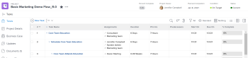

# Project Percent Complete overview

The Percent Complete value of a project is calculated based on either the Planned Duration or Planned Hours of tasks in the project. Your Adobe Workfront administrator or a group administrator defines which value is taken into account when calculating percent complete in your system when they configure information in the Project Preferences area. For information about configuring project preferences, see [Configure system-wide project preferences](../../../administration-and-setup/set-up-workfront/configure-system-defaults/set-project-preferences.md).

The Percent Complete of a task is based on the Planned Duration or Planned Hours of each of the subtasks.

Similarly, the Percent Complete of a project is based on the planned durations or planned hours of each main task in the project. The main tasks are the parent tasks and the standalone tasks which have no children.

>[!NOTE]
>
>Main tasks are not indented in a project plan.



## How Workfront calculates Percent Complete

* [Update the Percent Complete on a task](#update-the-percent-complete-on-a-task) 
* [How Workfront calculates Percent Complete on a parent task](#how-workfront-calculates-percent-complete-on-a-parent-task) 
* [How Workfront calculates Percent Complete on a project](#how-workfront-calculates-percent-complete-on-a-project)

### Update the Percent Complete on a task {#update-the-percent-complete-on-a-task}

You can modify the percent complete of a task manually. This is not a calculation.

Workfront uses the percent complete of an individual task to calculate the percent complete of its parent task or the percent complete of the project.

For information about updating the percent complete of a task, see [View and update Percent Complete for tasks](../../../manage-work/projects/updating-work-in-a-project/view-update-percent-complete-for-tasks.md).

### How Workfront calculates Percent Complete on a parent task {#how-workfront-calculates-percent-complete-on-a-parent-task}

Depending on what your Workfront administrator selected in the Project Preferences at the system level, the percent complete for a parent task is calculated either based on the Planned Duration or the Planned Hours of tasks.

Consider the following scenarios:

* If the system calculates the percent complete based on Planned Hours, the parent task percent complete is calculated using the following formula:

  ```
  Parent Task Percent Complete = (Task 1 Planned Hours * Task 1 Percent Complete + Task 2 Planned Hours * Task 2 Percent Complete)/Total Planned Hours of Parent*100
  ```

* If the system calculates the percent complete based on the Planned Duration, the parent task percent complete is calculated using the following formula:

  ```
  Parent Task Percent Complete = (Task 1 Duration * Task 1 Percent Complete + Task 2 Duration * Task 2 Percent Complete)/ Total Duration of Parent*100
  ```

### How Workfront calculates Percent Complete on a project {#how-workfront-calculates-percent-complete-on-a-project}

Depending on what your Workfront administrator selected in the Project Preferences at the system level, the percent complete for a project is calculated either based on the Planned Duration or the Planned Hours of the main tasks on the project.

* If the system calculates the percent complete based on Planned Hours, the project percent complete is calculated using the following formula:

  ```
  Project Percent Complete =((Task 1 Planned Hours * Task 1 Percent Complete + Task 2 Planned Hours * Task 2 Percent Complete)/Total Planned Hours of Parent)*100
  ```

  >[!NOTE]
  >
  >Task 1 or Task 2 can only be parent tasks or standalone tasks. The Planned Hours and Percent Complete of children tasks are not used in this calculation.

* If the system calculates the percent complete based on the Planned Duration, the project percent complete is calculated using the following formula:

  ```
  Project Percent Complete = ((Task 1 Duration * Task 1 Percent Complete + Task 2 Duration * Task 2 Percent Complete)/Duration of Parent)*100
  ```

  >[!NOTE]
  >
  >Task 1 or Task 2 can only be parent tasks or standalone tasks. The Duration and Percent Complete of children tasks are not used in this calculation.

## Example of Percent Complete on a project using Duration

When using the Planned Duration of the tasks to calculate the percent complete of a project, consider the following example:

Only the parent task (Task 1) and the standalone task (Task 8) are used to calculate the percent complete of the project.

The secondary parents of Task 1 are used to calculate the percent complete of the main parent (Task 1).

To calculate the percent complete of the main parent (Task 1), first calculate the percent complete of its secondary parents:

```
Task 5 Percent Complete = ((14 * 0.75 + 12 * 0.25)/(12 + 14))*100 = 51.92% <br>Task 2 Percent Complete = ((5 * 0.7 + 2 * 0.5)/(5 + 2))*100 = 64.29 %
```

Then, to calculate the percent complete of the main parent (Task 1), use the following formula:

```
Task 1 Percent Complete =((56 * 0.5192 + 7 * 0.6429)/63)*100 = 53.29%
```

To calculate the percent complete of the project, you will need to have the following numbers ready:

* Task 1 Duration (63 hours) and Percent Complete (53.29%)
* Task 8 Duration (100 hours) and Percent Complete (4%)

Now, to calculate the percent complete of the project, use the following formula:

```
Project Percent Complete =((100 * 0.04 + 63 * 0.5329))/163)*100 = 23.05%
```

