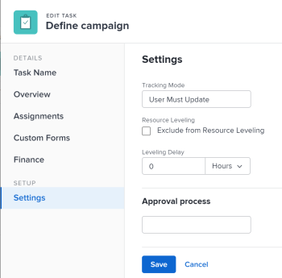

# Update task Leveling Delay

At times, there might be conflicts between task schedules on a project. You can level resources or address resource conflicts by rescheduling resources and tasks so that all tasks can be completed within a realistic&nbsp;schedule. For information about leveling tasks, see [Level Resources in the Gantt Chart](../../../manage-work/gantt-chart/use-the-gantt-chart/level-resources-in-gantt.md).

As the project manager, or the task assignee, you can also add a Leveling Delay on individual tasks to account for any resource or scheduling conflicts. In other words, a task might be scheduled with a delay to ensure that when Adobe Workfront levels&nbsp;the tasks a more realistic schedule overcomes resource conflicts.

Adding a leveling delay to a task adjusts the Projected Completion Date of the task. For information about the projected completion date, see [Overview of the Projected Completion Date for projects, tasks, and issues](../../../manage-work/projects/planning-a-project/project-projected-completion-date.md).

## Access requirements

You must have the following access to perform the steps in this article:

<table style="table-layout:auto"> 
 <col> 
 <col> 
 <tbody> 
  <tr> 
   <td role="rowheader">Adobe Workfront plan*</td> 
   <td> 
Any
 </td> 
  </tr> 
  <tr> 
   <td role="rowheader">Adobe Workfront license*</td> 
   <td> 
Work or higher
 </td> 
  </tr> 
  <tr> 
   <td role="rowheader">Access level configurations*</td> 
   <td> 
Edit access to Tasks and Projects
 
Note: If you still don't have access, ask your Workfront administrator if they set additional restrictions in your access level. For information on how a Workfront administrator can modify your access level, see <a href="../../../administration-and-setup/add-users/configure-and-grant-access/create-modify-access-levels.md" class="MCXref xref">Create or modify custom access levels</a>.
 </td> 
  </tr> 
  <tr> 
   <td role="rowheader">Object permissions</td> 
   <td> 
Manage permissions to Tasks 
 
Contribute or higher permissions to Projects
 
For information on requesting additional access, see <a href="../../../workfront-basics/grant-and-request-access-to-objects/request-access.md" class="MCXref xref">Request access to objects </a>.
 </td> 
  </tr> 
 </tbody> 
</table>

&#42;To find out what plan, license type, or access you have, contact your Workfront administrator.

## Add a Leveling Delay to a task

1. Go to a task for which you want to add a Leveling Delay.
1. Click the **More icon** to the right of the task name, then click **Edit**.

1. Click **Settings**.

   

1. Specify the **Leveling Delay**, in hours, then choose a unit of time.  
   This is the time that the resource will be delayed starting the task due to resource conflicts.

   Select from the following options for units of time:

   * Minutes
   * Hours.&nbsp;This is the default.
   * Days
   * Weeks
   * Months
   * Elapsed Minutes
   * Elapsed Hours
   * Elapsed Days
   * Elapsed Weeks
   * Elapsed Months

   >[!TIP]
   >
   >Elapsed time is a unit of time for a task's Duration. It is the time between the Planned Start Date and the Planned Completion Date of a task that includes holidays, weekends, and time off. In other words, elapsed time is the passage of calendar days.

1. Click **Save**.&nbsp;

&nbsp;
