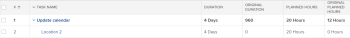
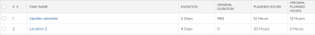

# Overview of task Original Duration and Original Planned Hours

As part of planning a project, you should determine the values for the Planned Hours and for the Duration (or Planned Duration) of every task in the project.

For more information about Planned Hours on tasks, see [Planned Hours overview](../../../manage-work/tasks/task-information/planned-hours.md).

For more information about task Duration, see [Overview of Task Duration and Duration Type](../../../manage-work/tasks/taskdurtn/task-duration-and-duration-type.md).

You can see these values in the Task Details tab, or while editing a task.

If you build a view for a task list or a task report, you can additionally see the Original Planned Hours and the Original Duration fields for the tasks.

## Original Planned Hours

The Original Planned Hours of a task represent the number of Planned Hours that a task originally had before it became a parent task. When a task becomes a parent task, the Planned Hours of the children tasks roll up to the parent task to indicate the Planned Hours of the parent.

Displaying the Original Planned Hours field in a task report or list you can see the original number of Planned Hours before the task inherited the number of Planned Hours of its children.

>[!NOTE]
>
>When you create a task, the number of Original Planned Hours is zero. If the task becomes a parent task, the value of this field is populated with the number of the Planned Hours of the task before it was changed to a parent. This value remains in this field even when the task reverts back to being a standalone task.

## Original Duration

The Original Duration of a task is the Duration that a task originally had before it became a parent task, in minutes. When a task becomes a parent, the Duration between the Planned Start Date of the earliest child and the Planned Completion Date of the last child rolls up to the parent task and becomes the Duration of the parent task. This replaces the Duration of the original task.

Displaying the Original Duration field in a task report or list you can see the original number of days for the Duration of the task before it inherited the Duration of its children.

>[!NOTE]
>
>When you create a task, the Original Duration is zero. If the task becomes a parent task, the value of this field is populated with the Duration of the task before it was changed to a parent. This value remains in this field even when the task reverts back to being a standalone task. This value displays in minutes.

## Example

For example, when two tasks are standalone tasks, their Original Duration and Original Planned Hours are zero.

When the first task becomes the parent of the second task, the Original Duration and Original Planned Hours fields are populated with the values for the Duration and Planned Hours of the task before it became a parent. The Original Duration is displayed in minutes. The Duration and the Planned Hours of the child become the Duration and the Planned Hours of the parent.

When the parent becomes a standalone task again, the Duration and Planned Hours revert back to the original values, while the Original Duration and the Original Planned Hours remain populated. They do not revert to zero.

