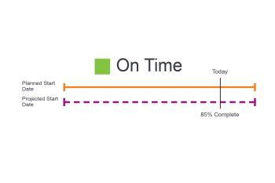
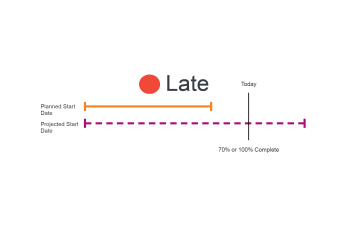

# Task Progress Status overview

<!-- Audited: 1/2024 -->

Adobe Workfront determines the Progress Status of a task by looking at the progression of the task across its timeline. You can configure Workfront to determine the Condition of a project based on the value of the Progress Status of the tasks. For more information about configuring the Condition of the project, see the article [Overview of Project Condition and Condition Type](../../../manage-work/projects/manage-projects/project-condition-and-condition-type.md).

## Criteria that determine the Progress Status of tasks

For information about the Progress Status of a project, see [Project Progress Status overview](../../../manage-work/projects/planning-a-project/project-progress-status.md).

For information about tracking the progress of your tasks, see [Task Tracking Mode overview](../../../manage-work/tasks/task-information/task-tracking-mode.md).

The following criteria determine the Progress Status of a task: 

<table> 
 <col> 
 <col> 
 <thead> 
  <tr> 
   <th> 
<strong>Progress Status</strong> 
 </th> 
   <th> 
<strong>Determining Criteria</strong> 
 </th> 
  </tr> 
 </thead> 
 <tbody> 
  <tr valign="top"> 
   <td scope="col"> 
&nbsp;
 
<strong>On Time</strong> 
 </td> 
   <td scope="col"> 
A task is considered <strong>On Time</strong> when all the Planned Dates match the Projected Dates. This Progress Status could also mean that the project is ahead of schedule and the Projected Dates could be before the Planned Dates.
 
For more information about Projected Dates, see <a href="../../../manage-work/projects/planning-a-project/project-projected-completion-date.md" class="MCXref xref">Overview of the Projected Completion Date for projects, tasks, and issues</a>.
 
For more information about task Planned Completion Date, see the following articles:
 
    <ul> 
     <li> 
<a href="../../../manage-work/tasks/task-information/task-planned-start-date.md" class="MCXref xref">Overview of the task Planned Start Date</a> 
 </li> 
     <li> 
<a href="../../../manage-work/tasks/task-information/task-planned-completion-date.md" class="MCXref xref">Overview of the task Planned Completion Date</a> 
 </li> 
    </ul> </td> 
  </tr> 
  <tr> 
   <td>

 
<strong>At Risk</strong> 
 </td> 
   <td>
A task is considered <strong>At Risk</strong> when the Estimated Completion Date is later than the Planned Completion Date and later than the Projected Completion Date. This can happen when a task has a constraint of <strong>Must Finish On</strong> or <strong>Must Start On</strong> but the percent complete or the predecessor relationships of the task show that it cannot finish or start on the specified dates. 

 Setting the Task Constraint to <strong>Must Finish On</strong> manually sets the Planned Completion Date to a specific date. The Projected Completion Date in this case matches the Planned Completion Date. In the case of this constraint, Workfront analyzes the task to calculate when it will finish based on the percent completed. This calculation is stored as the Estimated Due Date. If the Estimated Due Date is after the Projected Completion Date, the task is considered at risk of being late. 
 
 Setting the Task Constraint to <strong>Must Start On</strong> manually sets the Planned Start Date to a specific date. The Projected Start Date in this case matches the Planned Start Date. In the case of this constraint, Workfront analyzes the task to calculate when it will start based on its predecessor relationships. This calculation is stored as the Estimated Start Date. If there is an enforced predecessor that will not allow the task to start on the specified Start Date, then the Estimated Start Date can be after the Projected Completion Date. The task is considered at risk of being late. 
 
Note:  Typically, Estimated Dates match Projected Dates except for when <strong>Must Start On</strong> or <strong>Must Finish On</strong> are used. In these cases, Estimated Dates continue to calculate based on percent complete and other factors (predecessor relationships), while the Projected Dates are forced to match the Planned Dates which have been set manually.
 </td> 
  </tr> 
  <tr> 
   <td> 
<strong>Behind</strong> 
 </td> 
   <td> 
A task is considered to be <strong>Behind</strong> when the Estimated Completion Date is later or equal than the Planned Completion Date and sooner than the Projected Completion Date.
 
The Projected Completion Date is a real-time view of when the task will be completed based on prior progress. Though the task was started late, it is not considered late yet, because the Planned and Projected Completion Dates are still in the future, and the task might still be completed on time.
 
Note:  The <strong>Behind</strong> and <strong>At Risk</strong> Progress Statuses are almost identical. However, <strong>At Risk</strong> indicates there are some forced Task Constraints (Must Finish On, Must Start On, Fixed Dates) on one or both of the Planned Dates. If there are no forced constraints on the task, the Projected Dates are the same as the Estimated Dates and reflect the system calculation of the Completion Date based on the current progress of the task. The task is not considered late yet, because the Planned and Projected Completion Dates are still in the future, and the task might still be completed on time. For more information about the Projected and the Estimated Dates, see <a href="../../../manage-work/tasks/task-information/differentiate-projected-estimated-dates.md" class="MCXref xref">Differentiate between Projected and Estimated Dates </a>.
 </td> 
  </tr> 
  <tr valign="top"> 
   <td> 
<strong>Late</strong> 
 </td> 
   <td> 
A task is <strong>Late</strong> when the Planned Completion Date is before today's date. 
 </td> 
  </tr> 
 </tbody> 
</table>

<!--hiding this because some users find the images confusing, as they don't really show the dates mentioned in the descriptions above. Keep the pictures though, in case some users will complain that we hid them. 

## How task Progress Status updates over time

The different date types in our projects tell us how tasks are progressing over time:

* On Time

  

* At Risk

  

* Behind

  

* Late

  

-->