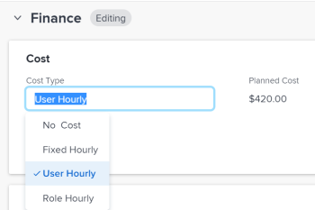

# Update task&nbsp;Cost Type

The Planned and Actual Cost of the tasks and their Labor Costs are determined by the Cost Type of each task.

You can configure the Cost Type for individual tasks within the project. Each cost type affects the Planned Cost and Actual Cost values.

For information about tracking costs in&nbsp;Adobe Workfront, see [Track costs](../../../manage-work/projects/project-finances/track-costs.md).

## Access requirements

+++ Expand to view access requirements for the functionality in this article.

<table style="table-layout:auto"> 
 <col> 
 <col> 
 <tbody> 
  <tr> 
   <td role="rowheader">Adobe Workfront package</td> 
   <td> 
Any
 </td> 
  </tr> 
  <tr> 
   <td role="rowheader">Adobe Workfront license</td> 
   <td> 
Standard

   
Plan
 </td> 
  </tr> 
  <tr> 
   <td role="rowheader">Access level configurations</td> 
   <td> 
Edit access to Projects, Tasks, and Financial Data
</td> 
  </tr> 
  <tr> 
   <td role="rowheader">Object permissions</td> 
   <td> 
Contribute or higher permissions to a project
 
Manage permissions to a task
 </td> 
  </tr> 
 </tbody> 
</table>

For more information, see [Access requirements in Workfront documentation](/help/quicksilver/administration-and-setup/add-users/access-levels-and-object-permissions/access-level-requirements-in-documentation.md).

 +++

<!--Old:

<table style="table-layout:auto"> 
 <col> 
 <col> 
 <tbody> 
  <tr> 
   <td role="rowheader">Adobe Workfront plan*</td> 
   <td> 
Any
 </td> 
  </tr> 
  <tr> 
   <td role="rowheader">Adobe Workfront license*</td> 
   <td> 
Plan 
 </td> 
  </tr> 
  <tr> 
   <td role="rowheader">Access level configurations*</td> 
   <td> 
Edit access to Projects, Tasks, and Financial&nbsp;Data
 
Note: If you still don't have access, ask your Workfront administrator if they set additional restrictions in your access level. For information on how a Workfront administrator can modify your access level, see <a href="../../../administration-and-setup/add-users/configure-and-grant-access/create-modify-access-levels.md" class="MCXref xref">Create or modify custom access levels</a>.
 </td> 
  </tr> 
  <tr> 
   <td role="rowheader">Object permissions</td> 
   <td> 
Contribute or higher permissions to a project
 
Manage permissions to a task
 
For information on requesting additional access, see <a href="../../../workfront-basics/grant-and-request-access-to-objects/request-access.md" class="MCXref xref">Request access to objects </a>.
 </td> 
  </tr> 
 </tbody> 
</table>-->

## Configure the Cost Type of an individual task

1. Go to the task where you want to configure the Cost Type. 
1. Click **Task Details** in the left panel, then expand the **Finance** area. 
1. Double click **Cost Type** and select the cost type that you want to apply to the task.

   

   Select from the following options:

   * No Cost
   * Fixed Hourly
   * User Hourly
   * Role Hourly

   For more information about each task cost type, see [Track costs](../../../manage-work/projects/project-finances/track-costs.md).

1. Click **Save** **Changes** **.**
