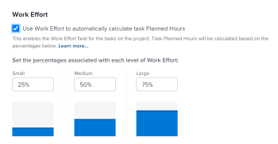

# Work Effort overview

<!--Audited: 01/2024-->

<!--
(NOTE: Linked to the UI >> in the Project/ Template edit box > Tasks area> Learn more)
-->

As a project manager, you can decide how you want to estimate the amount of work needed for tasks to complete in a project. Estimate the amount of work needed to complete tasks using one of the following indicators: 

<table style="table-layout:auto"> 
 <col> 
 <col> 
 <tbody> 
  <tr> 
   <td role="rowheader">Planned Hours</td> 
   <td> <p> A manual numeric entry or a Adobe Workfront calculation that displays the number of hours that it would take for the resources assigned to a task to complete it. </p> <p>Consider the following about Planned Hours: </p> 
    <ul> 
     <li>This is the default method. </li> 
     <li>You can manually update Planned Hours only for tasks with a Duration Type of Calculated Assignment or Simple. </li> 
    </ul> <p>For information about Planned Hours, see <a href="../../../manage-work/tasks/task-information/planned-hours.md" class="MCXref xref">Planned Hours overview</a>. </p> </td> 
  </tr> 
  <tr> 
   <td role="rowheader">Work Effort </td> 
   <td> <p>A manual label that defines whether it takes a user a small, medium, or large amount of daily effort to complete a task. <!--
      <MadCap:conditionalText data-mc-conditions="QuicksilverOrClassic.Draft mode">
       The level of effort is estimated to be a percentage of the daily amount of working time. (NOTE: keep this drafted. Vazgen said it's not needed, but waiting for feedback from users)
      </MadCap:conditionalText>
     --> </p> <p>Consider the following about Work Effort:</p> 
    <ul> 
     <li>This field is available only for tasks with a Simple Duration Type. </li> 
     <li>You can enable the use of this label and define the percentage of working time associated with it at the project level. </li> 
    </ul> </td> 
  </tr> 
 </tbody> 
</table>

This article describes what Work Effort is and how you should use it when estimating the amount of work for your tasks.

>[!NOTE]
>
>Planned Hours and Work Effort influence each other. Updating the Planned Hours can update the Work Effort and updating the Work Effort can update the Planned Hours of the task.

## Access requirements

You must have the following access to perform the steps in this article:

<table style="table-layout:auto"> 
 <col> 
 <col> 
 <tbody> 
  <tr> 
   <td role="rowheader">Adobe Workfront plan</td> 
   <td> <p>Any</p> </td> 
  </tr> 
  <tr> 
   <td role="rowheader">Adobe Workfront license*</td> 
   <td> <p>Current: Plan </p>
   Or
   <p>New: Standard </p>
    </td> 
  </tr> 
  <tr> 
   <td role="rowheader">Access level configuration</td> 
   <td> <p>Edit access to Projects and Tasks</p> </td> 
  </tr> 
  <tr> 
   <td role="rowheader">Object permissions</td> 
   <td> <p>Manage permissions to a project and its tasks</p>  </td> 
  </tr> 
 </tbody> 
</table>

&#42;To find out what plan, license type, or access you have, contact your Workfront administrator. For more information, see [Access requirements in Workfront documentation](/help/quicksilver/administration-and-setup/add-users/access-levels-and-object-permissions/access-level-requirements-in-documentation.md). 

## Considerations for using Work Effort

* When the project tasks have 0 Planned Hours and you enable the Use Work Effort to automatically calculate task Planned Hours setting on the project, the default level of Work Effort associated with them will be Medium. The Planned Hours automatically update for Simple Duration Type tasks. For more information, see the section  [Levels of Work Effort](#levels-of-work-effort) in this article. 
* When the project tasks have Planned Hours that are more than 0 and you enable the Use Work Effort to automatically calculate task Planned Hours setting on the project, the level of Work Effort updates according to the amount of Planned Hours without changing the amount of the Planned Hours for Simple Duration Type tasks. For more information, see the section [How Workfront calculates Work Effort based on Planned Hours](#how-workfront-calculates-work-effort-based-on-planned-hours) in this article. 
* When the project tasks have 0 Planned Hours and you enable the Use Work Effort to automatically calculate task Planned Hours setting on the project, then update the level of Work Effort from Medium to Small or Large, the Planned Hours also update. For more information, see the section [How Workfront calculates Planned Hours based on Work Effort](#how-workfront-calculates-planned-hours-based-on-work-effort) in this article.
* When you inline edit tasks and modify both the Planned Hours and Work Effort field for task at the same time, the Planned Hours will be updated with the value you specify, whereas the Work Effort value is calculated based on your updated Planned Hours.
* When you update the Work Effort value of a task, the Duration no longer auto-calculates based on the Planned Hours. For more information about how Duration calculates for Simple Duration tasks, see [Duration Type overview: Simple](../../../manage-work/tasks/taskdurtn/simple-duration-type.md).
* When you change the Duration Type of a task from Simple to any other type, the Work Effort field is hidden on the task. The Planned Hours remain unchanged. 
* You cannot update the Work Effort level on a parent task. The Work Effort level for a parent task is automatically calculated based on the number of Planned Hours for the tasks which is a rollup of all the children tasks. For information about parent tasks, see [Create subtasks](../../../manage-work/tasks/create-tasks/create-subtasks.md).

## Enable using Work Effort instead of Planned Hours

1. Go to a project and click the **More** menu , then click **Edit**.  
1. Click **Task Settings**, then select the option**Use Work Effort to automatically calculate task Planned hours**. This is deselected by default.

   

   For more information about enabling the use of Work Effort on a project, see the "Tasks Settings" section in the [Edit projects](../../../manage-work/projects/manage-projects/edit-projects.md) article. 

1. Click **Tasks** on the left panel , then click the name of a task to access it. 
1. Click the **More** menu , then click **Edit**. Ensure the task has a Simple Duration Type.

   >[!TIP]
   >
   >You can update the Work Effort for a task in the Task Details section as well.

1. In the **Overview** area, click the Work Effort drop-down menu to correct the amount of effort needed to complete the task.

   

   For more information about updating the Work Effort field on a task, see the following articles:

   * The "Overview" section in the [Edit tasks](../../../manage-work/tasks/manage-tasks/edit-tasks.md) article
   * [Manage task information in the Task Details Overview area](../../../manage-work/tasks/manage-tasks/task-information-in-overview.md)

## Levels of Work Effort {#levels-of-work-effort}

As a project manager, you can identify three levels of Work Effort for your projects. Each level of effort equates with a percentage of daily time that users need to complete the task.

When setting up the level of Work Effort you have to ask yourself the question: "How much time should a user assigned to this task spend on it daily to get it done in time?" 

The following table illustrates the possible levels of Work Effort and their default corresponding percentages. As a project manager, you can update the percentages to suit the needs of your organization. You do this as you edit a project. For information about editing projects, see [Edit projects](../../../manage-work/projects/manage-projects/edit-projects.md).

As a Workfront administrator, you define the Typical hours per work day in the Project Preferences area of Setup. This is the daily amount of time considered as working time. For information about configuring Project Preferences for your instance of Workfront, see [Configure system-wide project preferences](../../../administration-and-setup/set-up-workfront/configure-system-defaults/set-project-preferences.md).

>[!NOTE]
>
>In the examples below, we assume that the Workfront administrator has set the Typical hours per work day amount to 8 hours.

<table style="table-layout:auto"> 
 <col> 
 <col> 
 <tbody> 
  <tr> 
   <td>Level of Work Effort</td> 
   <td>Percentage values</td> 
  </tr> 
  <tr> 
   <td>Small </td> 
   <td>A Small level of effort for completing a task is set to 25% of the Typical hours per work day. This means that a task assigned this level of Work Effort should take up to 2 hours a day to complete in one day. <code>(0.25*8=2)</code></td> 
  </tr> 
  <tr> 
   <td>Medium</td> 
   <td> <p>A Medium level of effort for completing a task is set to 50% of the Typical hours per work day. This means that a task assigned this level of Work Effort should take more than 2 and less than 6 hours to complete in one day. <code>(0.50*80=4)</code> </p> <p>Note: When the Use Work Effort to automatically calculate task Planned Hours setting is enabled on the project this is the default setting for a task, if the task had 0 Planned Hours before this setting was enabled. This causes the task Planned Hours to update to 4 hours. </p> </td> 
  </tr> 
  <tr> 
   <td>Large</td> 
   <td>A Large level of effort for completing a task is set to 75% of the Typical hours per work day. This means that a task assigned this level of Work Effort should take 6 hours or more to complete in one day. <code>(0.75*8=6)</code></td> 
  </tr> 
 </tbody> 
</table>

## How Workfront calculates Planned Hours based on Work Effort {#how-workfront-calculates-planned-hours-based-on-work-effort}

When you enable the Use Work Effort to automatically calculate task Planned Hours setting on a project, Workfront calculates the number of Planned Hours for a task with a Simple Duration Type using the following formula:

```
Task Planned Hours = Number of days in task Duration * Work Effort percentage * Typical hours per work day
```

For example, a task with a Duration of 3 days and a Work Effort of Medium has 12 Planned Hours:

```
Planned Hours = 3*4=12
```

where the Typical hours per work day value is 8 hours.

>[!TIP]
>
>When a task is assigned to multiple resources, the Planned Hours are evenly distributed to each resource for each day of the task's duration.

## How Workfront calculates Work Effort based on Planned Hours {#how-workfront-calculates-work-effort-based-on-planned-hours}

When you enable the Use Work Effort to automatically calculate task Planned Hours setting on a project and you already have Planned Hours on the task or you edit the number of Planned Hours on the task, Workfront updates the Work Effort value.

Workfront uses the following formula to update the level of Work Effort according to the Planned Hours:

```
Work Effort level = Task Planned Hours / Duration / Typical hours per work day
```

For example, if you have a task with a Duration of 2 days and you update the Planned Hours from 8 to 20 hours, the Work Effort for the task updates from Medium to Large:

```
Work Effort level = 20 / 2 / 8 = 125 % = Large
```

## Locate Work Effort for tasks and projects

* [Work Effort for projects](#work-effort-for-projects) 
* [Work Effort for tasks](#work-effort-for-tasks)

### Work Effort for projects {#work-effort-for-projects}

You can locate the Work Effort section on a project in the following area:

* The Task Settings area in the Edit Project box

### Work Effort for tasks {#work-effort-for-tasks}

You can locate the Work Effort field for a task in the following areas:

* The Overview area in the Edit Task box
* The Overview area of the Task Details section, in the Working time area
* A task list or report
