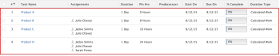

# Duration Type overview: Calculated Work

Calculated Work is a Duration Type that you can set for a task in Adobe Workfront. For general information about Duration Types in Workfront, see [Overview of Task Duration and Duration Type](../../../manage-work/tasks/taskdurtn/task-duration-and-duration-type.md).

## Overview of the Calculated Work Duration Type

Calculated Work determines the amount of effort (Planned Hours) needed for the task to be completed. We recommend that you use the Calculated Work Duration Type when the resources assigned to the task are allocated for the entire duration of the task.

Your Workfront or a group administrator can set the default Duration Type of your system or group as Calculated Work. In this case, all new tasks will be created with this Duration Type. For information about changing your task and issue preferences as part of your system-level or group-level project preferences, see [Configure system-wide task and issue preferences](../../../administration-and-setup/set-up-workfront/configure-system-defaults/set-task-issue-preferences.md).

As resources are added to a task, a project manager can expect to see the planned effort increase. To illustrate, a one-hour planning meeting with three resources represents three total hours of work required, and a one-hour planning meeting with ten resources represents ten hours of work required. This assumes that each resource is allocated to the task with 100% allocation.

## Review the formula for calculating the Work Required when using the Calculated Work Duration Type

When you use the Calculated Work Duration Type on a task, Workfront calculates the amount of Work for each task using the following two formulas. The formulas differ depending on what percentage of time each resource is allocated to the task and how many resources you have assigned to each task:

* Simplified formula: Assuming you have one resource assigned to the task and they are allocated to the task for 100% of their available time, the Work Required value for each task is calculated using the following formula:

```
Work Required (Planned Hours) = (Duration of the task in hours) x (The number of resources assigned to the task)
```

* Complex formula: If you assign each resource with various allocations, the formula takes these allocations into account and accounts for these variations:

```
Work Required (Planned Hours) = SUM[(Duration of the task in hours) x (Percent allocated towards tasks for each resource)]
```

## Review the effect of adding or removing resources from the task

When adding or removing assignees to a task with the Calculated Work duration type, Duration can be manually edited. As assignees are added or removed from the task, the Planned Hours change.

In the following example, the Typical Hours per Work Day is set to 8 in the Project Preferences in Setup. Each task has a Duration of 1 day. As the number of assignees changes, the Planned Hours changes based on the number of assignees on a given task:

<table border="1" cellspacing="15" cellpadding="1"> 
 <col> 
 <col> 
 <col> 
 <thead> 
  <tr> 
   <th> <p><strong>Number of Assignees (each 100% allocated)</strong> </p> </th> 
   <th> <p><strong>Duration</strong> </p> </th> 
   <th> <p><strong>Planned Hours</strong> </p> </th> 
  </tr> 
 </thead> 
 <tbody> 
  <tr> 
   <td> <p>1</p> </td> 
   <td> <p>1 Day</p> </td> 
   <td> <p>8 Hours</p> <p>(1 Day x 8 Hours per Work Day x 1 Assignee = 8 Planned Hours)</p> </td> 
  </tr> 
  <tr> 
   <td> <p>2</p> </td> 
   <td> <p>1 Day</p> </td> 
   <td> <p>16 Hours</p> <p>(1 Day x 8 Hours per Work Day x 2 Assignees = 16 Planned Hours)</p> </td> 
  </tr> 
  <tr> 
   <td> <p>3</p> </td> 
   <td> <p>1 Day</p> </td> 
   <td> <p>24 Hours</p> <p>(1 Day x 8 Hours per Work Day x 3 Assignees = 24 Planned Hours)</p> </td> 
  </tr> 
 </tbody> 
</table>

In this case, each assignee is 100% allocated to the Calculated Work task.



## Change the Duration Type of a task to Calculated Work

For information about changing the Duration Type of a task, see [Update the Duration Type of a task](../../../manage-work/tasks/taskdurtn/update-duration-type-of-task.md).

<!--
<p data-mc-conditions="QuicksilverOrClassic.Draft mode">(NOTE: replaced with new article linked above)</p>
-->

<!--
<ol data-mc-conditions="QuicksilverOrClassic.Draft mode">
<li value="1">Go to a task for which you want to change the Duration Type.</li>
<li value="2"> <p data-mc-conditions="QuicksilverOrClassic.Quicksilver">Click <strong>Task Details</strong> in the left panel, then in the Overview area double click <strong>Duration Type</strong>. </p> </li>
<li value="3">Select <strong>Calculated Work</strong> from the drop-down menu.</li>
<li value="4">Click <strong>Save</strong> <strong>Changes</strong>.</li>
</ol>
-->
