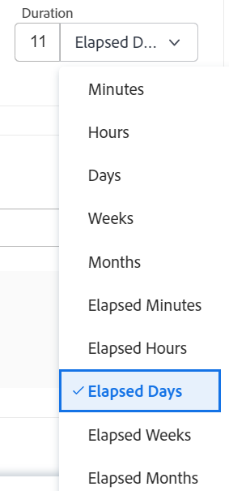

# Overview of Task Duration and Duration Type

<!-- Audited: 12/2023 -->

The task Duration is the difference between the Planned Completion Date and the Planned Start Date of the task. The Duration indicates the time frame that is available for the task to get completed.

The Duration Type of a task identifies the relationship between the number of resources assigned to a task, the total effort, and the total Duration of the task.

## Task Duration overview

If the Actual Start and Actual Completion Dates of the task fall outside of the schedule of the project, primary assignee, or the Default Schedule, the task Duration is zero.

**Example:** If you have a schedule that starts at 9:00 AM and ends at 12:00 PM and a task that is scheduled to start at 2:00 PM and end at 4:00 PM, the task's Duration is zero.

The following are two scenarios that exist when calculating duration in&nbsp;Adobe Workfront: 

* If the task is assigned to a user Workfront, uses one of the following schedules, in this exact order to calculate Duration:

   1. Workfront takes into account the user's schedule. 
   1. If the user is not associated with a schedule, Workfront takes into account the project's schedule.
   1. If the project is not associated with a schedule, Workfront takes into account the Default Schedule of your system. For information about schedules, see [Create a schedule](../../../administration-and-setup/set-up-workfront/configure-timesheets-schedules/create-schedules.md).

* If the task is assigned to multiple users:

  1. Workfront takes into account either the schedule of the project or that of the primary assignee.

  Your Workfront administrator determines which schedule Workfront uses when a task is assigned to multiple users. For information, see [Configure system-wide project preferences](../../../administration-and-setup/set-up-workfront/configure-system-defaults/set-project-preferences.md).

  The steps are similar to the first scenario after understanding which schedule Workfront uses to calculate Duration.

>[!NOTE]
>
>When taking into account the Primary Assignee's time off on a project, the planned dates of the task might adjust, but the Duration of the task remains the same. For information about taking into account the time off of the Primary Assignee when planning a project, see  [Configure system-wide project preferences](../../../administration-and-setup/set-up-workfront/configure-system-defaults/set-project-preferences.md).

## Units of time for Task Duration

You can indicate task&nbsp;Duration in both the regular time and the elapsed time between the Planned Start and Planned Completion Dates.

When updating the Duration of tasks in a list, you can use the following abbreviations for indicating units of time in&nbsp;Workfront: 

| Unit of Time |Abbreviation |
|---|---|
| Minutes |M |
| Hours |H |
| Days.&nbsp;This is the default.  |D |
| Weeks |W |
| Months |T, MO |
| Elapsed Minutes |EM |
| Elapsed Hours |EH |
| Elapsed Days |ED |
| Elapsed Weeks |EW |
| Elapsed Months |ET |

{style="table-layout:auto"}

**Example:** If you want to indicate that a task's Duration is 3 Elapsed Day, you would type "3 ED" in the Duration field in a task list .  You can also select the preferred option for the Duration Unit of Time from the available drop-down menu when editing a task or in the Task&nbsp;Details section. For information about editing tasks, see [Edit tasks](../../../manage-work/tasks/manage-tasks/edit-tasks.md).

<!--

(NOTE: stays QS only forever; for the pictures below: make the first one classic at preview time and the second one stays QS always. The second one is yellow >> take out at 21.2 production!!)

-->

Consider the following when indicating the Duration of a task:

* Elapsed time is a unit of time for a task's Duration. It is the time between the Planned Start Date and the Planned Completion Date of a task that includes holidays, weekends, and time off. In other words, elapsed time is the passage of calendar days. 
* Regular time takes into account holidays, weekends, and time off and excludes them from the Duration of the task.

* When you indicate the Duration of a task in weeks, Workfront calculates the Duration in days and hours based on the Typical work days per week and Typical hours per work day settings set by your Workfront administrator in the Project&nbsp;Preferences area of Setup.
* Workfront uses the default duration of 4 weeks for one month when calculating Duration in months.

## Task Duration Type overview

Managing the Duration&nbsp;Type of a task enables you to set consistent resource assignments based on the needs of the task.

Duration Type helps to answer the following questions:

* How busy are we going to be?
* How big is the job?
* How long is it going to take?

## Define Duration Types

<table border="1" cellspacing="15" cellpadding="1"> 
 <col> 
 <col> 
 <col> 
 <thead> 
  <tr> 
   <th scope="row">
<strong>Duration Type</strong>
</th> 
   <th scope="col"> 
<strong>Function</strong> 
 </th> 
   <th scope="col"> 
<strong>How Resources Affect It</strong> 
 </th> 
  </tr> 
 </thead> 
 <tbody> 
  <tr> 
   <th scope="col"> 
<strong>Calculated Assignment</strong> 
 </th> 
   <td scope="col"> 
Calculates the allocation percentage for each assignee on a task. 
 
When you choose this Duration Type, you can input individual Duration and Planned Hours for the task. Workfront divides the Planned Hours by the number of hours inside the Duration of the task, then by the number of resources assigned to the task to calculate the allocation for each assignee.
 
For more detailed information, see <a href="../../../manage-work/tasks/taskdurtn/calculated-assignment.md" class="MCXref xref">Duration Type overview: Calculated Assignment</a>.
 </td> 
   <td scope="col">Duration and Planned Hours do not change when adding or removing assignees to the task. </td> 
  </tr> 
  <tr> 
   <th scope="col"> 
<strong>Calculated Work</strong> 
 </th> 
   <td scope="col"> 
Determines the Planned Hours (amount of effort) required for the task to be completed.
 
Normally used when the resources assigned to the task are allocated for the entire Duration of the task.
 
When you choose this Duration Type, you have the ability to input an individual Duration for the task. Workfront calculates the Planned Hours for the task by multiplying the number of days in the Duration by the number of work hours in the schedule and by the number of assignees to the task. 
 
You have the ability to manually change the allocation percentage of each assignee to the task which will shorten the amount of the Planned Hours.
 
For more detailed information, see <a href="../../../manage-work/tasks/taskdurtn/calculated-work.md" class="MCXref xref">Duration Type overview: Calculated Work</a>.
 </td> 
   <td scope="col"> 
Planned Hours increase when assignees are added to the task. 
 
Planned Hours decrease when assignees are removed from the task.
 </td> 
  </tr> 
  <tr> 
   <th scope="col"> 
<strong>Effort Driven</strong>
 </th> 
   <td scope="col"> 
Determines the Planned Hours based on the number of resources.
 
When you choose this Duration Type, you have the ability to input an individual Duration for the task. Workfront calculates the Planned Hours for the task by multiplying the number of days in the Duration by the number of work hours in the schedule and dividing that by the number of assignees to the task. 
 
You have the ability to manually change the allocation percentage of each assignee to the task, but the number of Planned Hours remains the same.
 
For more detailed information, see <a href="../../../manage-work/tasks/taskdurtn/effort-driven.md" class="MCXref xref">Duration Type overview: Effort Driven</a>.
 </td> 
   <td scope="col"> 
Planned hours increase when assignees are removed from the task.
 
Planned hours decrease when assignees are added to the task. 
 
The Duration does not change, regardless of changes in the number of assignees or their schedule. 
 
Duration is equal to Planned Hours. Planned Duration is equal to Planned Hours divided by the number of assignees.
 </td> 
  </tr> 
  <tr> 
   <th scope="col"> 
<strong>Simple</strong> 
 </th> 
   <td scope="col"> 
Determines the Planned Hours and the Duration (which are the same, for this Duration Type) based on the number of hours each assignee is allocated for. 
 
Workfront calculates the Planned Hours by adding up the planned allocated hours for each assignee. 
 
You have the ability to manually change the amount of hours that each assignee is allocated for, and the number of Planned Hours and the amount of the Duration changes accordingly. If you choose a total number of allocated hours for all the assignees, that number is divided equally between each assignee.
 
For more detailed information, see <a href="../../../manage-work/tasks/taskdurtn/simple-duration-type.md" class="MCXref xref">Duration Type overview: Simple</a>.
 </td> 
   <td scope="col"> 
Hours are distributed evenly among assignees if you choose a total number of allocated hours. However, as the project manager, you can manually adjust the hours for each assignee. 
 
You can either edit Planned Hours and Duration of a task with a Simple Duration Type inline or at the task level. 
 
If an agile team is assigned to a task, the Duration Type is automatically set to Simple and cannot be changed. The task duration for an agile team must be greater than 0 minutes.
 </td> 
  </tr> 
 </tbody> 
</table>

## The Duration Type of new tasks

The Duration Type of a new task matches the Duration Type set up in your system. The default Duration Type is Calculated Assignment. Your Workfront administrator or a group administrator can update the default Duration Type for your system or for the group associated with the project. For information, see [Configure system-wide task and issue preferences](../../../administration-and-setup/set-up-workfront/configure-system-defaults/set-task-issue-preferences.md).

## Change the Duration Type of a task

For information about changing the Duration Type of a task, see [Update the Duration Type of a task](../../../manage-work/tasks/taskdurtn/update-duration-type-of-task.md).
