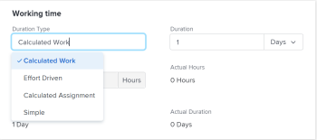

# Update the Duration&nbsp;Type of a task

The Duration Type of a task identifies the relationship between the number of resources assigned to a task, the total effort, and the total Duration of the task. For more information, see [Overview of Task Duration and Duration Type](../../../manage-work/tasks/taskdurtn/task-duration-and-duration-type.md).

## Access requirements

You must have the following to change the Duration&nbsp;Type of a task:

<table style="table-layout:auto"> 
 <col> 
 <col> 
 <tbody> 
  <tr> 
   <td role="rowheader">Adobe Workfront plan*</td> 
   <td> 
Any 
 </td> 
  </tr> 
  <tr> 
   <td role="rowheader">Adobe Workfront license*</td> 
   <td> 
Work or higher
 </td> 
  </tr> 
  <tr> 
   <td role="rowheader">Access level configurations*</td> 
   <td> 
View or higher access to Projects
 
Edit access to Tasks
 
Note: If you still don't have access, ask your Workfront administrator if they set additional restrictions in your access level. For information on how a Workfront administrator can modify your access level, see <a href="../../../administration-and-setup/add-users/configure-and-grant-access/create-modify-access-levels.md" class="MCXref xref">Create or modify custom access levels</a>.
 </td> 
  </tr> 
  <tr> 
   <td role="rowheader">Object permissions</td> 
   <td> 
Manage access to the task 
 
For information on requesting additional access, see <a href="../../../workfront-basics/grant-and-request-access-to-objects/request-access.md" class="MCXref xref">Request access to objects </a>.
 </td> 
  </tr> 
 </tbody> 
</table>

&#42;To find out what plan, license type, or access you have, contact your Workfront administrator.

## Update the Duration Type of a task

In addition to updating the Duration Type of a task as described in this article, you can also update the Duration Type when editing a task or when making advanced assignments. For more information, see:

* [Edit tasks](../../../manage-work/tasks/manage-tasks/edit-tasks.md) 
* [Create advanced assignments](../../../manage-work/tasks/assign-tasks/create-advanced-assignments.md)

To update the Duration Type of a task:

1. Click **Main Menu** > **Projects**, then click a project to access it.
1. Click the **Tasks** section in the left panel . 
1. Click **Task Details** in the left panel, then in the Overview area click **Duration Type**.

   

1. Select from the following options

   |Duration Type|More information|
   |---|---|
   | Calculated Work |For information, see [Duration Type overview: Calculated Work](../../../manage-work/tasks/taskdurtn/calculated-work.md).  |
   | Effort Driven |For information, see [Duration Type overview: Effort Driven](../../../manage-work/tasks/taskdurtn/effort-driven.md).  |
   | Calculated Assignment |For information, see [Duration Type overview: Calculated Assignment](../../../manage-work/tasks/taskdurtn/calculated-assignment.md).  |
   | Simple |For information, see [Duration Type overview: Simple](../../../manage-work/tasks/taskdurtn/simple-duration-type.md).  |

1. Click **Save Changes**.
