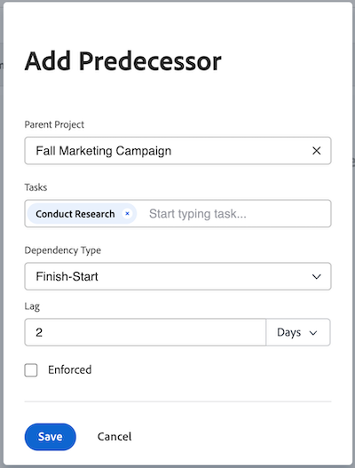

# Create a predecessor relationship using the Predecessors area

<!-- Audited: 5/2025 -->

You can use predecessor tasks (or just predecessors) to link tasks that depend on other tasks to start or complete. For example, you wouldn't want to host a party (dependent task) before you send out the invitations (predecessor task).

This article shows how you can set predecessors using the Predecessors tab within a task.

For information about setting predecessors in a list of tasks, see [Create a predecessor relationship on the task list](../../../manage-work/tasks/use-prdcssrs/create-predecessors-on-task-list.md).

You can view the predecessors of tasks in the following areas of Adobe Workfront:

* In the Predecessors section of the dependent tasks
* In the Gantt Chart
* In the task list in the Predecessors column

For information about predecessors, see [Overview of task predecessors](../../../manage-work/tasks/use-prdcssrs/predecessors-overview.md).

## Access requirements

+++ Expand to view access requirements for the functionality in this article.

You must have the following access to perform the steps in this article:

<table style="table-layout:auto"> 
 <col> 
 <col> 
 <tbody> 
  <tr> 
   <td role="rowheader">Adobe Workfront plan</td> 
   <td> 
Any
 </td> 
  </tr> 
  <tr> 
   <td role="rowheader">Adobe Workfront license</td> 
   <td> 
   
New: Standard 

   
Or 

   
Current: Plan 
 </td> 
  </tr> 
  <tr> 
   <td role="rowheader">Access level configurations</td> 
   <td> 
Edit access to Tasks and Projects
 
Note: If you still don't have access, ask your Workfront administrator if they set additional restrictions in your access level. For information on how a Workfront administrator can modify your access level, see <a href="../../../administration-and-setup/add-users/configure-and-grant-access/create-modify-access-levels.md" class="MCXref xref">Create or modify custom access levels</a>.
 </td> 
  </tr> 
  <tr> 
   <td role="rowheader">Object permissions</td> 
   <td> 
Manage permissions to the tasks and the project
 
For information on requesting additional access, see <a href="../../../workfront-basics/grant-and-request-access-to-objects/request-access.md" class="MCXref xref">Request access to objects</a>.
 </td> 
  </tr> 
 </tbody> 
</table>

For more detail about the information in this table, see [Access requirements in Workfront documentation](/help/quicksilver/administration-and-setup/add-users/access-levels-and-object-permissions/access-level-requirements-in-documentation.md).

 +++

## Create a predecessor for a task

1. Navigate to the task you want to designate as a dependent task.

1. In the left panel, click **Predecessors**.

1. In the **Predecessors** section, click **+Add Predecessor**. The **Add Predecessor** dialog box opens. 

1. (Optional) To add a cross-project predecessor, replace the name of the project in the **Parent Project** field with another project.

   For information, see [Create cross-project predecessors](../../../manage-work/tasks/use-prdcssrs/cross-project-predecessors.md).

1. In the **Tasks** field, type in the name of the task or tasks you want to designate as the predecessors, then select them when they appear in the drop-down.

1. Select a **Dependency Type**.

   For information, see [Overview of task dependency types](../../../manage-work/tasks/use-prdcssrs/task-dependency-types.md).

1. Enter a **Lag** amount.

   For information, see ​[Lag Types overview](../../../manage-work/tasks/use-prdcssrs/lag-types.md).

    

1. Select the **Enforced** checkbox if you want to enforce the predecessor relationship between the two tasks.

   For information, see [Enforce predecessors](../../../manage-work/tasks/use-prdcssrs/enforced-predecessors.md).

1. Click **Save**.
