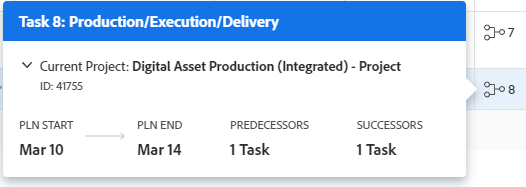

# Create a predecessor relationship on the task list

You can use predecessor tasks (or just predecessors) to link tasks that depend on other tasks to start or complete. For example, you would not want to host a party (dependent task) before you send out the invitations (predecessor task).

This article shows you how to create predecessors on the task list.

You can view the predecessors of tasks in the following areas of Adobe Workfront:

* In the task list in the Predecessors column. 
* In the Gantt chart
* In the Predecessors section of a dependent task

For more information, see [Overview of task predecessors](../../../manage-work/tasks/use-prdcssrs/predecessors-overview.md).

## Access requirements

You must have the following access to perform the steps in this article:

<table style="table-layout:auto"> 
 <col> 
 <col> 
 <tbody> 
  <tr> 
   <td role="rowheader">Adobe Workfront plan*</td> 
   <td> 
Any
 </td> 
  </tr> 
  <tr> 
   <td role="rowheader">Adobe Workfront license*</td> 
   <td> 
Plan 
 </td> 
  </tr> 
  <tr> 
   <td role="rowheader">Access level configurations*</td> 
   <td> 
Edit access to Tasks and Projects
 
Note: If you still don't have access, ask your Workfront administrator if they set additional restrictions in your access level. For information on how a Workfront administrator can modify your access level, see <a href="../../../administration-and-setup/add-users/configure-and-grant-access/create-modify-access-levels.md" class="MCXref xref">Create or modify custom access levels</a>.
 </td> 
  </tr> 
  <tr> 
   <td role="rowheader">Object permissions</td> 
   <td> 
Manage permissions to the tasks and the project
 
For information on requesting additional access, see <a href="../../../workfront-basics/grant-and-request-access-to-objects/request-access.md" class="MCXref xref">Request access to objects </a>.
 </td> 
  </tr> 
 </tbody> 
</table>

&#42;To find out what plan, license type, or access you have, contact your Workfront administrator.

## Create a predecessor

1. Go to a project. 
1. Click **Tasks** in the left panel. 
1. Ensure that your current view displays the **Predecessor** column.

   If the view doesn't display the Predecessors column, change to a view that does, or add the column to your view. 

1. Select the task that you want to designate as the dependent task. 
1. Click inside the **Predecessors** column.
1. Type the task number that you want to designate as the predecessor of the selected task, then press **Enter**.

   The predecessor icon turns green when the predecessor task is marked complete. This signals that the dependent task is ready for work.

   For more information about the relationship types available in the Predecessors column, see [Overview of task predecessors](../../../manage-work/tasks/use-prdcssrs/predecessors-overview.md) in [Overview of task predecessors](../../../manage-work/tasks/use-prdcssrs/predecessors-overview.md).

## View predecessor details

You can quickly view details about the predecessor from the task list.

1. On the task list, hover over the predecessor number in the **Predecessors** column.

   A box with the details of the predecessor displays.

   

   The following details are displayed:

   **Predecessor name:** The name of the predecessor that is being referenced. The task number of the predecessor is included. Click the task name to open it. In the above example, the predecessor is Production/Execution/Delivery.

   **Project name:** The name of the project where the predecessor resides. The project is identified as the current project or a cross project. In the above example, the project name is Digital Asset Production (Integrated) - Project.

   You can expand the project details to see the project's planned start and end dates, condition, status, percent complete, and owner. For a cross project, you can then click **See Project** to open the project.

   **Planned Start:** The planned start date of the predecessor task.

   **Planned End:** The planned completion date of the predecessor task.

   **Number of predecessors:** The number of predecessors for the predecessor being referenced. In the above example, the predecessor being referenced has 1 predecessor.

   **Number of successors:** The number of successor (or dependent) tasks for the predecessor being referenced. In the above example, the predecessor being referenced has 1 successor.
