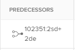

# Create cross-project predecessors

A Cross-Project Predecessor is a task that another task (called a successor task) in another project depends on. The predecessor is the task that takes priority over the dependent (successor) task. For example, you can create a dependency that requires that the predecessor task be marked Complete before the dependent task can start.

Like predecessors within a single project, Adobe Workfront allows for tasks to be dependent on tasks in other projects.

**Example:** If an excavating company has only one backhoe, and two concurrent projects have tasks that require the use of the backhoe, the project manager can make the task in the first project dependent on the task in the second project to illustrate that the excavating can start when the previous project will relinquish the backhoe. 
When linking projects through cross-project predecessors, the dates of the primary project (the one that has the predecessor task) will impact the secondary project (the one that has the successor task).

>[!TIP]
>
>You must recalculate timelines of the projects in order to see dates updated for the secondary project. For more information on recalculating timelines, see [Configure timeline recalculations for projects](../../../administration-and-setup/set-up-workfront/configure-system-defaults/configure-timeline-recalculations-projects.md).

For more information about predecessor relationships, see [Overview of task predecessors](../../../manage-work/tasks/use-prdcssrs/predecessors-overview.md).

## Access requirements

You must have the following access to perform the steps in this article:

<table cellspacing="0"> 
 <col> 
 <col> 
 <tbody> 
  <tr> 
   <td role="rowheader">Adobe Workfront plan*</td> 
   <td> 
Any
 </td> 
  </tr> 
  <tr> 
   <td role="rowheader">Adobe Workfront license*</td> 
   <td> 
Plan 
 </td> 
  </tr> 
  <tr> 
   <td role="rowheader">Access level configurations*</td> 
   <td> 
Edit access to Tasks and Projects
 
Note: If you still don't have access, ask your Workfront administrator if they set additional restrictions in your access level. For information on how a Workfront administrator can modify your access level, see <a href="../../../administration-and-setup/add-users/configure-and-grant-access/create-modify-access-levels.md" class="MCXref xref">Create or modify custom access levels</a>.
 </td> 
  </tr> 
  <tr> 
   <td role="rowheader">Object permissions</td> 
   <td> 
Manage permissions to the tasks and the projects
 
For information on requesting additional access, see <a href="../../../workfront-basics/grant-and-request-access-to-objects/request-access.md" class="MCXref xref">Request access to objects </a>.
 </td> 
  </tr> 
 </tbody> 
</table>

&#42;To find out what plan, license type, or access you have, contact your Workfront administrator.

## Create a cross-project predecessor

1. Go to the task that will be your successor. 
1. Click **Predecessors** in the left panel. 
1. Click **Add Predecessor.**
1. In the **Parent Project** field, begin typing the name of the project that contains the task that you want to be dependent to your current task.
1. Click the name when it appears in the drop-down list.
1. In the **Tasks** field, begin typing the name of the task that you want to be dependent on your current task.
1. Specify the following information for defining the relationship between the predecessor and dependent task:

   * **Dependency Type:** Select the relationship that you want the task to have with the dependent task. The default relationship is 'Finish-Start,' meaning that the predecessor task must finish before the dependent task can start. For more information about the various dependency types, see [Overview of task dependency types](../../../manage-work/tasks/use-prdcssrs/task-dependency-types.md)
   
   * **Lag:** Specify the amount of time that must pass after the completion of an enforced predecessor until the dependent task can begin. For more information about the various types of lag, see [Overview of Lag Types](../../../manage-work/tasks/use-prdcssrs/lag-types.md). 
   
   * **Enforced:** When this option is selected, dependency relationship between the two tasks cannot be circumvented by users beginning tasks early. For example, if you enforce a relationship between Task A and Task B, Task B cannot be started until Task A is complete. For more information about enforcing predecessors, see [Enforce predecessors](../../../manage-work/tasks/use-prdcssrs/enforced-predecessors.md).

     When this option is not selected, the dependency is treated like a suggestion to users. For example, users are able to start Task B before Task A is complete.

1. Click **Save.**

   Tasks that have a cross-project predecessor display the reference number of the project the predecessor belongs to and the number of the task, separated by a colon in the Predecessors column on a task list.

   

   The predecessor icon turns green when the predecessor task is marked complete. This signals that the dependent task is ready for work.

   Mouse over this value, to get more information on the predecessor, the project, and the dates.

