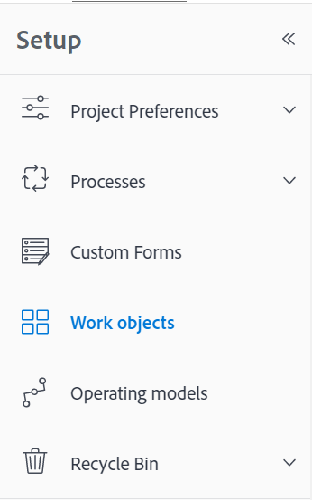
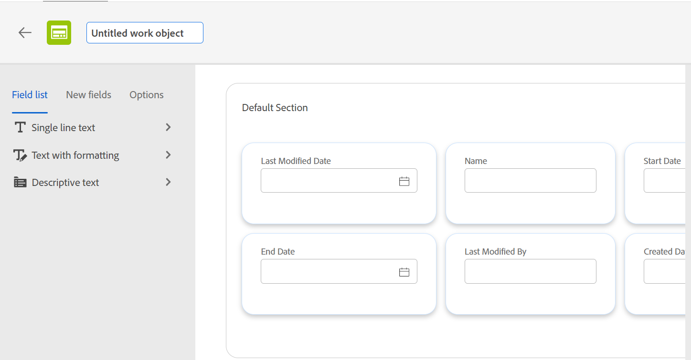
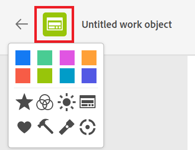
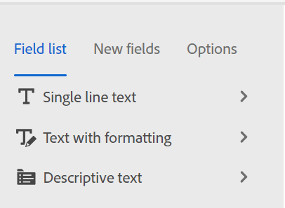
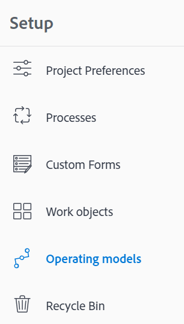
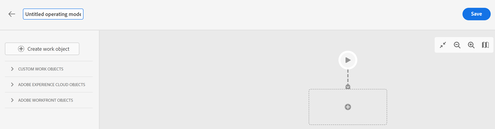
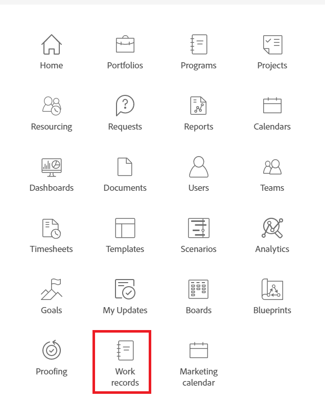
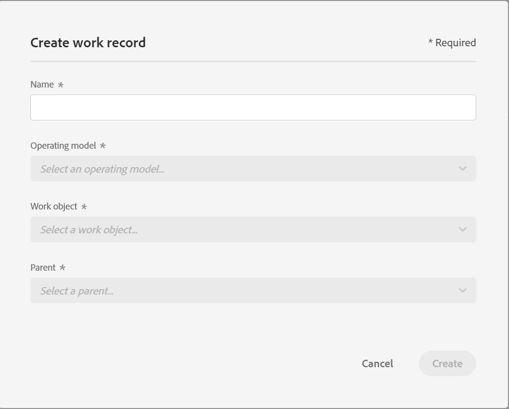

<!--this article is hidden; when you make this public maybe create a new one to avoid writing a redirect? And also keeping this hidden or drafting it? -->

# Design flexible operating models in Adobe Workfront

Currently, the work hierarchy in Adobe Workfront is set and only allows for the Portfolio-Program-Project relationships between larger work objects (in this order).  

Using the new operating model capabilities, you can define the types of work objects you want to work with as well as the relationships between them, or their place in the hierarchy of objects.  

You can create one operating model for your entire organization or create different ones for different departments.  

After defining your work objects and designing your operational model's structure you can create work records which represent actual work. <!--drafted, tracking is not possible from the start: You can name and track work records.-->  

## Access requirements 

| Requirement          | Details         |
|----------------------|-----------------|
| Product              | Adobe Workfront |
| Environment          | Preview         |
| Adobe Workfront Plan | Any             |
| License              | Plan            |

## Prerequisites 

* To create an operating model or to later create work records, you must first decide what work objects you want. You can use existing work objects or create them from scratch.  

## Create a work object 

1. Log in to your instance of Workfront in the Preview environment.  
1. Click the **Main menu** icon , then click **Setup**.  
1. (Optional) Click **Work objects**.
    
    

    The Work objects page displays with a list of work objects.  

1. Click **Create a work object** in the upper-right corner to add a new object.  

1. Update the name for the work object.

    

1. (Optional) Expand the icon to the left of the object name to select a new icon an icon color for the new work object. 

    

1. In the Default Section area of the work object, drag and drop the fields available in the order you would like to display them.

   <!-- Or
   Hover over the fields, then click the **Close icon x** to remove them. -->
    
1. From the left panel, select one of the following tabs to update information for the new work object: 
    * **Field list**: Add an existing custom field to the work object.
    * **New fields**: Add a new custom field to the work object.  
    * **Options**: Specify the areas that you would like to display in the left panel of a work record that uses this work object information. 
  
    >[!TIP]
    >
    >The fields you select here will be available for the work records that will be created using the work objects. 

     

    All users with a Plan license can view the work objects you create. 

1. Click **Save** in the upper-right corner.

## Create an operating model
   
1. Click the **Main menu** icon , then click **Setup**.  
1. (Optional) Click **Operating models**.

    
    
    The Operating models page displays.  

1. Click **Create an operating model** in the upper-right corner to create a structure for your work.

1. Update the name of the operating model. 

    

1. Add existing objects from Workfront or other Experience Cloud applications 

    Or

    Select from the **Custom work objects** list

    Or

    Click **Create work object** to create a work object. Follow steps described in the [Create a work object](#create-a-work-object) section in this article. 

    >[!NOTE]
    >
    >* You must create custom work objects before you can add them to the operating model. 
    >* Creating an operating model and work objects will serve as a template for how work records will be created in Workfront. 

    All system administrators can see the operating model you create <!--should this be undraftd: and Plan-license users can add them and their work objects to a new work record-->. 
1. Click **Save** in the upper-right corner.

<!--add a step above for adding sub-records when the UI is fixed-->

<!--drafted below - when they are ready for this, move it to another article

## Create work records 

1. Log into the Preview environment as a Plan-license user.  
1. Click the **Main menu** icon , then click **Work records**.  

    Work records are records that represent actual work that you can name and track and which follow the operating model structure you established in the [Create work objects and configure a new operating model](#create-work-objects-and-configure-a-new-operating-model) section in this article.

    
    
    The Work records page displays.

1. Expand the **Create work instance** drop-down menu in the upper-right corner of the screen to create a new work record and select from the following: (***********change field name to Create work record)
    * **Create from template**: Select this option to create a work record form a template, then select the template, and click **Create**. 
        Templates must be created before you can select them. 
    * **Create new work instance**: Select this option to create a work record from scratch. (****************change field name to Create work record)

        

1. Update the following fields: 
    * **Name**: Type a name of the new work record. 
    * **Operating model**: Select an existing operating model from the drop-down menu. 
     * **Work object**: Select an existing work object that you want the work record to represent.
    * **Parent**: Select an existing work object as the parent of the work record that you create. When selecting a parent, the new work record becomes a sub-record of the parent.  
1. Click **Create** in the upper-right corner.

    The work record is created and is visible to all users with a Plan license.  
1. (Optional) Click **Sub-records** in the left panel, then click **Create sub-record** in the upper-right corner. 

1. Select from the types of sub-records available, specify a **Name** for the sub-record, then click **Create**. The sub-records of a work record are children objects to the work records. You can only select the types of sub-records that are specified in the operating model used to create the work record. 

 -->
