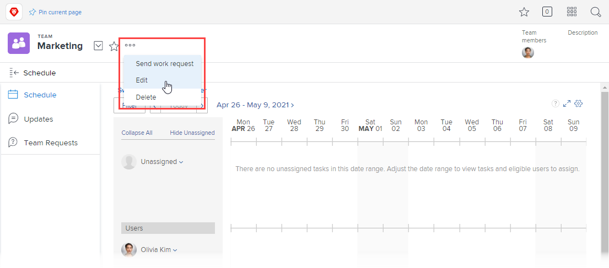

# Edit team settings

As an [!DNL Adobe Workfront] administrator or a user with a [!UICONTROL Standard], [!UICONTROL Plan] or [!UICONTROL Work] license, you can edit [!UICONTROL Team Settings].

You can add users to a team, set the team layout template, and set how status is recorded when work items are completed by a team.

## Access requirements

+++ Expand to view access requirements for the functionality in this article.

You must have the following access to perform the steps in this article:

<table style="table-layout:auto"> 
 <col> 
 <col> 
 <tbody> 
  <tr data-mc-conditions=""> 
   <td role="rowheader"> 
Adobe Workfront plan
 </td> 
   <td>Any</td> 
  </tr> 
  <tr> 
   <td role="rowheader">Adobe Workfront license</td> 
   <td>
   
New: Standard

   
or

   
Current: Work or higher
</td>
  </tr> 
 </tbody> 
</table>

For more detail about the information in this table, see [Access requirements in Workfront documentation](/help/quicksilver/administration-and-setup/add-users/access-levels-and-object-permissions/access-level-requirements-in-documentation.md).

+++

## Edit team settings

{{step1-to-team}}

1. Click the **[!UICONTROL Switch team]** icon , then either select a new team from the drop-down menu or search for a team in the search bar.

1. Click the **[!UICONTROL More]** menu , then select **[!UICONTROL Edit]**.

   Only team members with either a [!UICONTROL Plan] or [!UICONTROL Work] license see this option. 
    
   If you should have the [!UICONTROL Edit] option but you do not see it, ask your Workfront administrator to verify that [!UICONTROL Team Settings] is visible in the layout template for [!UICONTROL Scrum Team], [!UICONTROL Kanban Team], or [!UICONTROL Waterfall Team].

   

1. In team settings, you can make the following kinds of changes:

   * Modify the team name
   * Deactivate the team
   * Associate the team with a group

     >[!NOTE]
     >
     >When a team is assigned to a group or subgroup, any group administrators of that group or subgroup can manage the team without being a member of it. Group administrators can go to the Teams area from the Main Menu and click the [!UICONTROL Switch Teams] arrow  to list all of the teams that are assigned to the groups that they manage.

     You can make sure you are associating the right group with the team by hovering over it and clicking the information icon  that displays next to it. This displays a tooltip listing information about the group, such as the hierarchy of groups above it and its administrators.
   
   * Designate the team owner
   * Add and remove team members
   * Add a description of the team
   * Apply a layout template to the team

     For more information on applying a custom layout template to a team, see the "Applying a Custom Template to a Team" section in Change the [!UICONTROL My Work] and [!UICONTROL Work Requests] areas with Layout Templates.
   
   * Decide if this team is an agile team, by selecting the **[!UICONTROL This is an Agile Team]** option.

     For more information on agile teams and how to manage work inside an agile team, see [Create an agile team](../../agile/get-started-with-agile-in-workfront/create-an-agile-team.md).
   
   * Change the [!UICONTROL Work On It] button to a [!UICONTROL Start] button. For more information on how to configure the [!UICONTROL Start] button, see [Replace the Work On It button with a [!UICONTROL Start] button](../../people-teams-and-groups/create-and-manage-teams/work-on-it-button-to-start-button.md).
   * Customize the **[!UICONTROL Done]** button. For more information on how to customize the [!UICONTROL Done] button, see:

      * [Configure the [!UICONTROL Done] button for tasks](../../people-teams-and-groups/create-and-manage-teams/configure-the-done-button-for-tasks.md) 
      * [Configure the [!UICONTROL Done] button for issues](../../people-teams-and-groups/create-and-manage-teams/configure-the-done-button-for-issues.md)

1. Click **[!UICONTROL Save Changes]**.
