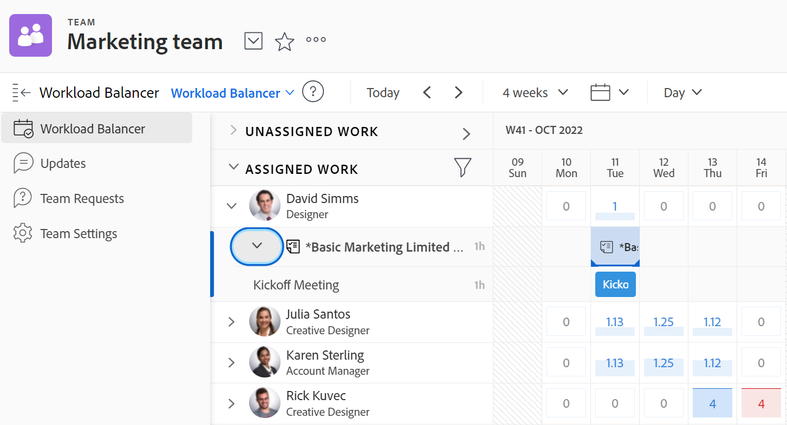

# Manage what your team is working on

You can see a list of items that your team is working on in the [!UICONTROL Team Requests] section of your team. 

You can assign unassigned items, adjust current assignments, adjust current allocations, and more in the [!UICONTROL Workload Balancer] section of your team.

For detailed information about how to manage work assigned to your team, see [[!UICONTROL Workload Balancer]](../../resource-mgmt/workload-balancer/assign-work-in-workload-balancer.md). 

