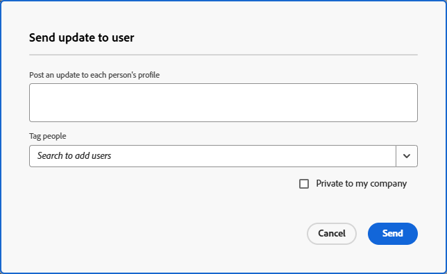

# Send direct messages to other users

{{preview-fast-release-general}}

[!DNL Adobe Workfront] enables you to quickly and easily send messages that are unrelated to any work item directly to other [!DNL Workfront] users. Messages sent as described in this section appear in the [!UICONTROL Updates] tab on the user's profile page and are visible to all users. For additional information on updates, see [Update work items and view updates: article index](../../workfront-basics/updating-work-items-and-viewing-updates/update-work-items-and-view-updates.md).

The user you are sending the message to receives the following types of notifications when you send a message as described in this section:

* An in-app notification, as described in [View and manage in-app notifications](../../workfront-basics/using-notifications/view-and-manage-in-app-notifications.md)
* An email notification

  This depends on the types of email notifications the user is configured to receive. For more information, see [Configure event notifications for everyone in the system](../../administration-and-setup/manage-workfront/emails/configure-event-notifications-for-everyone-in-the-system.md), [View and configure event notifications for a group](../../administration-and-setup/manage-groups/create-and-manage-groups/view-and-configure-event-notifications-group.md), and [Modify your own email notifications](../../workfront-basics/using-notifications/activate-or-deactivate-your-own-event-notifications.md).

## Access requirements

+++ Expand to view access requirements for the functionality in this article.

You must have the following access to perform the steps in this article:

<table style="table-layout:auto"> 
 <col> 
 <col> 
 <tbody> 
  <tr data-mc-conditions=""> 
   <td role="rowheader">Adobe Workfront plan</td> 
   <td>Any</td> 
  </tr> 
  <tr> 
   <td role="rowheader">Adobe Workfront license</td> 
   <td>
   
New: Light or higher

   
or

   
Current: Review or higher

   </td>
  </tr> 
 </tbody> 
</table>

For more detail about the information in this table, see [Access requirements in Workfront documentation](/help/quicksilver/administration-and-setup/add-users/access-levels-and-object-permissions/access-level-requirements-in-documentation.md).

+++

## Send a message unrelated to a work item to another user from their profile page

1. Go to the profile page of the user you want to send a message to.  
   
   To navigate to a user's profile page, click the linked name of the user as it appears anywhere in the [!DNL Workfront] interface. User names are displayed in many areas, such as in a comment made by the user.

1. On the **[!UICONTROL Updates]** tab, click in the text box field.

   ![Message user on the [!UICONTROL Updates] tab](assets/send-message-to-user-on-updates-tab.png)

1. Type your message.
1. (Optional) Click in the **[!UICONTROL Notify]** field, then begin typing the name of another user you want to include in this message.  

1. (Optional) Select **[!UICONTROL Private to my company]** to make this message visible only to other users in your company.  

1. Click **[!UICONTROL Update].** 
   The message is posted at the top of the list of messages on the **[!UICONTROL Updates]** tab on the user's profile page.

## Send a message to one or more users from the User list

This option is only available if you have a Standard, Plan, or Work license.

{{step-1-to-users}}

1. Select the user or users you want to send a message to, and click [!UICONTROL **Send Update to User**].
1. Type your message in the [!UICONTROL Send update to user] window.

   Sample image in the Preview environment:

   

1. (Optional) Search for any additional users you want to tag on the message. You do not need to tag the users you already selected in the user list.
1. (Optional) Select **[!UICONTROL Private to my company]** to make this message visible only to other users in your company.
1. Click [!UICONTROL **Send**].
   The message is posted at the top of the list of messages on the **[!UICONTROL Updates]** tab on each user's profile page.
