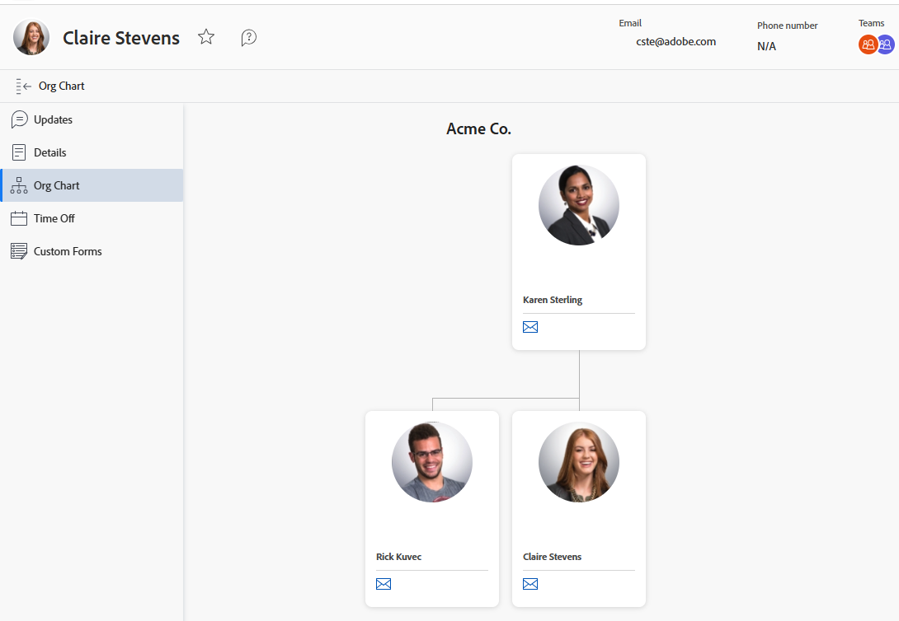

# View the organizational chart

The organizational chart feature allows you to to view the organizational chart associated with a particular [!DNL Adobe Workfront] user. Organizational charts are a great way to visualize the structure of a specific department.

## Access requirements

+++ Expand to view access requirements for the functionality in this article.

<table style="table-layout:auto">
 <col> 
 <col> 
 <tbody> 
  <tr> 
   <td>Adobe Workfront package</td> 
   <td>
Any
</td> 
  </tr> 
  <tr> 
   <td>Adobe Workfront license</td> 
   <td>
   
Light or higher

   
Review or higher
</td>
  </tr> 
 </tbody> 
</table>

For information, see [Access requirements in Workfront documentation](/help/quicksilver/administration-and-setup/add-users/access-levels-and-object-permissions/access-level-requirements-in-documentation.md).

+++

## Locate a user's organizational chart

{{step1-click-profile-pic}}

1. In the left panel, click **[!UICONTROL Org Chart]**.
   

   The organizational chart appears.
