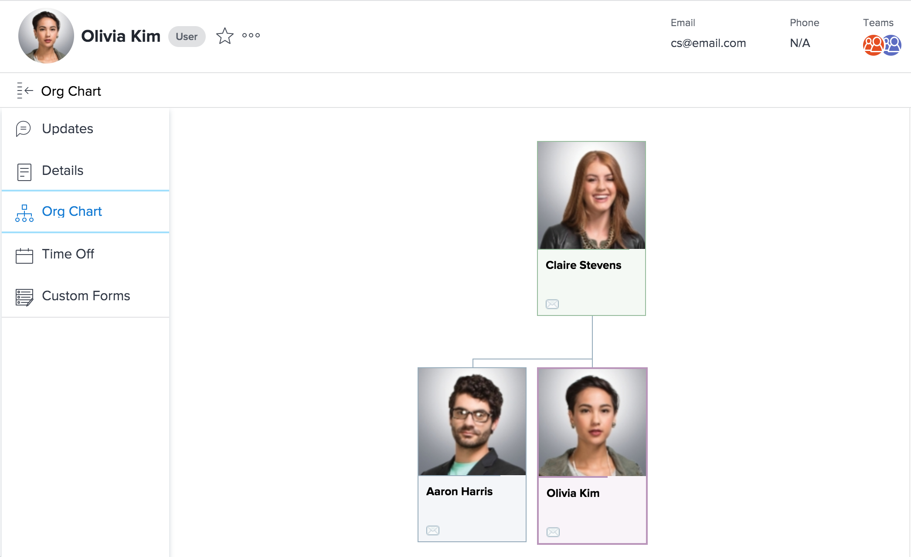

# View the organizational chart

The organizational chart feature allows you to to view the organizational chart associated with a particular Adobe Workfront user. Organizational charts are a great way to visualize the structure of a specific department.

## Access requirements

You must have the following access to perform the steps in this article:

<table style="table-layout:auto"> 
 <col> 
 </col> 
 <col> 
 </col> 
 <tbody> 
  <tr> 
   <td role="rowheader"><strong>Adobe Workfront plan*</strong></td> 
   <td> 
Any
 </td> 
  </tr> 
  <tr> 
   <td role="rowheader"><strong>Adobe Workfront license*</strong></td> 
   <td> 
Review or higher
 </td> 
  </tr> 
 </tbody> 
</table>

&#42;To find out what plan or license type you have, contact your Workfront administrator.

## Locate a user's organizational chart

1. Click the **Main Menu** icon  in the upper-right corner of Adobe Workfront, then click your user name next to your profile picture.

1. In the left panel, click **Org Chart**.  
   

