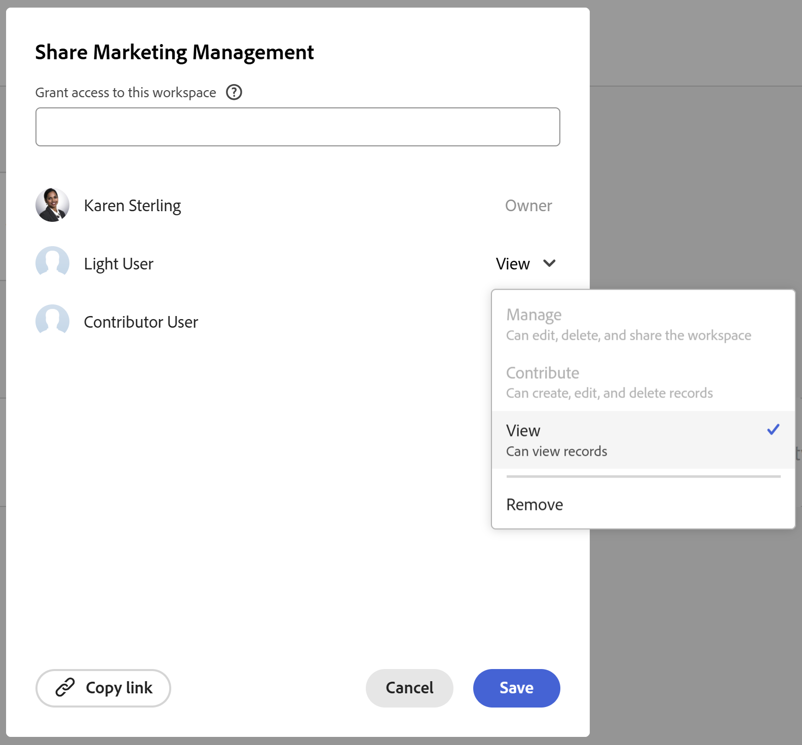
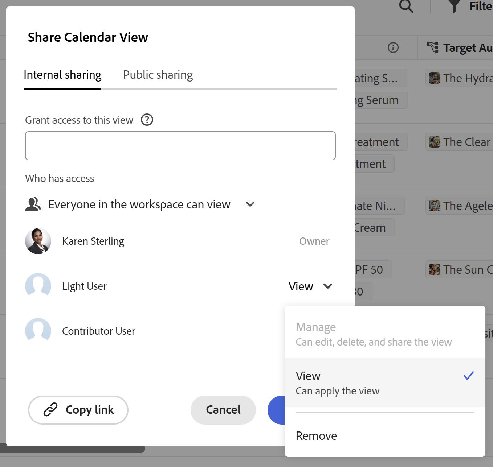

# License type overview when using Adobe Workfront Planning

{{planning-important-intro}}

Your Adobe Workfront license type works in conjunction with your Adobe Workfront Planning permissions to give the following access: 

* View, contribute, or manage workspaces
* View or manage views.

For information about permissions to objects in Workfront Planning, see [Overview of sharing permissions in Adobe Workfront Planning](/help/quicksilver/planning/access/sharing-permissions-overview.md). 

For information about access to Workfront Planning, see [Access overview](/help/quicksilver/planning/access/access-overview.md). 

## The relationship between Workfront license types and Workfront Planning permissions

The table below describes the relationship between the license type of a user in Adobe Workfront and the level of permissions you can grant to them to Adobe Workfront Planning objects based on that license. 

Granting a user permissions to a workspace also grants them permissions to record types, records, and fields. 

You must grant users separate permissions to views, in addition to the ones they have for workspaces, to be able to access and manage views. 

| Adobe Workfront license type*                                   | Highest permissions allowed in Adobe Workfront Planning                                                                                                                                             |
|------------------------------------------------|-------------------------------------------------------------------------------------------------------------------------------------------------------------------------------|
|Standard                     | 
Users can manage workspaces and views. They can create, edit, or delete workspaces, record types, records, fields, and views.
   
System administrators have Manage permissions to all workspaces, including the ones they did not create.
                                                                                                                     |
| Light or Contributor  | 
Users can view the workspaces shared with them, as well as the record types, records, and fields of those workspaces.
   
Users can view the views shared with them, but they cannot create their own. 
  
Users cannot create, edit, or delete workspaces, record types, records, or fields.
|

*Workfront Planning is not available for legacy Workfront licenses. 
For more information, see [Access requirements in Workfront documentation](/help/quicksilver/administration-and-setup/add-users/access-levels-and-object-permissions/access-level-requirements-in-documentation.md).

<!--OLD 

| Adobe Workfront license type*                                   | Highest permissions allowed in Adobe Workfront Planning                                                                                                                                             |
|------------------------------------------------|-------------------------------------------------------------------------------------------------------------------------------------------------------------------------------|
|New: Standard   or  Current: Plan                    | Users can manage workspaces. They can create, edit, or delete workspaces, record types, records, and fields.   System administrators have Manage permissions to all workspaces, including the ones they did not create.                                                                                                                     |
| New: Light, Contributor   or  Current: Work, Requestor, Reviewer                      | Users can view the workspaces shared with them, as well as the record types, records, and fields of those workspaces.   Users cannot create, edit, or delete workspaces, record types, records, or fields.|

*For more information, see [Access requirements in Workfront documentation](/help/quicksilver/administration-and-setup/add-users/access-levels-and-object-permissions/access-level-requirements-in-documentation.md).
-->

### License types and workspace permissions

Only users with a Standard license can have Contribute or Manage permissions to workspaces. Users with all other license types can have View permissions to workspaces shared with them. 

System administrators can view all workspaces in the system, even the ones they did not create. 

>[!INFO]
>
>**EXAMPLE:** 
>
>Contributors or Light-license users cannot contribute to or manage workspaces and their objects. 
>
>There is an indication in the sharing box that users cannot be granted permissions to contribute to or manage a workspace when they hold a lower-level license, as these permissions levels are dimmed. 
>
>

### License types and view permissions

Only users with a Standard license can have Manage permissions to views. Users with all other license types can have View permissions to views shared with them. 

>[!INFO]
>
>**EXAMPLE:** 
>
>Contributors or Light-license users cannot manage views. They can apply temporary filters, sorts, or groupings to views they can access. 
>
>There is an indication in the sharing box that users cannot be granted permissions to manage a view when they hold a lower-level license, as these permissions levels are dimmed. 
>
>
