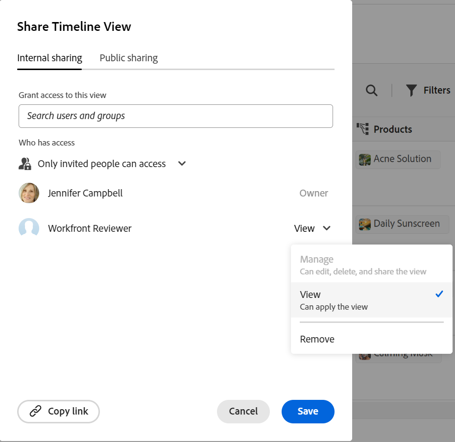

<!--update the metadata with real things when making this public; also update the description with something like this: Not all users in the organization have the same access and permissions to use Adobe Workfront plannint. This article describes the levels of access that users could have to Adobe Workfront Planning. -->
<!--update the title and the metadata title if Workfront Planning is NOT its own product - because the title is too generic for it being a Workfront capability-->

# License type overview when using Adobe Workfront Planning

{{planning-important-intro}}

Your Adobe Workfront license type works in conjunction with your Adobe Workfront Planning permissions to give you access to view, contribute, or manage workspaces. <!--add more objects here when we can grant other object-specific permissions-->

Workfront Planning permissions to record views are independent from Workfront license types. 

Users with all license types can view, create, edit, or manage Workfront Planning views. 

This article describes the types of licenses needed in Workfront, and the permissions granted to workspaces in Workfront Planning based on each license type. 

A user with a lower-level license type has restricted permissions to workspaces when using Workfront Planning capabilities. 

>[!INFO]
>
>**EXAMPLE:** 
>
>Requestors (or Collaborators, according to the new license model) cannot contribute to or manage workspaces and their objects. 
>
>There is an indication in the sharing box that users cannot be granted permissions to contribute to or manage a workspace when they hold a lower-level license, as these permissions levels are dimmed. 
>
>

<!--Replace the above, starting with "Workfront Planning permissions to record views are independent from Workfront license types. " down to the Note above with this (keep the image for workspace sharing): 

Your Adobe Workfront license type works in conjunction with your Adobe Workfront Planning permissions to give you access to the following: 

* View, contribute, or manage workspaces
* View or manage views.

Only users with a Standard (or Plan) license can have Contribute or Manage permissions to workspaces. Users with all other license types can have View permissions to workspaces shared with them. System administrators can view all workspaces in the system, even the ones they did not create. 

(add the note below here)

Only users with a Standard (or Plan) license can have Manage permissions to views. Users with all other license types can have View permissions to views shared with them. 

>[!INFO]
>
>**EXAMPLE:** 
>
>Collaborators (or Requestors and Reviewers) cannot manage views. They can apply temporary filters, sorts, or groupings to views they can access. 
>
>There is an indication in the sharing box that users cannot be granted permissions to manage a view when they hold a lower-level license, as these permissions levels are dimmed. 
>
>
-->

For information about permissions to objects in Workfront Planning, see [Overview of sharing permissions in Adobe Workfront Planning](/help/quicksilver/planning/access/sharing-permissions-overview.md). 

## The relationship between Workfront license types and Workfront Planning permissions

The table below describes the relationship between the license type of a user in Adobe Workfront and the level of permissions you can grant to them to Adobe Workfront Planning objects based on that license. 

Granting a user permissions to a workspace also grants them permissions to record types, records, and fields. 

| Adobe Workfront license type*                                   | Highest permissions allowed in Adobe Workfront Planning                                                                                                                                             |
|------------------------------------------------|-------------------------------------------------------------------------------------------------------------------------------------------------------------------------------|
|New: Standard   or  Current: Plan                    | Users can manage workspaces. They can create, edit, or delete workspaces, record types, records, and fields.   System administrators have Manage permissions to all workspaces, including the ones they did not create.                                                                                                                     |
| New: Light, Contributor   or  Current: Work, Requestor, Reviewer                      | Users can view the workspaces shared with them, as well as the record types, records, and fields of those workspaces.   Users cannot create, edit, or delete workspaces, record types, records, or fields.|

*For more information, see [Access requirements in Workfront documentation](/help/quicksilver/administration-and-setup/add-users/access-levels-and-object-permissions/access-level-requirements-in-documentation.md). 

<!--Replace all of the above with this:

The table below describes the relationship between the license type of a user in Adobe Workfront and the level of permissions you can grant to them to Adobe Workfront Planning objects based on that license. 

Granting a user permissions to a workspace also grants them permissions to record types, records, and fields. 

You must grant view permissions separately from workspace permissions. 

| Adobe Workfront license type*                                   | Highest permissions allowed in Adobe Workfront Planning                                                                                                                                             |
|------------------------------------------------|-------------------------------------------------------------------------------------------------------------------------------------------------------------------------------|
|New: Standard   or  Current: Plan                    | <ul><li>Users can contribute to or manage workspaces and they can manage views. They can create, edit, or delete workspaces, record types, records, fields, and views.</li> <li> System administrators have Manage permissions to all workspaces, including the ones they did not create.</li> <li> System administrators can only access views they created.</li></ul>                                                                                                                     |
|New: Light, Contributor   or  Current: Work, Requestor, Reviewer                      | <ul><li>Users can view the workspaces shared with them, as well as the record types, records, and fields of those workspaces.</li> <li>Users can access views shared with them and apply temporary filters, sorts, or groupings, but they cannot modify the views. </li><li> Users cannot create, edit, or delete workspaces, record types, records, fields, or views.</li></ul>|

*For more information, see [Access requirements in Workfront documentation](/help/quicksilver/administration-and-setup/add-users/access-levels-and-object-permissions/access-level-requirements-in-documentation.md). 

-->